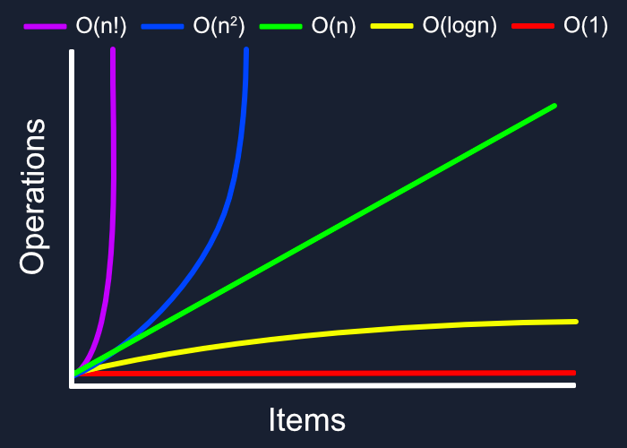

## Вычиcление Big O

Термин "терм" в контексте анализа временной сложности алгоритмов обычно относится к отдельному слагаемому в математическом выражении, которое описывает как растет время выполнения алгоритма в зависимости от размера входных данных.

Когда мы говорим об O-нотации (например, O(n^2 + n)), каждое слагаемое (n^2, n) внутри скобок считается отдельным "термом". Терм может включать в себя переменные, константы и операторы.

В контексте анализа временной сложности алгоритмов нас обычно интересует терм, который растет быстрее всех остальных при увеличении размера входных данных, поскольку именно этот терм в конечном итоге будет доминировать и определять общую эффективность алгоритма. В примере O(n^2 + n) при больших значениях n терм n^2 будет расти гораздо быстрее, чем терм n, и поэтому n^2 считается доминирующим термом, определяющим временную сложность алгоритма.

---
**Какова финальная временная сложность алгоритма, части которого выполняются за O(2n+nlog(n)+10)?**

- A. O(n)
- B. O(n log(n))
- C. O(n + log(n))
- D. O(2n + 10)

Разберём выражение \( O(2n + n\log(n) + 10) \) по частям:

1. \( O(2n) \) — линейная сложность, но константа \( 2 \) в Big-O отбрасывается, так что остаётся \( O(n) \).
2. \( O(n\log n) \) — доминирующая часть, так как логарифмический множитель растёт быстрее, чем линейный.
3. \( O(10) \) — это константа, а константы в асимптотическом анализе не учитываются.

Теперь найдём доминирующий член. В данном случае сравниваем \( O(n) \) и \( O(n\log n) \). Поскольку \( n\log n \) растёт быстрее, чем \( n \) при больших значениях \( n \), итоговая сложность определяется именно им.

**Финальный ответ:** ``O(n \log n)``

> **Feedback** 
> 
>**Пояснение:** Поскольку мы предполагаем, что n стремится к очень большим значениям, линейный терм 2n и константный терм 10 будут иметь незначительное влияние на общую производительность по сравнению с термом n log(n). Следовательно, мы можем их игнорировать, и итоговая временная сложность будет O(n log(n)).

---

**Какова временная сложность следующего алгоритма: O(n^2 + 3n + 20)?**

- A. O(n)
- B. O(n^2)
- C. O(3n + 20)
- D. O(n^2 + 3n)

Рассмотрим выражение \( O(n^2 + 3n + 20) \):

1. \( O(n^2) \) — квадратичная сложность.
2. \( O(3n) \) — линейная сложность, но по сравнению с \( O(n^2) \) она незначительна для больших \( n \).
3. \( O(20) \) — это константа, которая не влияет на асимптотическую сложность.

Согласно правилам Big-O, мы оставляем только наиболее значимый член, который доминирует при больших \( n \). В данном случае это **\( O(n^2) \)**.

**Финальный ответ:** ``O(n^2)``

> **Feedback**
> 
> **Пояснение:** Квадратичный терм n^2 будет расти значительно быстрее, чем линейный терм 3n и константный терм 20, когда n стремится к большим значениям. Таким образом, он доминирует и определяет итоговую временную сложность, которая составляет O(n^2).

---

**Определите временную сложность: O(5n^3 + 10n^2 + 50).**

- A. O(n^3)
- B. O(5n^3 + 10n^2)
- C. O(10n^2)
- D. O(n^3 + 10n^2)

Рассмотрим выражение \( O(5n^3 + 10n^2 + 50) \):

1. \( O(5n^3) \) — кубическая сложность.
2. \( O(10n^2) \) — квадратичная сложность, но она растёт медленнее, чем \( O(n^3) \).
3. \( O(50) \) — константа, которая не влияет на асимптотику.

Согласно правилам Big-O, оставляем **доминирующий член**, который растёт быстрее всего при больших \( n \). В данном случае это **\( O(n^3) \)** (коэффициент 5 не учитывается).

**Финальный ответ:** ``O(n^3)``

> **Feedback**
>
> **Пояснение:** Кубический терм 5n^3 будет доминировать в выражении временной сложности, поскольку он растет быстрее, чем квадратичный терм 10n^2 и константный терм 50, когда n стремится к большим значениям. Таким образом, итоговая временная сложность будет O(n^3).

---

**Чему равна временная сложность следующего алгоритма: O(100n^2 + n log(n) + 1000)?**

- A. O(n^2)
- B. O(100n^2 + n log(n))
- C. O(n log(n))
- D. O(100n^2)

Разберём выражение \( O(100n^2 + n\log n + 1000) \) по частям:

1. \( O(100n^2) \) — квадратичная сложность.
2. \( O(n\log n) \) — сложность, растущая медленнее, чем \( O(n^2) \), но быстрее, чем линейная.
3. \( O(1000) \) — константа, которая не влияет на асимптотику.

Согласно правилам Big-O, оставляем **наиболее доминирующий член**, который в данном случае — **\( O(n^2) \)**, так как он растёт быстрее, чем \( O(n\log n) \).

**Финальный ответ:**  ``O(n^2)``

> **Feedback**
> 
> **Пояснение:** Квадратичный терм 100n^2 будет иметь наибольшее влияние на общую производительность алгоритма при больших значениях n, даже несмотря на то, что есть также логарифмически масштабируемый терм n log(n). Константный терм 1000 и линейный терм будут иметь незначительное влияние и могут быть проигнорированы. Таким образом, итоговая временная сложность составляет O(n^2).

---

**Какова временная сложность алгоритма с термами O(n! + n^2)?**

- A. O(n!)
- B. O(n! + n^2)
- C. O(n^2)
- D. O(n! + n)

Рассмотрим выражение **\( O(n! + n^2) \)**:

1. **\( O(n!) \)** — факториальная сложность.
2. **\( O(n^2) \)** — квадратичная сложность.

Факториальная сложность **\( O(n!) \)** растёт значительно быстрее, чем **\( O(n^2) \)** при больших значениях \( n \). Например:
- Для \( n = 5 \): \( 5! = 120 \), а \( 5^2 = 25 \).
- Для \( n = 10 \): \( 10! = 3,628,800 \), а \( 10^2 = 100 \).
- Для \( n = 20 \): \( 20! \approx 2.43 \times 10^{18} \), а \( 20^2 = 400 \).

Очевидно, что \( O(n!) \) доминирует над \( O(n^2) \).

**Финальный ответ:** ``O(n!)``

> **Feedback**
>
> **Пояснение:** Факториальный терм n! растет экстремально быстро, даже быстрее, чем квадратичный терм n^2. При очень больших значениях n, n! будет настолько велико, что другие термы можно будет проигнорировать. Таким образом, итоговая временная сложность будет O(n!).

---

**Определите временную сложность: O(2^n + n^2).**

- A. O(2^n)
- B. O(2^n + n^2)
- C. O(n^2)
- D. O(2^n + n)

Рассмотрим выражение **\( O(2^n + n^2) \)**:

1. **\( O(2^n) \)** — экспоненциальная сложность.
2. **\( O(n^2) \)** — квадратичная сложность.

Экспоненциальная функция **\( 2^n \)** растёт гораздо быстрее, чем **\( n^2 \)** при больших \( n \). Например:
- Для \( n = 10 \): \( 2^{10} = 1024 \), \( 10^2 = 100 \).
- Для \( n = 20 \): \( 2^{20} = 1,048,576 \), \( 20^2 = 400 \).
- Для \( n = 50 \): \( 2^{50} \approx 1.13 \times 10^{15} \), \( 50^2 = 2500 \).

Очевидно, что **\( O(2^n) \)** доминирует над **\( O(n^2) \)**.

**Финальный ответ:** ``O(2^n)``

> **Feedback**
>
> **Пояснение:** Экспоненциальный терм 2^n будет расти значительно быстрее, чем квадратичный терм n^2, когда n стремится к большим значениям. Таким образом, он доминирует и определяет итоговую временную сложность, которая составляет O(2^n).

---

**Какова временная сложность следующего алгоритма: O(n^3 + 10n + 100)?**

- A. O(n^3)
- B. O(n^3 + 10n)
- C. O(n + 100)
- D. O(n^3 + 10n + 100)

Разберём выражение **\( O(n^3 + 10n + 100) \)**:

1. **\( O(n^3) \)** — кубическая сложность.
2. **\( O(10n) \)** — линейная сложность, которая растёт медленнее, чем \( O(n^3) \).
3. **\( O(100) \)** — константа, которая не влияет на асимптотику.

Согласно правилам Big-O, оставляем **наиболее доминирующий член**, который в данном случае — **\( O(n^3) \)**, так как он растёт быстрее, чем \( O(n) \) при больших значениях \( n \).

**Финальный ответ:** ``O(n^3)``

> **Feedback**
>
> **Пояснение:** Кубический терм n^3 будет расти значительно быстрее, чем линейный терм 10n и константный терм 100, когда n стремится к большим значениям. Таким образом, он доминирует и определяет итоговую временную сложность, которая составляет O(n^3).

---

**Чему равна временная сложность следующего алгоритма: O(n^2 + n^3)?**

- A. O(n^3)
- B. O(n^2 + n^3)
- C. O(n^2)
- D. O(n^3 + n^2)

Рассмотрим выражение **\( O(n^2 + n^3) \)**:

1. **\( O(n^2) \)** — квадратичная сложность.
2. **\( O(n^3) \)** — кубическая сложность.

Так как **\( n^3 \)** растёт быстрее, чем **\( n^2 \)** при больших \( n \), квадратичный член становится незначительным.

Согласно правилам Big-O, оставляем **доминирующий член**, которым является **\( O(n^3) \)**.

**Финальный ответ:** ``O(n^3)``

> **Feedback**
> 
> **Пояснение:** Кубический терм n^3 будет расти значительно быстрее, чем квадратичный терм n^2, когда n стремится к большим значениям. Таким образом, он доминирует и определяет итоговую временную сложность, которая составляет O(n^3).

---

**Определите временную сложность: O(mn + m + n).**

- A. O(mn)
- B. O(mn + m + n)
- C. O(m + n)
- D. O(mn + n)

Рассмотрим выражение **\( O(mn + m + n) \)**:

1. **\( O(mn) \)** — произведение двух переменных, это доминирующий член, если \( m \) и \( n \) достаточно велики.
2. **\( O(m) \)** и **\( O(n) \)** — линейные члены, которые растут медленнее, чем \( O(mn) \).

Согласно правилам Big-O, оставляем **наиболее доминирующий член**, которым является **\( O(mn) \)**, так как оно растёт быстрее, чем \( O(m) \) и \( O(n) \).

**Финальный ответ:** ``O(mn)``

> **Feedback**
> 
> **Пояснение:** В этом случае у нас есть две переменные, m и n. Терм mn будет расти быстрее, чем линейные термы m и n, когда обе переменные стремятся к большим значениям. Следовательно, итоговая временная сложность будет O(mn).

---

**Какова временная сложность алгоритма с термами O(n log(n) + n^2 + n)?**

- A. O(n^2)
- B. O(n log(n) + n^2)
- C. O(n log(n))
- D. O(n^2 + n)

Разберём выражение **\( O(n \log n + n^2 + n) \)**:

1. **\( O(n \log n) \)** — сложность, которая растёт быстрее, чем \( O(n) \), но медленнее, чем \( O(n^2) \).
2. **\( O(n^2) \)** — квадратичная сложность, которая доминирует над \( O(n \log n) \) и \( O(n) \).
3. **\( O(n) \)** — линейная сложность, самая медленно растущая часть.

Поскольку квадратичный член **\( O(n^2) \)** растёт быстрее, чем остальные, он доминирует в асимптотике.

**Финальный ответ:** ``O(n^2)``

> **Feedback**
> 
> **Пояснение:** Квадратичный терм n^2 будет доминировать в выражении временной сложности, так как он растет быстрее, чем логарифмически масштабируемый терм n log(n) и линейный терм n, когда n стремится к большим значениям. Следовательно, итоговая временная сложность составляет O(n^2).