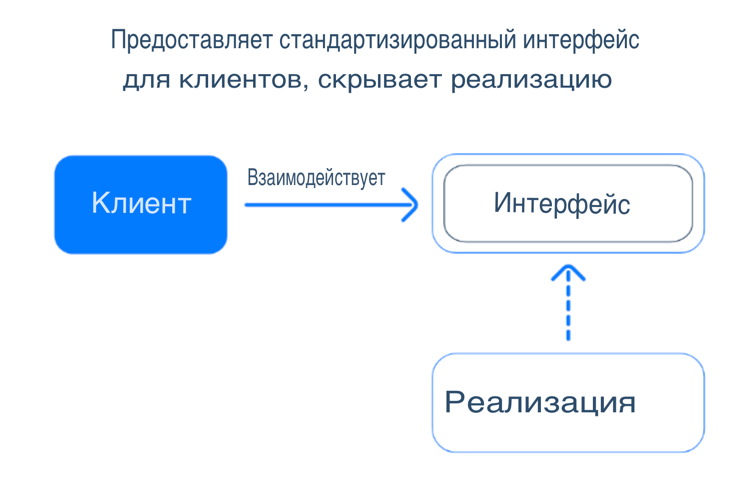

<details style="padding-top: 18px">
  <summary><b>Lesson 28: OOP Principles.</b></summary>

<details style="padding-top: 18px">
  <summary><b>Lesson 23: OOP Principles. Encapsulation</b></summary>

<details style="padding-top: 18px">
  <summary>1. What is Encapsulation?</summary>

## **What is Encapsulation?**

### **Definition and Importance of Encapsulation**

🔹 **Encapsulation** is one of the key principles of OOP, which means **hiding internal object data** and **restricting
access to it**.

The main goals of encapsulation:  
✔️ **Data Protection** – preventing direct modification of important object fields.  
✔️ **Access Control** – data can only be changed through methods.  
✔️ **Code Flexibility** – internal logic can be modified without affecting other parts of the code.

**Example without encapsulation (bad practice):**

```java
class BankAccount {
    String owner;
    double balance;
}
```

Here, **balance** is public and can be changed from outside without restrictions:

```java
BankAccount account = new BankAccount();
account.balance =-1000; // Error: Can set a negative balance!
```

To prevent such issues, we use **encapsulation**.

### **Analogy: File Access on a Computer**

Imagine your computer is a **class**, and the files on it have **different access levels**:

| **Modifier** | **Analogy on a Computer**                                 | **Who Can Open the File?**          |
|--------------|-----------------------------------------------------------|-------------------------------------|
| `private`    | **Personal documents**                                    | Only the computer owner             |
| `default`    | **Work files in a local network**                         | Only colleagues in the same network |
| `protected`  | **Shared folder with a password**                         | Family members or selected users    |
| `public`     | **File on the internet (Google Docs with public access)** | Anyone on the internet              |

🔹 **Examples:**

- **`private`** – Your personal diary, which no one can open without a password.
- **`default`** – Files in an office network, accessible only to employees.
- **`protected`** – Family photos in the cloud, available only with a password.
- **`public`** – An open article on the internet, accessible to everyone.

### **Protecting Data with Access Modifiers**

In Java, **access modifiers** are used for encapsulation, controlling which parts of the code can interact with an
object's fields and methods.

| **Modifier** | **Accessible Inside Class** | **Accessible Inside Package** | **Accessible in Subclasses** | **Accessible in Other Classes** |
|--------------|-----------------------------|-------------------------------|------------------------------|---------------------------------|
| `private`    | ✅ Yes                       | ❌ No                          | ❌ No                         | ❌ No                            |
| `default`    | ✅ Yes                       | ✅ Yes                         | ❌ No                         | ❌ No                            |
| `protected`  | ✅ Yes                       | ✅ Yes                         | ✅ Yes                        | ❌ No                            |
| `public`     | ✅ Yes                       | ✅ Yes                         | ✅ Yes                        | ✅ Yes                           |

**How to properly protect data?**  
✔️ Use `private` for fields (so they cannot be modified directly).  
✔️ Provide access to data via **getters and setters**.  
✔️ Allow modifications only through methods with validation.

Example of **data encapsulation** in the `BankAccount` class:

```java
class BankAccount {
    private String owner;
    private double balance;

    public BankAccount(String owner, double initialBalance) {
        this.owner = owner;
        if (initialBalance >= 0) {
            this.balance = initialBalance;
        } else {
            this.balance = 0;
            System.out.println("Balance cannot be negative. Set to 0.");
        }
    }

    public double getBalance() {
        return balance;
    }

    public void deposit(double amount) {
        if (amount > 0) {
            balance += amount;
            System.out.println("Deposited: " + amount);
        } else {
            System.out.println("Deposit amount must be positive.");
        }
    }

    public void withdraw(double amount) {
        if (amount > 0 && amount <= balance) {
            balance -= amount;
            System.out.println("Withdrawn: " + amount);
        } else {
            System.out.println("Insufficient funds or invalid amount.");
        }
    }
}
```

Now, `balance` cannot be modified directly:

```java
BankAccount account = new BankAccount("Alice", 500);
account.

deposit(200);
account.

withdraw(1000); // Error: Insufficient funds
```

---

### **Real-World Analogy: Bank Account**

Imagine you have a **bank account**.

- You **cannot** simply set the balance by writing `balance = 100000;`
- The balance can **increase** only through deposits.
- The balance can **decrease** only through withdrawals.
- You cannot go into negative balance unless the bank allows overdrafts.

🔹 **The `BankAccount` class works the same way!** It hides `balance` and allows access to it **only through methods**
that validate operations.

## **Summary**

✅ **Encapsulation** protects data and controls access to it.  
✅ Class fields should be `private`, and access to them should be provided through methods.  
✅ **Analogy** – a bank account: access to the balance is only possible through transactions.

</details>

--------

<details style="padding-top: 18px">
  <summary>2. Access Modifiers in Java</summary>

## **Access Modifiers in Java**

### **What Are Access Modifiers?**
🔹 **Access modifiers** are keywords in Java that define **the level of visibility and accessibility** of classes, methods, and fields in a program.

**Why are they important?**  
✔️ Allow **control over data access**.  
✔️ Protect **internal class logic** from misuse.  
✔️ Improve **code structure and readability**.

Java provides **four main access modifiers**:

| **Modifier**  | **Visible Inside Class** | **Visible in Package** | **Visible in Subclasses** | **Visible in Other Classes** |
|--------------|----------------------|----------------------|----------------------|----------------------|
| `private`    | ✅ Yes | ❌ No | ❌ No | ❌ No |
| `default` (no modifier) | ✅ Yes | ✅ Yes | ❌ No | ❌ No |
| `protected`  | ✅ Yes | ✅ Yes | ✅ Yes | ❌ No |
| `public`     | ✅ Yes | ✅ Yes | ✅ Yes | ✅ Yes |

---

### **Explanation of Modifiers with Examples**

#### **1. `private` – Full Control Inside the Class**
🔹 **Accessible only within the class itself**.  
🔹 Completely **hides data** from other classes.  
🔹 Used to **protect important data**, such as passwords or account balances.

**Example:**
```java
class User {
    private String password;

    public User(String password) {
        this.password = password;
    }

    private void encryptPassword() {
        System.out.println("Encrypting password...");
    }
}
```

**❌ Error: You cannot access `password` or call `encryptPassword()` from another class.**

---

#### **2. `default` (package-private) – Access Within the Same Package**
🔹 **Accessible within the same package**, but **not in other packages**.  
🔹 If **no modifier is specified**, `default` is used.  
🔹 Useful for classes that should interact **only within a module**.

**Example:**
```java
class PackageClass {
    String message = "Accessible only within this package!";
}
```

If another class **in the same package** tries to access `message`, it will work:  
```java
PackageClass obj = new PackageClass();
System.out.println(obj.message); // Works!
```

However, if the class is in **a different package**, access **will not be allowed**.

---

#### **3. `protected` – Access in Package + Inheritance**
🔹 Accessible to **all classes in the package** + **subclasses in other packages**.  
🔹 Allows **protected inheritance**: data is hidden from others but available to child classes.

**Example:**
```java
class Parent {
    protected String familySecret = "Family secret";
}
```

```java
class Child extends Parent {
    void revealSecret() {
        System.out.println(familySecret); // Works!
    }
}
```

If `Child` is in **a different package** but **inherits from Parent**, it can access `protected` fields.

---

#### **4. `public` – Full Access Anywhere**
🔹 **Accessible in any class and package**.  
🔹 Used for **public APIs and interfaces** that should be available everywhere.

**Example:**
```java
public class PublicClass {
public String greeting = "Hello, world!";
}
```

Any code can access `greeting`:  
```java
PublicClass obj = new PublicClass();
System.out.println(obj.greeting); // Works!
```

---

### **When and Why to Use Each Modifier?**

| **Modifier**  | **When to Use?** |
|--------------|--------------------------|
| `private`    | For **hidden data**, such as passwords, balances, internal methods. |
| `default`    | When a class or method **should not be visible outside the package**. |
| `protected`  | When you need to **allow subclass access** but hide from others. |
| `public`     | When **a method or class should be accessible to everyone** (e.g., API). |

---

## **Summary**
✅ **Access modifiers** manage data visibility in Java.  
✅ **`private`** protects data inside the class.  
✅ **`default`** works only within the same package.  
✅ **`protected`** is accessible to subclasses, even in other packages.  
✅ **`public`** allows unrestricted access everywhere.

🚀 **Next, we'll practice choosing the right access modifiers for various classes!**


<details style="padding-top: 18px">
  <summary>Practice</summary>

### **Task: Choose the Right Access Modifiers**

Below are several classes with fields that currently have no access modifiers.  
Your task is to **assign appropriate modifiers (`public`, `private`, `protected`)** based on logic and encapsulation
principles.

---

```java
// TODO: Assign access modifiers to the fields based on best practices.

class UserAccount {
    String username;
    String password;
    String email;
    int age;
}
```

---

```java
// TODO: Assign access modifiers to the fields.

class BankAccount {
    String accountNumber;
    double balance;
    String ownerName;
}
```

---

```java
// TODO: Assign access modifiers to the fields.

class Product {
    String name;
    double price;
    int stock;
}
```

---

```java
// TODO: Assign access modifiers to the fields.

class Car {
    String brand;
    String model;
    int speed;
    double fuelLevel;
}
```

---

```java
// TODO: Assign access modifiers to the fields.

class LibraryBook {
    String title;
    String author;
    boolean isAvailable;
    String borrowerName;
}
```

---

```java
// TODO: Assign access modifiers to the fields.

class Order {
    int orderId;
    String customerName;
    double totalAmount;
    String status;
}
```

---

```java
// TODO: Assign access modifiers to the fields.

class Flight {
    String flightNumber;
    String destination;
    int availableSeats;
    String departureTime;
}
```

---

```java
// TODO: Assign access modifiers to the fields.

class ChatMessage {
    String sender;
    String receiver;
    String text;
    String timestamp;
}
```

---

### **Instructions:**

1. Review the fields in each class and decide which ones should be **`private`**, **`protected`**, or **`public`**.
2. Consider **which fields should be hidden (private)** and which should remain accessible.
3. Modify the classes accordingly.

🚀 **This exercise will help you understand how to properly encapsulate data in Java!**
</details>
</details>

--------

<details style="padding-top: 18px">
  <summary><b>3. Getters and Setters</b></summary>

## **Getters and Setters in Java**

### **Why is Direct Access to Fields Bad Practice?**

🔹 **Direct access to fields (`public`) breaks encapsulation** and allows uncontrolled modifications.  
🔹 If fields are public, **any class can change them without restrictions**, leading to potential errors.  
🔹 Getters and setters **allow validation** before changing field values.

**Example of Bad Practice (No Encapsulation):**  
```java
class BankAccount {
    public double balance;
}
```

Here, any class can modify `balance` without control:  
```java
BankAccount account = new BankAccount();
account.balance = -1000; // ❌ Incorrect! The balance should not be negative.
```

To avoid such problems, **we use getters and setters**.

---

### **Implementing Getters and Setters**

🔹 **Getter (`get`)** – a method that allows reading the value of a private field.  
🔹 **Setter (`set`)** – a method that allows modifying the value with validation.

**Example: Correct Implementation Using Getters and Setters**  
```java
class BankAccount {
private double balance;

    public double getBalance() { // Getter
        return balance;
    }

    public void setBalance(double balance) { // Setter
        if (balance >= 0) {
            this.balance = balance;
        } else {
            System.out.println("❌ Balance cannot be negative!");
        }
    }
}
```

Now, an external class **cannot** modify `balance` directly but can use `setBalance()`, which includes validation.

**Usage:**  
```java
BankAccount account = new BankAccount();
account.setBalance(500);  // ✅ Correct
account.setBalance(-100); // ❌ Will print "Balance cannot be negative!"
System.out.println(account.getBalance()); // Prints 500
```


### **Example: `BankAccount` with Controlled Balance Modification**

A more advanced example where we also add `deposit()` and `withdraw()` methods.

```java
class BankAccount {
private double balance;

    public BankAccount(double initialBalance) {
        if (initialBalance >= 0) {
            this.balance = initialBalance;
        } else {
            System.out.println("❌ Initial balance cannot be negative. Setting to 0.");
            this.balance = 0;
        }
    }

    public double getBalance() { // Getter
        return balance;
    }

    public void deposit(double amount) {
        if (amount > 0) {
            balance += amount;
            System.out.println("✅ Deposited: " + amount);
        } else {
            System.out.println("❌ Deposit amount must be positive.");
        }
    }

    public void withdraw(double amount) {
        if (amount > 0 && amount <= balance) {
            balance -= amount;
            System.out.println("✅ Withdrawn: " + amount);
        } else {
            System.out.println("❌ Insufficient funds or invalid amount.");
        }
    }
}
```

**Usage:**  
```java
BankAccount account = new BankAccount(100);
account.deposit(50);
account.withdraw(200); // ❌ Insufficient funds
System.out.println("Balance: " + account.getBalance()); // ✅ 150
```

---

## **Summary**
✅ **Getters** allow reading private fields safely.  
✅ **Setters** validate data before modifying fields.  
✅ Encapsulation prevents **direct field modification**, reducing errors.

</details>

-------

<details style="padding-top: 18px">
  <summary><b>4. Practice: Getters, Setters, and `this`</b></summary>

## **Task: Implement Getters and Setters**

### **Exercise Goals**
✔️ Learn to use **getters and setters** to access private fields.  
✔️ Understand how **validation** in setters helps protect data.  
✔️ Practice using **the `this` keyword** to distinguish local variables from class fields.

---

### **Part 1: Basic Getters and Setters**
🔹 In the first two classes, you need to **implement simple getters and setters** without validation.

---

```java
// TODO: Add getters and setters for all fields.
class Book {
    private String title;
    private String author;
    private int pages;
}
```

---

```java
// TODO: Add getters and setters for all fields.
class User {
    private String username;
    private String email;
    private int age;
}
```

---

### **Part 2: Getters, Setters, and Validation**
🔹 In the next classes, you need to **implement getters and setters with validation**.

---

```java
// TODO: Implement getters and setters with validation.
// 1. The `balance` field cannot be negative.
// 2. The `accountNumber` field should not be changed after the object is created.
class BankAccount {
    private String accountNumber;
    private double balance;
}
```

---

```java
// TODO: Implement getters and setters with validation.
// 1. The `temperature` field must be within the range of -100 to 100 degrees.
// 2. The `condition` field can only be "Sunny", "Rainy", "Cloudy", or "Snowy".
class WeatherReport {
    private double temperature;
    private String condition;
}
```

---

```java
// TODO: Implement getters and setters with validation.
// 1. The `rating` field must be between 1 and 5.
// 2. The `reviewText` field cannot be empty.
class ProductReview {
    private String productName;
    private int rating;
    private String reviewText;
}
```

---

## **Instructions**
1. **Add getters and setters** in each class.
2. **In the first two classes (`Book`, `User`), getters and setters should simply return and set values.**
3. **In the other classes (`BankAccount`, `WeatherReport`, `ProductReview`), add validation in setters.**
4. Use **`this`** in setters to differentiate local variables from class fields.

</details>
</details>

<details style="padding-top: 18px">
  <summary><b>Lesson 24: OOP Principles. Inheritance</b></summary>

<details style="padding-top: 18px">
  <summary>1. What is Inheritance?</summary>

## **What is Inheritance?**

### **Theoretical Foundations of Inheritance**

🔹 **Inheritance** is one of the four key principles of Object-Oriented Programming (OOP). It allows **creating new classes based on existing ones**, reusing their properties and methods.

🔹 In Java, inheritance is implemented using the **`extends` keyword**. This means that a new class (child class) **inherits** functionality from a parent class while also being able to add its own unique methods and properties.

---

### **Why is Inheritance Important?**

🟢 **1. Reducing Code Duplication**  
Imagine you have multiple classes describing similar objects. Instead of copying the same code into each of them, you can extract **common properties and methods** into a parent class.

🟢 **2. Logical Grouping of Objects**  
Inheritance helps structure the code by creating a **class hierarchy**, making the program more readable and understandable.

🟢 **3. Easier Maintenance and Scalability**  
If you need to modify a common behavior, you can simply **change the code in the parent class**, and the update will automatically apply to all child classes.

🟢 **4. Ability to Override Behavior**  
A child class can **modify (override) the methods of the parent class** if it needs to function differently.

---

### **How Is Inheritance Used?**

Suppose we are developing a system for managing **smart devices**, such as smartphones, tablets, and smartwatches.  
All of these devices share **common characteristics** (screen, battery, processor) and **functions** (turning on/off).

**How can we describe them?**  
❌ **Without inheritance:** We would have to duplicate the code in each class.  
✔ **With inheritance:** We can create a **base class `SmartDevice`** and then extend it with  
`Smartphone`, `Tablet`, and `SmartWatch`.

---

### **Real-Life Analogy: Smart Devices**

📱 **Smartphones**, ⌚ **smartwatches**, and 💻 **tablets** are all **smart devices** that share **common properties**:

- **Screen**
- **Processor**
- **Operating system**
- **Battery charging capability**

However, each of them has **unique functions**:

- **Smartphone** – can make calls.
- **Tablet** – ideal for working with documents and drawing.
- **Smartwatch** – tracks physical activity.

We can create a **general `SmartDevice` class** and then extend it with **`Smartphone`**, **`Tablet`**, and **`SmartWatch`**, adding additional methods specific to each.

---

### **Conclusion**

✅ **Inheritance** helps eliminate code duplication and simplifies program maintenance.  
✅ **It helps group classes** into a logical structure.  
✅ **It simplifies functional expansion** – new devices can be added easily by inheriting from `SmartDevice`.  
✅ **It allows modifying general logic** in one place – a change in the parent class automatically affects all child classes.

</details>

-------

<details style="padding-top: 18px">
  <summary>2. Implementing Inheritance in Java</summary>

## **Implementing Inheritance in Java**

### **The `extends` Keyword: How to Create a Subclass**

🔹 In Java, inheritance is implemented using the **`extends` keyword**, which indicates that **a new class (child class) inherits functionality from a parent class**.  
🔹 The child class receives **all public and protected (`protected`) fields and methods** from the parent class.  
🔹 The child class can:  
✔ **Use** inherited properties and methods.  
✔ **Extend** the parent class with new properties and methods.  
✔ **Override** (modify) inherited methods if different behavior is needed.

**Basic inheritance syntax:**
```java
class ParentClass {
// Fields and methods of the parent class
}

class ChildClass extends ParentClass {
// Additional properties and methods of the child class
}
```

---

### **Inheriting Fields and Methods from a Superclass**

Let's assume we have a **base class `SmartDevice`**, which defines the essential characteristics of smart devices.  
All **smartphones, tablets, and smartwatches** have **a brand, model, and basic power-on functionality**.

**Parent class `SmartDevice`:**
```java
class SmartDevice {
    String brand;
    String model;

    void powerOn() {
        System.out.println(model + " is turning on...");
    }
}
```
Now, we will create **child classes** that inherit this functionality and add their own features.

---

### **Example: `SmartDevice` and Its Subclasses (`Smartphone`, `Tablet`, `SmartWatch`)**

**1. Inheriting `Smartphone` from `SmartDevice`**  
A smartphone can **make calls**, while also inheriting all properties and methods of `SmartDevice`.

```java
class Smartphone extends SmartDevice {
    void makeCall(String number) {
        System.out.println("Calling " + number);
    }
}
```

**2. Inheriting `Tablet` from `SmartDevice`**  
A tablet inherits `SmartDevice` properties and adds a feature to draw on the screen.

```java
class Tablet extends SmartDevice {
    void drawOnScreen() {
        System.out.println("Drawing on the screen...");
    }
}
```

**3. Inheriting `SmartWatch` from `SmartDevice`**  
A smartwatch can display the time while also inheriting basic characteristics.

```java
class SmartWatch extends SmartDevice {
    void showTime() {
        System.out.println("Current time: 12:30");
    }
}
```

---

### **Using Inheritance in a Program**

Now, let's create objects of different devices and test their functionality.

```java
public class Main {
    public static void main(String[] args) {
        Smartphone phone = new Smartphone();
        phone.brand = "Samsung";
        phone.model = "Galaxy S22";
        phone.powerOn(); // Method from the parent class
        phone.makeCall("+123456789"); // Method from the child class

        Tablet tablet = new Tablet();
        tablet.brand = "Apple";
        tablet.model = "iPad Pro";
        tablet.powerOn();
        tablet.drawOnScreen();

        SmartWatch watch = new SmartWatch();
        watch.brand = "Garmin";
        watch.model = "Forerunner 955";
        watch.powerOn();
        watch.showTime();
    }
}
```

**Console Output:**
```  
Galaxy S22 is turning on...  
Calling +123456789  
iPad Pro is turning on...  
Drawing on the screen...  
Forerunner 955 is turning on...  
Current time: 12:30  
```

---

### **Summary**
✅ **The `extends` keyword** allows creating child classes that inherit the properties and methods of a parent class.  
✅ **Objects of child classes can use inherited methods and add new ones.**  
✅ **The example with `SmartDevice`** demonstrated how to easily expand the functionality of a base class.

🚀 **Next, we will explore how to override inherited methods and use the `super` keyword!**
</details>

--------

<details style="padding-top: 18px">
  <summary>3. Multilevel Inheritance</summary>

## **Multilevel Inheritance**

### **What is Multilevel Inheritance?**

🔹 **Multilevel inheritance** is when **one subclass inherits from another**, creating a **chain of classes**.  
🔹 Each successive class **extends or modifies the functionality** of the previous one while inheriting all its properties and methods.  
🔹 Java allows **deep inheritance hierarchies**, but excessively long chains can make the code harder to manage.

---

### **When to Use Multilevel Inheritance?**

✅ When **classes are logically related** and extend each other's functionality.  
✅ When **code duplication needs to be minimized** by structuring classes properly.  
✅ When each level of inheritance **adds a new layer of functionality**.

❌ **Avoid multilevel inheritance** if simpler inheritance is sufficient. Deep hierarchies can make maintenance more difficult.

---

### **How `Smartphone` Can Inherit `MusicPlayer` and `Camera`**

Let’s consider an example with smart devices.  
A smartphone **can play music (MusicPlayer)** and **take photos (Camera)**.

However, Java **does not support multiple inheritance for classes**.  
Solution: **Use multilevel inheritance**, where:

- `MusicPlayer` – the base class that plays music.
- `Camera` extends `MusicPlayer` and adds photography functionality.
- `SmartDevice` extends `Camera` and contains common smart device functions.
- `Smartphone` extends `SmartDevice`, combining all features.

```
MusicPlayer → Camera → SmartDevice → Smartphone

```

---

### **Example: Multilevel Inheritance in Code**

#### **1. Base Class `MusicPlayer`**
This class handles music playback.

```java
class MusicPlayer {
    void playMusic() {
        System.out.println("Playing music...");
    }
}
```

---

#### **2. Class `Camera`, Inheriting from `MusicPlayer`**
Adds the ability to take photos while keeping music playback.

```java
class Camera extends MusicPlayer {
    void takePhoto() {
        System.out.println("Photo taken!");
    }
}
```

---

#### **3. Class `SmartDevice`, Inheriting from `Camera`**
Adds common properties of all smart devices.

```java
class SmartDevice extends Camera {
    String brand;
    String model;

    void powerOn() {
        System.out.println(model + " is turning on...");
    }
}
```

---

#### **4. Class `Smartphone`, Inheriting from `SmartDevice`**
The final class that combines all functionalities.

```java
class Smartphone extends SmartDevice {
    void makeCall(String number) {
        System.out.println("Calling " + number);
    }
}
```

---

### **Using Multilevel Inheritance**

Now, let's create a `Smartphone` object and test all the functions inherited from different classes.

```java
public class Main {
    public static void main(String[] args) {
        Smartphone phone = new Smartphone();
        phone.brand = "Samsung";
        phone.model = "Galaxy S22";

        phone.powerOn();    // Method from SmartDevice
        phone.playMusic();  // Method from MusicPlayer
        phone.takePhoto();  // Method from Camera
        phone.makeCall("+123456789");  // Method from Smartphone
    }
}
```

**Console Output:**
```  
Galaxy S22 is turning on...  
Playing music...  
Photo taken!  
Calling +123456789  
```

---

### **Summary**
✅ **Multilevel inheritance** allows building **logical hierarchies**, where each class extends the previous one.  
✅ **The class chain** `MusicPlayer → Camera → SmartDevice → Smartphone` demonstrates how to combine functions in a single class.  
✅ **Each level adds new functionality**, making code reuse easier.

🚀 **Next, we will explore method overriding using `super`!**
</details>

--------

<details style="padding-top: 18px">
  <summary>4. Method Overriding and the `super` Keyword</summary>

## **Method Overriding and the `super` Keyword**

### **What is Method Overriding?**

🔹 **Overriding** is a process where **a child class changes the implementation of a method inherited from a parent class**.  
🔹 It is used when the method’s behavior in the parent class **is not suitable** for the child class.  
🔹 The method in the child class **must have the same name, parameters, and return type**, but with a different implementation.  
🔹 In Java, the `@Override` annotation is recommended (but not mandatory) when overriding a method.

**Example syntax:**
```java
class Parent {
    void showMessage() {
        System.out.println("Message from the parent class");
    }
}

class Child extends Parent {
    @Override
    void showMessage() {
        System.out.println("Message from the child class");
    }
}
```

---

### **Using `super` to Call Parent Class Methods**

🔹 The **`super`** keyword allows a child class to **call a method from the parent class**, even if it has been overridden.  
🔹 `super` can be used **inside an overridden method** to preserve part of the parent class’s functionality.  
🔹 It can also be used in **constructors** to call the parent class’s constructor.

---

### **Example: Overriding `takePhoto()` in `Smartphone` While Keeping `Camera` Functionality**

In the previous example, the `Camera` class **can take photos**, but `Smartphone` should be able to **apply filters** when taking a picture.

We use **`super.takePhoto()`** to first execute the parent class’s method and then add new functionality.

#### **1. Parent Class `Camera`**
```java
class Camera {
    void takePhoto() {
        System.out.println("Photo taken!");
    }
}
```

---

#### **2. Child Class `Smartphone`, Overriding `takePhoto()`**
```java
class Smartphone extends Camera {
    @Override
    void takePhoto() {
        super.takePhoto(); // Calls the parent class's method
        System.out.println("Filter applied to the photo!");
    }
}
```

---

### **Using `super` in Constructors**

🔹 The **`super()`** keyword is used to call **a parent class constructor** from the child class.  
🔹 This is useful when the parent class **requires mandatory parameters** that need to be passed when creating an object.

#### **Example: `SmartDevice` with a Constructor**
```java
class SmartDevice {
    String brand;
    String model;

    SmartDevice(String brand, String model) {
        this.brand = brand;
        this.model = model;
    }
}
```
---

#### **Child Class `Smartphone`, Using `super()` in the Constructor**
```java
class Smartphone extends SmartDevice {
    Smartphone(String brand, String model) {
        super(brand, model); // Calls the parent class constructor
    }

    void showInfo() {
        System.out.println("Device: " + brand + " " + model);
    }
}
```

---

### **Using Overridden Methods and `super` in a Program**
```java
public class Main {
    public static void main(String[] args) {
        Smartphone phone = new Smartphone("Apple", "iPhone 15");
        phone.showInfo(); // Displays device information

        phone.takePhoto(); // Overridden method with super call
    }
}
```

**Console Output:**
```  
Device: Apple iPhone 15  
Photo taken!  
Filter applied to the photo!  
```

---

### **Summary**
✅ **Methods can be overridden in a child class** if their logic needs to be modified.  
✅ **The `super` keyword** allows calling a **parent class method**, preserving its behavior.  
✅ **`super()` in constructors** helps pass parameters from a child class to a parent class.


<details style="padding-top: 18px">
  <summary>Task 1: Employee Management System</summary>

## **Task: Inheritance in a Corporate System**

🔹 In this task, you need to create a class hierarchy describing employees in a company.  
🔹 **Step 1:** Create a base class `Employee`, which will contain general characteristics.  
🔹 **Step 2:** Create subclasses `Manager`, `Developer`, and `Intern`, adding specific properties and methods.  
🔹 **Step 3:** Override the `work()` method in each subclass.

---

### **Step 1: Creating the Base Class `Employee`**
✔ Fields: `name` (employee name), `position` (job title), and `salary` (salary).  
✔ Method `work()`, which simply prints `"The employee is performing their duties."`.

---

### **Step 2: Creating Subclasses `Manager`, `Developer`, `Intern`**
✔ `Manager` – adds `teamSize` (number of team members) and a method `conductMeeting()`.  
✔ `Developer` – adds `programmingLanguage` (programming language).  
✔ `Intern` – adds `internshipDuration` (internship duration in months).

---

### **Step 3: Overriding the `work()` Method**
✔ `Manager`’s `work()` method prints `"The manager is leading the team and conducting meetings."`.  
✔ `Developer`’s `work()` method prints `"The developer is writing code in {programming_language}."`.  
✔ `Intern`’s `work()` method prints `"The intern is learning and assisting the team."`.

🚀 **Bonus:**  
✔ In `Manager`, use `super.work()` so that `"The employee is performing their duties."` is printed first, followed by `"The manager is leading the team."`.  
✔ Create multiple employee objects of different types and call `work()` on them.

</details>


<details style="padding-top: 18px">
  <summary>Task 2: Online Store System</summary>

## **Task: Inheritance in an Online Store**

🔹 In this task, you need to create a class hierarchy modeling a product system for an online store.  
🔹 **Step 1:** Create a base class `Product` that contains general product properties.  
🔹 **Step 2:** Create subclasses `Electronics`, `Clothing`, and `Grocery`, adding unique characteristics.  
🔹 **Step 3:** Override the `applyDiscount()` method in each subclass.

---

### **Step 1: Creating the Base Class `Product`**
✔ Fields: `name` (product name) and `price` (product price).  
✔ Method `applyDiscount()`, which prints `"No discount applied."`.

---

### **Step 2: Creating Subclasses `Electronics`, `Clothing`, `Grocery`**
✔ `Electronics` – adds `warranty` (warranty period in years).  
✔ `Clothing` – adds `size` (size) and `color` (color).  
✔ `Grocery` – adds `expirationDate` (expiration date).

---

### **Step 3: Overriding the `applyDiscount()` Method**
✔ `Electronics`’s `applyDiscount()` reduces the price by 10%.  
✔ `Clothing`’s `applyDiscount()` reduces the price by 20% if it's a sale season.  
✔ `Grocery`’s `applyDiscount()` reduces the price by 50% if the expiration date is approaching.

🚀 **Bonus:**  
✔ Use `super.applyDiscount()` so that the parent class method is called first.  
✔ Create an array of `Product[]`, add different product types, and apply discounts to them.

</details>
</details>
</details>


<details style="padding-top: 18px">
  <summary><b>Lesson 25: Polymorphism in Java</b></summary>

<details style="padding-top: 18px">
  <summary><b>Polymorphism in a Messaging System</b></summary>

## **Polymorphism in a Messaging System**

Let's consider a situation where users can send messages in different ways:  
📱 **SMS** – sent via a mobile network.  
💬 **WhatsApp** – instant messaging over the internet.  
📧 **Email** – text messages sent through a mail server.

In all cases, a message **contains text, a sender, and a receiver**, but the delivery method differs.  
Here, we can apply **inheritance** and **polymorphism**.

---

## **Creating the Base Class `Message`**

We will start with a **base class `Message`**, which **stores common data**:  
✔ `text` – the message content.  
✔ `sender` – the sender of the message.  
✔ `receiver` – the recipient of the message.  
✔ Method `send()` – defines the sending process (to be overridden in subclasses).

This class does not need to know how the message will be sent – **this will be determined by subclasses**.

---

## **Extending `Message` with Specific Implementations**

Now, we will create three types of messages that inherit from `Message`:  
✔ **`SMSMessage`** – sent via a mobile network.  
✔ **`WhatsAppMessage`** – sent over the internet.  
✔ **`EmailMessage`** – sent via a mail server.

Each of these classes will **override the `send()` method** to implement its own unique way of sending a message.

---

## **Using Polymorphism to Work with Different Message Types**

When a user sends a message, **we don’t need to know what type it is**.  
We can work **through the general `Message` type**, but the actual behavior will depend on the specific object.

This way, **we can send an SMS, a WhatsApp message, or an Email using the same code**,  
without modifying the core logic of how messages are processed.
</details>

--------

<details style="padding-top: 18px">
  <summary><b>Method Overloading (Compile-Time Polymorphism)</b></summary>

## **What is Method Overloading?**

🔹 **Method Overloading** is the ability to define multiple methods  
with the same name but different parameters within a class.

🔹 The compiler **distinguishes methods** based on the number, type,  
and order of parameters, so the method call is determined **at compile-time**.

---

## **Rules of Method Overloading**
✔ **Methods must differ in the number or type of parameters**.  
✔ **The return type does not affect overloading** (methods like `void print()` and `int print()` are considered the same).  
✔ **Overloaded methods can exist in the same class or a subclass**.

---

## **Example of Overloading in a Messaging System**

Let's say we have a `printDetails()` method in the `Message` class  
that prints message information.

🔹 We can overload this method so that it accepts **different parameters**:

1️⃣ **No arguments** – simply prints the message text.  
2️⃣ **With `boolean showSender`** – specifies whether to show the sender.  
3️⃣ **With `int maxLength`** – limits the number of displayed characters.

This way, we can call `printDetails()` in different contexts,  
and the compiler will choose the appropriate version **at compile-time**.

</details>

----------

<details style="padding-top: 18px">
  <summary><b>Method Overriding (Runtime Polymorphism)</b></summary>

## **What is Method Overriding?**

🔹 **Method Overriding** is a mechanism where a **subclass provides its own implementation of a method**  
that is already defined in the parent class.

🔹 Unlike **method overloading**, overriding allows **modifying method behavior** without changing its signature.  
The decision on **which method version to execute is made at runtime**.

---

## **Difference Between Overloading and Overriding**

| **Feature**           | **Overloading**          | **Overriding**           |
|----------------------|------------------------|----------------------|
| **When does it occur?** | At compile-time  | At runtime |
| **Where is it defined?** | In the same class  | In parent and child classes |
| **Method signature** | Different parameters  | Same parameters |
| **Purpose**  | Extending method functionality  | Changing method behavior |

---

## **Example of Overriding in a Messaging System**

Previously, we created a base class `Message` with a `send()` method.  
Now, each specific implementation (`SMSMessage`, `WhatsAppMessage`, `EmailMessage`)  
must **override this method** to define its own sending logic.

### **How does overriding work in this case?**

1️⃣ **In the parent class `Message`**, we declare a `send()` method,  
but we don't know how exactly the message will be sent.

2️⃣ **In each subclass (`SMSMessage`, `WhatsAppMessage`, `EmailMessage`)**,  
we **override the `send()` method** so that it performs **its specific** sending action.

3️⃣ **When calling `send()` on a `Message` object** (e.g., `message.send()`),  
**the method from the actual object type will be executed**.

---

## **Implementation in Code**

```java
// Base class Message
class Message {
protected String text;
protected String sender;
protected String receiver;

    public Message(String text, String sender, String receiver) {
        this.text = text;
        this.sender = sender;
        this.receiver = receiver;
    }

    // The send() method will be overridden in subclasses
    public void send() {
        System.out.println("Sending message...");
    }
}
```

```java
// Subclass SMSMessage
class SMSMessage extends Message {
public SMSMessage(String text, String sender, String receiver) {
super(text, sender, receiver);
}

    @Override
    public void send() {
        System.out.println("Sending SMS: " + text + " from " + sender + " to " + receiver);
    }
}
```

```java
// Subclass WhatsAppMessage
class WhatsAppMessage extends Message {
public WhatsAppMessage(String text, String sender, String receiver) {
super(text, sender, receiver);
}

    @Override
    public void send() {
        System.out.println("Sending WhatsApp message: " + text + " from " + sender + " to " + receiver);
    }
}
```

```java
// Subclass EmailMessage
class EmailMessage extends Message {
public EmailMessage(String text, String sender, String receiver) {
super(text, sender, receiver);
}

    @Override
    public void send() {
        System.out.println("Sending Email: " + text + " from " + sender + " to " + receiver);
    }
}
```

### **Using Polymorphism in Code**

```java
public class Main {
public static void main(String[] args) {
// Creating an array of different types of messages
Message[] messages = {
new SMSMessage("Hello!", "Anna", "John"),
new WhatsAppMessage("How are you?", "Maria", "Alex"),
new EmailMessage("Important letter", "Company", "Client")
};

        // Sending all messages using the common Message interface
        for (Message message : messages) {
            message.send();
        }
    }
}
```

### **Expected Console Output:**
```
Sending SMS: Hello! from Anna to John  
Sending WhatsApp message: How are you? from Maria to Alex  
Sending Email: Important letter from Company to Client  
```

---

## **Summary**

✅ **Method overriding** allows subclasses to modify the behavior of a parent class method.  
✅ **Runtime polymorphism** enables working with different objects through a common interface (`Message`).  
✅ **The messaging example** demonstrates how a single action (`send()`) can be implemented differently depending on the message type.
</details>

-------

<details style="padding-top: 18px">
  <summary><b>Using Polymorphism in Practice</b></summary>

## **Superclass Variable Holding a Subclass Object**

One of the key advantages of polymorphism is the ability to declare **a superclass variable**  
and assign it **subclass objects**.

This allows us to **write generic code** that works with different objects **in the same way**,  
without being tied to a specific subclass.

**Example:**
🔹 We have a base class `Message` and three subclasses: `SMSMessage`, `WhatsAppMessage`, `EmailMessage`.  
🔹 We can declare a variable `Message msg`, but assign **any** of these subclasses to it.

```java
Message msg1 = new SMSMessage("Hello!", "Anna", "John");
Message msg2 = new WhatsAppMessage("How are you?", "Maria", "Alex");
Message msg3 = new EmailMessage("Important letter", "Company", "Client");
```

---

## **Polymorphism in Action: Dynamic Method Dispatch**

When a method is called on a superclass variable,  
**the actual method executed is determined at runtime**.

This is called **Dynamic Method Dispatch**.  
Java automatically determines **which `send()` method to execute**,  
based on the **actual type of the object**.

```java
msg1.send(); // Calls send() from SMSMessage
msg2.send(); // Calls send() from WhatsAppMessage
msg3.send(); // Calls send() from EmailMessage
```

### **How does it work?**
🔹 Java does not check the declared variable type (`Message`) but instead examines the **actual object type** stored in it.  
🔹 At runtime, **the system searches for the correct implementation** of the method in the actual subclass (`SMSMessage`, `WhatsAppMessage`, etc.).  
🔹 This allows handling different types of messages **in a unified way**.

---

## **Applying Polymorphism in Real Code**

Using **polymorphism**, we can, for example, create **a list of all messages**  
and send them **in a single loop**, even if they are of different types.

```java
public class Main {
    public static void main(String[] args) {
// Creating an array of Message objects
        Message[] messages = {
                new SMSMessage("Hello!", "Anna", "John"),
                new WhatsAppMessage("How are you?", "Maria", "Alex"),
                new EmailMessage("Important letter", "Company", "Client")
        };

        // Sending all messages in a single loop
        for (Message message : messages) {
            message.send();
        }
    }
}
```

### **Expected Console Output:**
```
Sending SMS: Hello! from Anna to John  
Sending WhatsApp message: How are you? from Maria to Alex  
Sending Email: Important letter from Company to Client  
```

---

## **Summary**
✅ **Polymorphism allows declaring superclass variables and assigning subclass objects to them**.  
✅ **Dynamic method dispatch** ensures that the correct `send()` method is executed at runtime.  
✅ **Thanks to polymorphism**, we can handle different message types **in a unified way**, without redundant code.

</details>

--------

<details style="padding-top: 18px">
  <summary><b>Classwork: Polymorphism in a Notification System</b></summary>

## **Task: Applying Polymorphism in a Notification System**

🔹 In this task, you will create a notification system that supports different delivery channels.  
🔹 **Step 1:** Implement a base class `Notification` with common properties and a `send()` method.  
🔹 **Step 2:** Create subclasses `PushNotification`, `EmailNotification`, and `SMSNotification`, overriding `send()`.  
🔹 **Step 3:** Use polymorphism to handle different notification types in a unified way.

---

### **Step 1: Create the Base Class `Notification`**
✔ Define fields for `message`, `recipient`, and `timestamp`.  
✔ Implement a method `send()`, which will later be overridden by subclasses.

---

### **Step 2: Create Subclasses for Different Notification Types**
✔ `PushNotification` – Implements `send()` to simulate sending a push notification.  
✔ `EmailNotification` – Implements `send()` to simulate sending an email notification.  
✔ `SMSNotification` – Implements `send()` to simulate sending an SMS notification.

Each subclass should **implement its own version of `send()`**.

---

### **Step 3: Use Polymorphism in the `Main` Class**
✔ Create an array or list of `Notification` objects, each holding a different type of notification.  
✔ Iterate through the collection and call `send()` on each notification.  
✔ Observe how Java dynamically calls the correct `send()` method depending on the object type.

</details>
</details>

<details style="padding-top: 18px">
<summary><b> Lesson 28: OOP. The Principle of "Abstraction" </b></summary>

# Lesson 28: OOP. The Principle of "Abstraction"

## Introduction to Abstraction in OOP

### Definition of Abstraction

In Java, **abstraction** is one of the core principles of Object-Oriented Programming, implemented through **abstract classes** and **interfaces**.  
Abstraction allows hiding complex implementation details and presenting objects in a **simpler and more understandable form**.



- **Abstract Classes**: Used when there is a shared implementation or state that should be passed down to derived classes.
- **Interfaces**: Used to define a contract of behavior that can be implemented by any class, regardless of its position in the class hierarchy.

Both approaches are crucial for creating **flexible and scalable** systems, allowing developers to focus on **"what an object should do"** rather than **"how it does it"**.

### Abstraction and Inheritance

You are already familiar with the concept of **inheritance** and the use of the `extends` keyword for class extension.  
Abstraction enhances this principle by allowing the definition of **"skeletal" or partially implemented classes**, known as abstract classes.  
These classes are **not meant to be instantiated directly** but serve as a foundation for creating more specific classes.


### The Role of Abstraction in Managing Complexity

Abstraction helps manage complexity in programming by allowing developers to:

- **Focus on the General Concept:** Work with common characteristics of objects rather than specific details of each instance.
- **Simplify Design:** Define general **interfaces and base functionalities**, which can be extended or overridden in derived classes.
- **Improve Code Reusability:** Use shared implementations, reducing code duplication and making modifications easier.

Thus, abstraction is a key tool for building **flexible, scalable, and maintainable** software systems.

<details style="margin-left: 20px;">
<summary><strong><em> Code Example 1: (click the triangle to expand)</em></strong></summary>

```java
public abstract class GameCharacter {
protected String name;
protected int health;

    public GameCharacter(String name, int health) {
        this.name = name;
        this.health = health;
    }

    public abstract void attack(GameCharacter target);

    public void takeDamage(int damage) {
        health -= damage;
        System.out.println(name + " takes " + damage + " damage. Health: " + health);
    }

    // Common methods for all characters
    public void move() {
        System.out.println(name + " is moving");
    }
}
```

```java
public class Knight extends GameCharacter {
public Knight(String name) {
super(name, 100);
}

    @Override
    public void attack(GameCharacter target) {
        System.out.println(name + " strikes with a sword");
        target.takeDamage(15);
    }
}
```

```java
public class Wizard extends GameCharacter {
public Wizard(String name) {
super(name, 80);
}

    @Override
    public void attack(GameCharacter target) {
        System.out.println(name + " casts a fireball");
        target.takeDamage(20);
    }
}
```

### How It Works:

- **Abstract Class `GameCharacter`**: This class defines a **common structure and behavior** for all game characters.  
  The `attack` method is abstract, meaning each specific character **must provide its own implementation**.
- **Concrete Classes `Knight` and `Wizard`**: These classes **inherit** from `GameCharacter` and provide specific implementations for the `attack` method.  
  For example, the knight attacks with a sword, while the wizard **casts magic spells**.
- **Polymorphism and Interaction**: `Knight` and `Wizard` objects **can interact** through shared methods, such as `takeDamage` and `move`, defined in `GameCharacter`.

### Conclusion

This example demonstrates abstraction in action:  
**General aspects and behaviors** of all characters are encapsulated in the abstract `GameCharacter` class,  
while **specific details** are implemented in subclasses.

Such an approach **facilitates adding new character types**, **reduces code duplication**, and makes the game **architecture more flexible and extendable**.

</details>

<details style="margin-left: 20px;">
<summary><strong><em> Code Example 2: (click the triangle to expand)</em></strong></summary>

```java
public abstract class HomeDevice {
protected String name;

    public HomeDevice(String name) {
        this.name = name;
    }

    public abstract void turnOn();
    public abstract void turnOff();

    public void displayStatus() {
        System.out.println(name + " status is displayed.");
    }
}
```

```java
public class Television extends HomeDevice {
public Television(String name) {
super(name);
}

    @Override
    public void turnOn() {
        System.out.println(name + " TV is turned on.");
    }

    @Override
    public void turnOff() {
        System.out.println(name + " TV is turned off.");
    }
}
```

```java
public class Refrigerator extends HomeDevice {
public Refrigerator(String name) {
super(name);
}

    @Override
    public void turnOn() {
        System.out.println(name + " Refrigerator is turned on.");
    }

    @Override
    public void turnOff() {
        System.out.println(name + " Refrigerator is turned off.");
    }
}
```

### Expanding a Standard Class: `ElectricKettle`

```java
public class ElectricKettle {
private String name;

    public ElectricKettle(String name) {
        this.name = name;
    }

    public void turnOn() {
        System.out.println(name + " Kettle is turned on.");
    }

    public void turnOff() {
        System.out.println(name + " Kettle is turned off.");
    }

    public void displayStatus() {
        System.out.println(name + " status is displayed.");
    }
}
```

### Analysis

- **Abstract Class `HomeDevice`**: Defines **common methods** (`turnOn`, `turnOff`, `displayStatus`) for all home devices.  
  `turnOn` and `turnOff` are abstract methods, **forcing subclasses to provide specific implementations**.
- **Concrete Classes `Television` and `Refrigerator`**: Extend `HomeDevice`, **implementing** device-specific `turnOn` and `turnOff` behaviors.
- **Standalone Class `ElectricKettle`**: Does **not inherit** from `HomeDevice`, resulting in **code duplication**.

### Conclusion

Extending an abstract class **eliminates redundant code** and ensures **a consistent interface** across all derived classes.  
In contrast, standalone classes without inheritance lead to code duplication, making maintenance **more complex**.

</details>

---

## **Interfaces in Java**

In Java, an **interface** is a reference type similar to a class.

It defines method signatures **without implementations** and serves as a contract between the implementing class and other parts of the program.  
Unlike a class, an interface can **extend multiple interfaces**, and a class can **implement multiple interfaces**.

### Why Use Interfaces?

One of the key **OOP principles** is **abstraction**. It allows representing **real-world objects** through **abstract models**, focusing only on their essential characteristics.

For example, consider **drawing tools** in a graphic editing program:
- A **pen**, **pencil**, **brush**, and **spray** have different properties but share **one core function: the ability to draw**.
- This **common function** can be **defined as an interface**.

---

## **Conclusion: Key OOP Principles**

### **Encapsulation**
Encapsulation **hides implementation details** and provides a controlled way to interact with an object.  
This improves **security**, **code maintainability**, and **modularization**.

### **Inheritance**
Inheritance allows **new classes to reuse existing code**, making **software easier to maintain and extend**.

### **Polymorphism**
Polymorphism enables handling **different object types through a common interface**, leading to **more flexible and reusable code**.

### **Abstraction**
Abstraction **hides complexity** and allows focusing on **what an object does rather than how it does it**.

</details>

</details>


---------

<details style="padding-top: 18px">
  <summary><b>Урок 28: Принципы ООП </b></summary>

<details style="padding-top: 18px">
  <summary><b>Урок 23: Принципы ООП. Инкапсуляция </b></summary>

<details style="padding-top: 18px">
  <summary><b>1. Что такое инкапсуляция? </b></summary>

## **Что такое инкапсуляция?**

### **Определение и важность инкапсуляции**

🔹 **Инкапсуляция** – это один из ключевых принципов ООП, который означает **скрытие внутренних данных объекта** и *
*ограничение доступа к ним**.

Основные цели инкапсуляции:  
✔️ **Защита данных** – исключение прямого изменения важных полей объекта.  
✔️ **Контроль доступа** – изменение данных происходит только через методы.  
✔️ **Гибкость кода** – можно менять внутреннюю логику класса без влияния на остальной код.

**Пример без инкапсуляции (плохая практика):**

```java
class BankAccount {
    String owner;
    double balance;
}
```

Здесь **balance** открыт, и его можно изменить извне без ограничений:

```java
BankAccount account = new BankAccount();
account.balance =-1000; // Ошибка: можно установить отрицательный баланс!
```

Чтобы избежать таких проблем, используют **инкапсуляцию**.

### **Аналогия: Доступ к файлам на компьютере**

Представьте, что ваш компьютер — это **класс**, а файлы на нём имеют **разные уровни доступа**:

| **Модификатор** | **Аналогия в компьютере**                              | **Кто может открыть файл?**                |
|-----------------|--------------------------------------------------------|--------------------------------------------|
| `private`       | **Личные документы**                                   | Только владелец компьютера                 |
| `default`       | **Рабочие файлы в локальной сети**                     | Только коллеги в одной сети                |
| `protected`     | **Общий диск с паролем**                               | Доступен семье или избранным пользователям |
| `public`        | **Файл в интернете (Google Docs с открытым доступом)** | Любой пользователь сети                    |

🔹 **Примеры:**

- **`private`** – ваш личный дневник, который никто не может открыть без пароля.
- **`default`** – файлы в офисной сети, доступные только сотрудникам компании.
- **`protected`** – семейные фото в облаке, доступные только по паролю.
- **`public`** – открытая статья в интернете, доступная всем.

### **Защита данных с помощью модификаторов доступа**

В Java для инкапсуляции используются **модификаторы доступа**, которые контролируют, какие части кода могут
взаимодействовать с полями и методами объекта.

| **Модификатор** | **Доступен внутри класса** | **Доступен внутри пакета** | **Доступен в подклассах** | **Доступен в других классах** |
|-----------------|----------------------------|----------------------------|---------------------------|-------------------------------|
| `private`       | ✅ Да                       | ❌ Нет                      | ❌ Нет                     | ❌ Нет                         |
| `default`       | ✅ Да                       | ✅ Да                       | ❌ Нет                     | ❌ Нет                         |
| `protected`     | ✅ Да                       | ✅ Да                       | ✅ Да                      | ❌ Нет                         |
| `public`        | ✅ Да                       | ✅ Да                       | ✅ Да                      | ✅ Да                          |

**Как правильно защитить данные?**  
✔️ Использовать `private` для полей (чтобы нельзя было изменить их напрямую).  
✔️ Доступ к данным делать через **геттеры и сеттеры**.  
✔️ Разрешать изменение данных только через методы с проверками.

Пример **инкапсуляции данных** в классе `BankAccount`:

```java
class BankAccount {
    private String owner;
    private double balance;

    public BankAccount(String owner, double initialBalance) {
        this.owner = owner;
        if (initialBalance >= 0) {
            this.balance = initialBalance;
        } else {
            this.balance = 0;
            System.out.println("Баланс не может быть отрицательным. Установлено 0.");
        }
    }

    public double getBalance() {
        return balance;
    }

    public void deposit(double amount) {
        if (amount > 0) {
            balance += amount;
            System.out.println("Баланс пополнен на " + amount);
        } else {
            System.out.println("Сумма для пополнения должна быть положительной.");
        }
    }

    public void withdraw(double amount) {
        if (amount > 0 && amount <= balance) {
            balance -= amount;
            System.out.println("Снято " + amount);
        } else {
            System.out.println("Недостаточно средств или некорректная сумма.");
        }
    }

}
```

Теперь нельзя просто так изменить `balance`:

```java
BankAccount account = new BankAccount("Alice", 500);
account.

deposit(200);
account.

withdraw(1000); // Ошибка: недостаточно средств
```

---

### **Аналогия из реального мира: банковский счёт**

Представьте, что у вас есть **банковский счёт**.

- Вы **не можете** просто так изменить баланс, написав `balance = 100000;`
- Баланс можно **увеличить** только через пополнение.
- Баланс можно **уменьшить** только через снятие.
- Нельзя уйти в минус, если банк не разрешает овердрафт.

🔹 **Класс `BankAccount` работает так же!** Он скрывает `balance` и даёт доступ к нему **только через методы**, которые
проверяют, можно ли выполнить операцию.

---

## **Вывод**

✅ **Инкапсуляция** защищает данные и контролирует доступ к ним.  
✅ Поля класса делают `private`, а доступ к ним организуют через методы.  
✅ **Аналогия** – банковский счёт: доступ к балансу возможен только через операции.

</details>


--------

<details style="padding-top: 18px">
  <summary><b>2. Модификаторы доступа в Java </b></summary>

## **Модификаторы доступа в Java**

### **Что такое модификаторы доступа?**

🔹 **Модификаторы доступа** (Access Modifiers) – это ключевые слова в Java, которые определяют **уровень видимости и
доступности** классов, методов и полей внутри программы.

**Почему это важно?**  
✔️ Позволяют **контролировать доступ** к данным.  
✔️ Защищают **внутреннюю логику** класса от неправильного использования.  
✔️ Улучшают **структуру и читаемость кода**.

В Java есть **4 основных модификатора доступа**:

| **Модификатор**              | **Видимость в классе** | **Видимость в пакете** | **Видимость в подклассах** | **Видимость в других классах** |
|------------------------------|------------------------|------------------------|----------------------------|--------------------------------|
| `private`                    | ✅ Да                   | ❌ Нет                  | ❌ Нет                      | ❌ Нет                          |
| `default` (без модификатора) | ✅ Да                   | ✅ Да                   | ❌ Нет                      | ❌ Нет                          |
| `protected`                  | ✅ Да                   | ✅ Да                   | ✅ Да                       | ❌ Нет                          |
| `public`                     | ✅ Да                   | ✅ Да                   | ✅ Да                       | ✅ Да                           |

---

### **Разбор модификаторов с примерами**

#### **1. `private` – Полный контроль внутри класса**

🔹 **Доступен только внутри самого класса**.  
🔹 Полностью **скрывает данные** от других классов.  
🔹 Используется для **защиты важных данных**, например, пароля или баланса.

**Пример:**
```java
class User {
private String password;

    public User(String password) {
        this.password = password;
    }

    private void encryptPassword() { 
        System.out.println("Шифрование пароля...");
    }

}
```

**❌ Ошибка: нельзя получить доступ к `password` или вызвать `encryptPassword()` из другого класса.**

---

#### **2. `default` (package-private) – Доступ в рамках пакета**

🔹 **Доступен внутри того же пакета**, но **не доступен в других пакетах**.  
🔹 Если **не указан модификатор**, по умолчанию используется `default`.  
🔹 Полезен для классов, которые должны взаимодействовать внутри одного модуля.

**Пример:**
```java
class PackageClass {
    String message = "Доступен только в этом пакете!";
}
```

Если другой класс из **того же пакета** попытается обратиться к `message`, он сможет это сделать:  
```java
PackageClass obj = new PackageClass();
System.out.println(obj.message); // Работает!
```

Но если класс находится **в другом пакете**, он **не сможет получить доступ**.

---

#### **3. `protected` – Доступ в пакете + наследование**

🔹 Доступен **всем классам внутри пакета** + **наследникам в других пакетах**.  
🔹 Позволяет **защищённое наследование**: данные скрыты от всех, кроме дочерних классов.

**Пример:**
```java
class Parent {
    protected String familySecret = "Секрет семьи";
}
```

```java
class Child extends Parent {
    void revealSecret() {
        System.out.println(familySecret); // Работает!
    }
}
```

Если `Child` находится в **другом пакете**, но **наследуется от Parent**, то он сможет получить доступ к `protected`
-полю.

---

#### **4. `public` – Полный доступ отовсюду**

🔹 Доступен **в любом классе и любом пакете**.  
🔹 Используется для **открытых API и интерфейсов**, которые должны быть доступны всем.

**Пример:**
```java
public class PublicClass {
    public String greeting = "Привет, мир!";
}
```

Любой код может получить доступ к `greeting`:  
```java
PublicClass obj = new PublicClass();
System.out.println(obj.greeting); // Работает!
```

---

### **Когда и зачем использовать каждый модификатор?**

| **Модификатор** | **Когда использовать?**                                                 |
|-----------------|-------------------------------------------------------------------------|
| `private`       | Для **скрытых данных**, например, паролей, баланса, внутренних методов. |
| `default`       | Если класс или метод **не должен быть виден за пределами пакета**.      |
| `protected`     | Если нужно **разрешить доступ подклассам**, но скрыть от остальных.     |
| `public`        | Если **метод или класс должен быть доступен всем** (например, API).     |

---

## **Вывод**

✅ **Модификаторы доступа** управляют видимостью данных в Java.  
✅ **`private`** защищает данные внутри класса.  
✅ **`default`** работает только в рамках одного пакета.  
✅ **`protected`** доступен наследникам, даже если они в другом пакете.  
✅ **`public`** позволяет использовать класс и его методы везде.

<details style="padding-top: 18px">
  <summary>4. Практика</summary>

### **Задание: Выбрать правильные модификаторы доступа**

Ниже представлены несколько классов с полями, у которых **пока нет модификаторов доступа**.  
Ваша задача — **назначить правильные модификаторы (`public`, `private`, `protected`)**, следуя принципам инкапсуляции.

---

```java
// TODO: Назначить модификаторы доступа для полей в соответствии с принципами инкапсуляции.

class UserAccount {
    String username;
    String password;
    String email;
    int age;
}
```

---

```java
// TODO: Назначить модификаторы доступа для полей.

class BankAccount {
    String accountNumber;
    double balance;
    String ownerName;
}
```

---

```java
// TODO: Назначить модификаторы доступа для полей.

class Product {
    String name;
    double price;
    int stock;
}
```

---

```java
// TODO: Назначить модификаторы доступа для полей.

class Car {
    String brand;
    String model;
    int speed;
    double fuelLevel;
}
```

---

```java
// TODO: Назначить модификаторы доступа для полей.

class LibraryBook {
    String title;
    String author;
    boolean isAvailable;
    String borrowerName;
}
```

---

```java
// TODO: Назначить модификаторы доступа для полей.

class Order {
    int orderId;
    String customerName;
    double totalAmount;
    String status;
}
```

---

```java
// TODO: Назначить модификаторы доступа для полей.

class Flight {
    String flightNumber;
    String destination;
    int availableSeats;
    String departureTime;
}
```

---

```java
// TODO: Назначить модификаторы доступа для полей.

class ChatMessage {
    String sender;
    String receiver;
    String text;
    String timestamp;
}
```

---

### **Инструкции:**

1. Просмотрите поля в каждом классе и решите, какие из них должны быть **`private`**, **`protected`** или **`public`**.
2. Подумайте, **какие поля следует скрыть (private)**, а какие оставить доступными.
3. Отредактируйте классы, добавив модификаторы доступа.

🚀 **Это упражнение поможет вам понять, как правильно инкапсулировать данные в Java!**
</details>
</details>

-------

<details style="padding-top: 18px">
  <summary><b>3. Геттеры, сеттеры и ключевое слово `this`</b></summary>

## **Геттеры и сеттеры в Java**

### **Почему прямой доступ к полям — плохая практика?**

🔹 **Прямой доступ к полям (`public`) нарушает инкапсуляцию** и позволяет неконтролируемо изменять данные.  
🔹 Если поля открыты, **любой класс может изменить их без ограничений**, что может привести к ошибкам.  
🔹 Геттеры и сеттеры **позволяют контролировать** изменение значений, добавляя валидацию.

**Пример плохой практики (без инкапсуляции):**  
```java
class BankAccount {
public double balance;
}
```

В этом случае любой класс может изменить `balance` без проверки:  
```java
BankAccount account = new BankAccount();
account.balance = -1000; // ❌ Ошибка! Баланс не может быть отрицательным.
```

Чтобы избежать подобных проблем, **используют геттеры и сеттеры**.

---

### **Реализация геттеров и сеттеров**

🔹 **Геттер (`get`)** – метод, который позволяет **прочитать значение** приватного поля.  
🔹 **Сеттер (`set`)** – метод, который **изменяет значение** с проверкой.

#### **Использование `this` в сеттерах**
🔹 Внутри сеттера часто используется **`this`**, чтобы различать локальную переменную и поле класса, если они имеют одинаковые имена.

**Пример: правильная реализация с использованием геттеров, сеттеров и `this`**  
```java
class BankAccount {
private double balance;

    public double getBalance() { // Геттер
        return balance;
    }

    public void setBalance(double balance) { // Сеттер
        if (balance >= 0) {
            this.balance = balance; // `this.balance` указывает на поле класса, `balance` — локальная переменная.
        } else {
            System.out.println("❌ Баланс не может быть отрицательным!");
        }
    }
}
```

Теперь внешний код **не может** напрямую изменить `balance`, а может использовать `setBalance()` с проверкой.

**Использование:**  
```java
BankAccount account = new BankAccount();
account.setBalance(500);  // ✅ Корректно
account.setBalance(-100); // ❌ Выведет "Баланс не может быть отрицательным!"
System.out.println(account.getBalance()); // Выведет 500
```

---

### **Пример: `BankAccount` с контролируемым изменением баланса**

Более сложный пример, где также добавлены методы `deposit()` и `withdraw()`, использующие `this`.

```java
class BankAccount {
private double balance;

    public BankAccount(double balance) {
        if (balance >= 0) {
            this.balance = balance; // Используем `this` для явного указания на поле класса
        } else {
            System.out.println("❌ Начальный баланс не может быть отрицательным. Установлен 0.");
            this.balance = 0;
        }
    }

    public double getBalance() { // Геттер
        return this.balance;
    }

    public void deposit(double amount) {
        if (amount > 0) {
            this.balance += amount;
            System.out.println("✅ Баланс пополнен на " + amount);
        } else {
            System.out.println("❌ Сумма пополнения должна быть положительной.");
        }
    }

    public void withdraw(double amount) {
        if (amount > 0 && amount <= this.balance) {
            this.balance -= amount;
            System.out.println("✅ Снято: " + amount);
        } else {
            System.out.println("❌ Недостаточно средств или некорректная сумма.");
        }
    }
}
```

**Использование:**  
```java
BankAccount account = new BankAccount(100);
account.deposit(50);
account.withdraw(200); // ❌ Недостаточно средств
System.out.println("Баланс: " + account.getBalance()); // ✅ 150
```

---

## **Что такое `this` и зачем он нужен?**

🔹 `this` – это **ссылка на текущий объект класса**, позволяющая:  
✔️ Различать локальные переменные и поля класса (например, `this.balance = balance`).  
✔️ Передавать текущий объект в методы других классов.  
✔️ Вызывать один конструктор внутри другого (`this(...)`).

**Пример: использование `this` в конструкторах**  
```java
class User {
private String username;
private int age;

    // Конструктор с двумя параметрами
    public User(String username, int age) {
        this.username = username;
        this.age = age;
    }

    // Конструктор по умолчанию вызывает другой конструктор через `this`
    public User() {
        this("Unknown", 18); // Вызывает другой конструктор
    }

    public void displayInfo() {
        System.out.println("Username: " + this.username + ", Age: " + this.age);
    }
}
```

**Использование:**  
```java
User user1 = new User("Alice", 25);
User user2 = new User(); // Будет использован конструктор по умолчанию

user1.displayInfo(); // ✅ Username: Alice, Age: 25
user2.displayInfo(); // ✅ Username: Unknown, Age: 18
```

---

## **Вывод**
✅ **Геттеры** позволяют безопасно получать значения приватных полей.  
✅ **Сеттеры** проверяют данные перед изменением полей.  
✅ **`this`** используется для явного указания на поля класса и вызова конструкторов.  
✅ Инкапсуляция защищает **данные от некорректных изменений**, уменьшая вероятность ошибок.

🚀 **Далее перейдём к практике, где будем реализовывать геттеры, сеттеры и `this` в разных классах!**
</details>

--------

<details style="padding-top: 18px">
  <summary><b>4. Практика: Геттеры, сеттеры и `this`</b></summary>

## **Задание: Реализовать геттеры и сеттеры**

### **Цель упражнения**
✔️ Научиться использовать **геттеры и сеттеры** для доступа к приватным полям.  
✔️ Понять, как **валидация** в сеттерах помогает защищать данные.  
✔️ Освоить применение **ключевого слова `this`** для различения локальных переменных и полей класса.

---

### **Часть 1: Простые геттеры и сеттеры**
🔹 В первых двух классах вам нужно **просто реализовать геттеры и сеттеры** без валидации.

```java
// TODO: Добавить геттеры и сеттеры для всех полей.
class Book {
    private String title;
    private String author;
    private int pages;
}
```

---

```java
// TODO: Добавить геттеры и сеттеры для всех полей.
class User {
    private String username;
    private String email;
    private int age;
}
```

---

### **Часть 2: Геттеры, сеттеры и валидация**
🔹 В следующих классах вам нужно **реализовать геттеры и сеттеры** с **валидацией значений**.

---

```java
// TODO: Реализовать геттеры и сеттеры с валидацией.
// 1. Поле `balance` не может быть отрицательным.
// 2. Поле `accountNumber` нельзя менять после создания объекта.
class BankAccount {
    private String accountNumber;
    private double balance;
}
```

---

```java
// TODO: Реализовать геттеры и сеттеры с валидацией.
// 1. Поле `temperature` должно быть в диапазоне от -100 до 100 градусов.
// 2. Поле `condition` может быть только "Sunny", "Rainy", "Cloudy" или "Snowy".
class WeatherReport {
    private double temperature;
    private String condition;
}
```

---

```java
// TODO: Реализовать геттеры и сеттеры с валидацией.
// 1. Поле `rating` должно быть от 1 до 5.
// 2. Поле `reviewText` не должно быть пустым.
class ProductReview {
    private String productName;
    private int rating;
    private String reviewText;
}
```

---

## **Инструкции**
1. **Добавьте геттеры и сеттеры** в каждый класс.
2. **В первых двух классах (`Book`, `User`) геттеры и сеттеры должны просто возвращать и устанавливать значения.**
3. **В остальных классах (`BankAccount`, `WeatherReport`, `ProductReview`) добавьте валидацию в сеттерах.**
4. Используйте **`this`** в сеттерах, чтобы отличать локальные переменные от полей класса.

</details>
</details>

<details style="padding-top: 18px">
  <summary><b>Урок 24: Принцыпы ООП. Наследование</b></summary>

<details style="padding-top: 18px">
  <summary>1. Что такое наследование?</summary>

## **Что такое наследование?**

### **Теоретические основы наследования**

🔹 **Наследование** – это один из четырех ключевых принципов объектно-ориентированного программирования (ООП). Оно
позволяет **создавать новые классы на основе уже существующих**, используя их свойства и методы.

🔹 В Java наследование реализуется с помощью **ключевого слова `extends`**. Это означает, что новый класс (дочерний) *
*унаследует** функциональность родительского класса, но при этом может добавлять свои уникальные методы и свойства.

---

### **Зачем нужно наследование?**

🟢 **1. Уменьшение дублирования кода**  
Представьте, что у вас есть несколько классов, описывающих похожие объекты. Вместо того чтобы копировать один и тот же
код в каждый из них, можно вынести **общие свойства и методы** в родительский класс.

🟢 **2. Логическая группировка объектов**  
Наследование помогает структурировать код, создавая **иерархию классов**. Это делает программу более читаемой и
понятной.

🟢 **3. Упрощение поддержки и масштабируемости**  
Если нужно изменить какую-то общую логику, достаточно **изменить код в родительском классе**, и это автоматически
отразится на всех дочерних классах.

🟢 **4. Возможность переопределять поведение**  
Дочерний класс может **изменять (переопределять) методы родителя**, если ему нужно работать по-другому.

---

### **Как используется наследование?**

Допустим, мы разрабатываем систему для управления **умными устройствами**: смартфонами, планшетами, умными часами.  
У всех этих устройств есть **общие характеристики** (экран, батарея, процессор) и **функции** (включение, выключение).

**Как мы можем их описать?**  
❌ **Без наследования:** придётся дублировать код в каждом классе.  
✔ **С наследованием:** можно создать **базовый класс `SmartDevice`**, а затем наследовать от
него `Smartphone`, `Tablet`, `SmartWatch`.

---

### **Аналогия из реальной жизни: умные устройства**

📱 **Смартфон**, ⌚ **умные часы** и 💻 **планшет** – это все **умные устройства**, у которых есть **общие свойства**:

- **Экран**
- **Процессор**
- **Операционная система**
- **Возможность заряжаться**

Но у каждого есть **свои уникальные функции**:

- **Смартфон** – умеет звонить.
- **Планшет** – удобен для работы с документами и рисования.
- **Умные часы** – отслеживают физическую активность.

Мы можем создать **общий класс `SmartDevice`**, а затем наследовать от него **`Smartphone`**, **`Tablet`** и *
*`SmartWatch`**, добавляя им дополнительные методы.

---

### **Вывод**

✅ **Наследование** позволяет избежать дублирования кода и упрощает поддержку программы.  
✅ **Помогает группировать классы** в логичную структуру.  
✅ **Упрощает расширение функционала** – новые устройства можно добавлять легко, просто унаследовав их
от `SmartDevice`.  
✅ **Позволяет изменять общую логику** в одном месте – достаточно поменять родительский класс, и это отразится на всех
его потомках.

</details>

--------

<details style="padding-top: 18px">
  <summary>2. Реализация наследования в Java</summary>

## **Реализация наследования в Java**

### **Ключевое слово `extends`: как создать подкласс**

🔹 В Java наследование реализуется с помощью **ключевого слова `extends`**, которое указывает, что **новый класс (дочерний) наследует функциональность родительского класса**.  
🔹 Дочерний класс получает **все публичные и защищённые (`protected`) поля и методы родительского класса**.  
🔹 Дочерний класс может:  
✔ **Использовать** унаследованные свойства и методы.  
✔ **Дополнять** родительский класс новыми свойствами и методами.  
✔ **Переопределять** (изменять) унаследованные методы, если требуется другая логика.

**Общий синтаксис наследования:**
```java
class ParentClass {
// Поля и методы родительского класса
}

class ChildClass extends ParentClass {
// Дополнительные свойства и методы дочернего класса
}
```

---

### **Наследование полей и методов от суперкласса**

Предположим, у нас есть **базовый класс `SmartDevice`**, который описывает основные характеристики умных устройств.  
Все **смартфоны, планшеты и умные часы** имеют **бренд, модель и базовую функцию включения**.

**Родительский класс `SmartDevice`:**
```java
class SmartDevice {
    String brand;
    String model;

    void powerOn() {
        System.out.println(model + " включается...");
    }
}
```
Теперь создадим **дочерние классы**, которые унаследуют этот функционал и добавят свои особенности.

---

### **Пример: `SmartDevice` и его подклассы (`Smartphone`, `Tablet`, `SmartWatch`)**

**1. Наследуем `Smartphone` от `SmartDevice`**  
Смартфон умеет **звонить**, но также наследует все свойства и методы `SmartDevice`.

```java
class Smartphone extends SmartDevice {
    void makeCall(String number) {
        System.out.println("Звоним на " + number);
    }
}
```

**2. Наследуем `Tablet` от `SmartDevice`**  
Планшет получает свойства `SmartDevice` и добавляет возможность рисовать на экране.

```java
class Tablet extends SmartDevice {
    void drawOnScreen() {
        System.out.println("Рисуем на экране...");
    }
}
```

**3. Наследуем `SmartWatch` от `SmartDevice`**  
Умные часы могут показывать время и также наследуют базовые характеристики.

```java
class SmartWatch extends SmartDevice {
    void showTime() {
        System.out.println("Текущее время: 12:30");
    }
}
```

---

### **Использование наследования в программе**

Теперь создадим объекты разных устройств и проверим их работу.

```java
public class Main {
    public static void main(String[] args) {
        Smartphone phone = new Smartphone();
        phone.brand = "Samsung";
        phone.model = "Galaxy S22";
        phone.powerOn(); // Метод из родительского класса
        phone.makeCall("+123456789"); // Метод из дочернего класса

        Tablet tablet = new Tablet();
        tablet.brand = "Apple";
        tablet.model = "iPad Pro";
        tablet.powerOn();
        tablet.drawOnScreen();

        SmartWatch watch = new SmartWatch();
        watch.brand = "Garmin";
        watch.model = "Forerunner 955";
        watch.powerOn();
        watch.showTime();
    }
}
```

**Вывод в консоль:**
```  
Galaxy S22 включается...  
Звоним на +123456789  
iPad Pro включается...  
Рисуем на экране...  
Forerunner 955 включается...  
Текущее время: 12:30  
```

---

### **Вывод**
✅ **Ключевое слово `extends`** позволяет создавать дочерние классы, которые наследуют свойства и методы родительского.  
✅ **Объекты дочерних классов могут использовать унаследованные методы и добавлять новые.**  
✅ **Пример с `SmartDevice`** показал, как можно легко расширять функциональность базового класса.

🚀 **Далее разберём, как можно переопределять унаследованные методы и использовать ключевое слово `super`!**
</details>

-----------

<details style="padding-top: 18px">
  <summary>3. Последовательное наследование (многоуровневое)</summary>

## **Последовательное наследование (многоуровневое)**

### **Что такое многоуровневое наследование?**

🔹 **Многоуровневое наследование** — это процесс, когда **один подкласс наследуется от другого**, создавая **цепочку классов**.  
🔹 Каждый следующий класс **дополняет или изменяет функциональность** предыдущего, при этом наследуя все его свойства и методы.  
🔹 В Java можно строить **глубокую иерархию наследования**, но излишне длинные цепочки могут усложнить код.

---

### **Когда использовать многоуровневое наследование?**

✅ Когда **классы логически связаны** и расширяют функциональность друг друга.  
✅ Когда **нужно избежать дублирования кода** и структурировать классы.  
✅ Когда каждый уровень наследования **добавляет новый слой функциональности**.

❌ **Не стоит использовать** многоуровневое наследование, если можно обойтись простым наследованием. Глубокие иерархии могут усложнить поддержку кода.

---

### **Как `Smartphone` может унаследовать `MusicPlayer` и `Camera`**

Рассмотрим пример с умными устройствами.  
Смартфон **может воспроизводить музыку (MusicPlayer)** и **делать фотографии (Camera)**.

Но в Java **нельзя наследоваться сразу от двух классов**.  
Решение: **создать последовательное наследование**, где:

- `MusicPlayer` – базовый класс, который умеет воспроизводить музыку.
- `Camera` наследуется от `MusicPlayer` и добавляет функцию фотографирования.
- `SmartDevice` наследуется от `Camera` и содержит базовые функции устройства.
- `Smartphone` наследуется от `SmartDevice`, объединяя всё.

Получается следующая цепочка:

```text
MusicPlayer → Camera → SmartDevice → Smartphone
```

---

### **Пример: многоуровневое наследование в коде**

#### **1. Базовый класс `MusicPlayer`**
Этот класс умеет воспроизводить музыку.

```java
class MusicPlayer {
    void playMusic() {
        System.out.println("Воспроизведение музыки...");
    }
}
```

---

#### **2. Класс `Camera`, наследуется от `MusicPlayer`**
Добавляет возможность фотографирования, сохраняя возможность проигрывания музыки.

```java
class Camera extends MusicPlayer {
    void takePhoto() {
        System.out.println("Снимок сделан!");
    }
}
```

---

#### **3. Класс `SmartDevice`, наследуется от `Camera`**
Добавляет общие свойства всех умных устройств.

```java
class SmartDevice extends Camera {
    String brand;
    String model;

    void powerOn() {
        System.out.println(model + " включается...");
    }
}
```

---

#### **4. Класс `Smartphone`, наследуется от `SmartDevice`**
Финальный класс, объединяющий все функции.

```java
class Smartphone extends SmartDevice {
    void makeCall(String number) {
        System.out.println("Звоним на " + number);
    }
}
```

---

### **Использование многоуровневого наследования**

Теперь создадим объект `Smartphone` и протестируем все функции, унаследованные от разных классов.

```java
public class Main {
    public static void main(String[] args) {
        Smartphone phone = new Smartphone();
        phone.brand = "Samsung";
        phone.model = "Galaxy S22";

        phone.powerOn();    // Метод из SmartDevice
        phone.playMusic();  // Метод из MusicPlayer
        phone.takePhoto();  // Метод из Camera
        phone.makeCall("+123456789");  // Метод из Smartphone
    }
}
```

**Вывод в консоль:**
```  
Galaxy S22 включается...  
Воспроизведение музыки...  
Снимок сделан!  
Звоним на +123456789  
```

---

### **Вывод**
✅ **Многоуровневое наследование** позволяет строить **логичные иерархии**, где каждый класс расширяет предыдущий.  
✅ **Цепочка классов** `MusicPlayer → Camera → SmartDevice → Smartphone` показала, как объединить функции в одном классе.  
✅ **Каждый уровень добавляет новую функциональность**, упрощая повторное использование кода.

🚀 **Далее разберём, как переопределять методы с помощью `super`!**
</details>

-------

<details style="padding-top: 18px">
  <summary>4. Переопределение методов и ключевое слово `super`</summary>

## **Переопределение методов и ключевое слово `super`**

### **Что такое переопределение методов?**

🔹 **Переопределение (overriding)** – это процесс, при котором **дочерний класс изменяет реализацию метода, унаследованного от родительского класса**.  
🔹 Используется, когда поведение метода в родительском классе **не подходит** для дочернего класса.  
🔹 Метод в дочернем классе **должен иметь такое же имя, параметры и возвращаемый тип**, но свою реализацию.  
🔹 В Java для переопределения метода используется аннотация `@Override` (рекомендуется, но не обязательна).

**Пример синтаксиса:**
```java
class Parent {
    void showMessage() {
        System.out.println("Сообщение из родительского класса");
    }
}

class Child extends Parent {
    @Override
    void showMessage() {
        System.out.println("Сообщение из дочернего класса");
    }
}
```

---

### **Использование `super` для вызова методов родительского класса**

🔹 Ключевое слово **`super`** позволяет дочернему классу **вызывать метод родительского класса**, даже если он был переопределён.  
🔹 `super` можно использовать **внутри переопределённого метода**, чтобы сохранить часть функционала родительского метода.  
🔹 Также `super` можно применять в **конструкторах** для вызова конструктора родительского класса.

---

### **Пример: переопределение метода `takePhoto()` в `Smartphone`, сохраняя функциональность `Camera`**

В предыдущем примере класс `Camera` умеет **делать снимки**, но `Smartphone` может **использовать фильтры при фотографировании**.

Используем **`super.takePhoto()`**, чтобы сначала выполнить действие родительского класса, а затем добавить новый функционал.

#### **1. Родительский класс `Camera`**
```java
class Camera {
    void takePhoto() {
        System.out.println("Фото сделано!");
    }
}
```

---

#### **2. Дочерний класс `Smartphone`, переопределяющий `takePhoto()`**
```java
class Smartphone extends Camera {
    @Override
    void takePhoto() {
        super.takePhoto(); // Вызов метода родительского класса
        System.out.println("Фильтр применён к фото!");
    }
}
```

---

### **Использование `super` в конструкторах**

🔹 Ключевое слово **`super()`** используется для вызова **конструктора родительского класса**.  
🔹 Это полезно, когда в родительском классе **есть обязательные параметры**, которые нужно передать при создании объекта.

#### **Пример: `SmartDevice` с конструктором**
```java
class SmartDevice {
    String brand;
    String model;

    SmartDevice(String brand, String model) {
        this.brand = brand;
        this.model = model;
    }
}
```
---

#### **Дочерний класс `Smartphone`, использующий `super()` в конструкторе**
```java
class Smartphone extends SmartDevice {
    Smartphone(String brand, String model) {
        super(brand, model); // Вызов конструктора родительского класса
    }

    void showInfo() {
        System.out.println("Устройство: " + brand + " " + model);
    }
}
```

---

### **Использование переопределённых методов и `super` в программе**
```java
public class Main {
    public static void main(String[] args) {
        Smartphone phone = new Smartphone("Apple", "iPhone 15");
        phone.showInfo(); // Вывод информации об устройстве

        phone.takePhoto(); // Переопределённый метод с вызовом super
    }
}
```

**Вывод в консоль:**
```  
Устройство: Apple iPhone 15  
Фото сделано!  
Фильтр применён к фото!  
```

---

### **Вывод**
✅ **Методы можно переопределять в дочернем классе**, если требуется изменить их логику.  
✅ **Ключевое слово `super`** позволяет **вызвать родительский метод**, сохраняя его поведение.  
✅ **`super()` в конструкторах** помогает передавать параметры из дочернего класса в родительский.

🚀 **Далее разберём практические задания на наследование!**
</details>

---------

<details style="padding-top: 18px">
  <summary>5. Практика</summary>

## **Практическое задание по наследованию**

### **Задача: Реализация цепочки наследования для умных устройств**

🔹 В этом задании вам нужно построить **иерархию классов**, используя наследование.  
🔹 **Шаг 1:** Создать базовый класс `SmartDevice` и унаследовать от него `Smartphone`, `Tablet` и `SmartWatch`.  
🔹 **Шаг 2:** Реализовать **цепочку наследования**, сначала расширяя `MusicPlayer`, затем `Camera`, а затем `SmartDevice`.  
🔹 **Шаг 3:** Использовать **`super`** для вызова методов и конструкторов родительского класса.

---

### **Шаг 1: Создание базового класса `SmartDevice`**
🔹 Базовый класс `SmartDevice` должен содержать:  
✔ Поля `brand` (бренд) и `model` (модель).  
✔ Метод `powerOn()`, который выводит `"Устройство включается..."`.

```java
class SmartDevice {
    String brand;
    String model;

    SmartDevice(String brand, String model) {
        this.brand = brand;
        this.model = model;
    }

    void powerOn() {
        System.out.println(model + " включается...");
    }
}
```

---

### **Шаг 2: Создание подклассов `Smartphone`, `Tablet`, `SmartWatch`**
🔹 Каждый подкласс наследуется от `SmartDevice` и добавляет уникальный метод:  
✔ `Smartphone` – `makeCall(String number)`.  
✔ `Tablet` – `drawOnScreen()`.  
✔ `SmartWatch` – `showTime()`.

```java
class Smartphone extends SmartDevice {
    Smartphone(String brand, String model) {
        super(brand, model);
    }

    void makeCall(String number) {
        System.out.println("Звоним на " + number);
    }
}

class Tablet extends SmartDevice {
    Tablet(String brand, String model) {
        super(brand, model);
    }

    void drawOnScreen() {
        System.out.println("Рисуем на экране...");
    }
}

class SmartWatch extends SmartDevice {
    SmartWatch(String brand, String model) {
        super(brand, model);
    }

    void showTime() {
        System.out.println("Текущее время: 12:30");
    }
}
```

---

### **Шаг 3: Реализация цепочки наследования**
🔹 Теперь создадим **цепочку наследования**, начиная с `MusicPlayer`.

#### **1. Класс `MusicPlayer` – базовый класс**
🔹 Содержит метод `playMusic()`.

```java
class MusicPlayer {
    void playMusic() {
        System.out.println("Воспроизведение музыки...");
    }
}
```

---

#### **2. Класс `Camera`, наследуется от `MusicPlayer`**
🔹 Добавляет метод `takePhoto()`.

```java
class Camera extends MusicPlayer {
    void takePhoto() {
        System.out.println("Снимок сделан!");
    }
}
```

---

#### **3. Класс `SmartDevice`, наследуется от `Camera`**
🔹 Теперь `SmartDevice` получает **музыкальный плеер и камеру**.

```java
class SmartDevice extends Camera {
    String brand;
    String model;

    SmartDevice(String brand, String model) {
        this.brand = brand;
        this.model = model;
    }

    void powerOn() {
        System.out.println(model + " включается...");
    }
}
```

---

#### **4. Класс `Smartphone`, наследуется от `SmartDevice`**
🔹 Теперь `Smartphone` умеет **играть музыку, делать снимки, включаться и звонить**.

```java
class Smartphone extends SmartDevice {
    Smartphone(String brand, String model) {
        super(brand, model);
    }

    void makeCall(String number) {
        System.out.println("Звоним на " + number);
    }

    @Override
    void takePhoto() {
        super.takePhoto();
        System.out.println("Фильтр применён к фото!");
    }
}
```

---

### **Шаг 4: Тестирование наследования**
Создадим объекты и протестируем, как работают все унаследованные методы.

```java
public class Main {
    public static void main(String[] args) {
        Smartphone phone = new Smartphone("Samsung", "Galaxy S22");
        phone.powerOn();
        phone.playMusic();
        phone.takePhoto();
        phone.makeCall("+123456789");

        Tablet tablet = new Tablet("Apple", "iPad Pro");
        tablet.powerOn();
        tablet.drawOnScreen();

        SmartWatch watch = new SmartWatch("Garmin", "Forerunner 955");
        watch.powerOn();
        watch.showTime();
    }
}
```

**Ожидаемый вывод в консоль:**
```  
Galaxy S22 включается...  
Воспроизведение музыки...  
Снимок сделан!  
Фильтр применён к фото!  
Звоним на +123456789  
iPad Pro включается...  
Рисуем на экране...  
Forerunner 955 включается...  
Текущее время: 12:30  
```

---

### **Вывод**
✅ **Наследование помогает строить логичные иерархии**, объединяя связанные классы.  
✅ **Цепочка классов `MusicPlayer → Camera → SmartDevice → Smartphone`** показывает, как можно последовательно расширять функциональность.  
✅ **Использование `super`** позволяет вызывать методы родительского класса и добавлять новое поведение.


<details style="padding-top: 18px">
  <summary>Задание 1: Система управления сотрудниками</summary>

## **Задание: Наследование в корпоративной системе**

🔹 В этом задании вам нужно создать иерархию классов, описывающих сотрудников компании.  
🔹 **Шаг 1:** Создать базовый класс `Employee`, который будет содержать общие характеристики.  
🔹 **Шаг 2:** Создать подклассы `Manager`, `Developer` и `Intern`, добавляя специфические свойства и методы.  
🔹 **Шаг 3:** Переопределить метод `work()` в каждом подклассе.

---

### **Шаг 1: Создание базового класса `Employee`**
✔ Поля `name` (имя), `position` (должность) и `salary` (зарплата).  
✔ Метод `work()`, который просто выводит `"Работник выполняет свои обязанности."`.

---

### **Шаг 2: Создание подклассов `Manager`, `Developer`, `Intern`**
✔ `Manager` – добавляет `teamSize` (размер команды) и метод `conductMeeting()`.  
✔ `Developer` – добавляет `programmingLanguage` (язык программирования).  
✔ `Intern` – добавляет `internshipDuration` (продолжительность стажировки).

---

### **Шаг 3: Переопределение метода `work()`**
✔ У `Manager` метод `work()` выводит `"Менеджер управляет командой и проводит встречи."`.  
✔ У `Developer` метод `work()` выводит `"Разработчик пишет код на {язык_программирования}."`.  
✔ У `Intern` метод `work()` выводит `"Стажёр учится и помогает команде."`.

🚀 **Дополнительно:**  
✔ В `Manager` использовать `super.work()`, чтобы сначала выводилось `"Работник выполняет свои обязанности."`, а затем добавлялось `"Менеджер управляет командой."`.  
✔ Создать несколько объектов разных типов сотрудников и вызвать у них `work()`.

</details>


<details style="padding-top: 18px">
  <summary>Задание 2: Система онлайн-магазина</summary>

## **Задание: Наследование в интернет-магазине**

🔹 В этом задании вам нужно создать иерархию классов, моделирующую систему товаров в интернет-магазине.  
🔹 **Шаг 1:** Создать базовый класс `Product`, который содержит общие свойства товара.  
🔹 **Шаг 2:** Создать подклассы `Electronics`, `Clothing` и `Grocery`, добавляя уникальные характеристики.  
🔹 **Шаг 3:** Переопределить метод `applyDiscount()` в каждом подклассе.

---

### **Шаг 1: Создание базового класса `Product`**
✔ Поля `name` (название товара) и `price` (цена).  
✔ Метод `applyDiscount()`, который выводит `"Скидка пока не применяется."`.

---

### **Шаг 2: Создание подклассов `Electronics`, `Clothing`, `Grocery`**
✔ `Electronics` – добавляет `warranty` (гарантия в годах).  
✔ `Clothing` – добавляет `size` (размер) и `color` (цвет).  
✔ `Grocery` – добавляет `expirationDate` (срок годности).

---

### **Шаг 3: Переопределение метода `applyDiscount()`**
✔ У `Electronics` метод `applyDiscount()` снижает цену на 10%.  
✔ У `Clothing` метод `applyDiscount()` снижает цену на 20%, если сезон распродаж.  
✔ У `Grocery` метод `applyDiscount()` снижает цену на 50%, если срок годности скоро истекает.

🚀 **Дополнительно:**  
✔ Использовать `super.applyDiscount()`, чтобы сначала вызывался метод родительского класса.  
✔ Создать массив `Product[]`, добавить туда товары разных типов и применить к ним скидки.

</details>
</details>
</details>

<details style="padding-top: 18px">
  <summary><b>Урок 25: Полиморфизм в Java</b></summary>


<details style="padding-top: 18px">
  <summary><b>Полиморфизм на примере системы сообщений</b></summary>

## **Полиморфизм на примере системы сообщений**

Рассмотрим ситуацию, в которой пользователи могут отправлять сообщения разными способами:  
📱 **SMS** – отправка через мобильную сеть.  
💬 **WhatsApp** – мгновенные сообщения через интернет.  
📧 **Email** – текстовое сообщение, отправляемое через почтовый сервер.

Во всех случаях сообщение **содержит текст, отправителя и получателя**, но способ доставки отличается.  
Здесь мы можем применить **наследование** и **полиморфизм**.

---

## **Создаём базовый класс `Message`**

Мы начнем с **базового класса `Message`**, который **содержит общие данные**:  
✔ `text` – сам текст сообщения.  
✔ `sender` – отправитель.  
✔ `receiver` – получатель.  
✔ Метод `send()` – определяет процесс отправки (будет переопределён в подклассах).

Этот класс не будет знать, каким образом сообщение будет отправлено – **это решат подклассы**.

---

## **Расширяем `Message` конкретными реализациями**

Теперь создадим три типа сообщений, которые наследуются от `Message`:  
✔ **`SMSMessage`** – отправка через мобильную сеть.  
✔ **`WhatsAppMessage`** – отправка через интернет.  
✔ **`EmailMessage`** – отправка через почтовый сервер.

Каждый из этих классов **переопределит метод `send()`** так, чтобы он соответствовал конкретному типу отправки.

---

## **Используем полиморфизм для работы с разными типами сообщений**

Когда пользователь отправляет сообщение, **нам не нужно знать, какой это тип сообщения**.  
Мы можем работать **через общий тип `Message`**, но реализация будет зависеть от того,  
какой именно объект мы передали.

Таким образом, **в одном и том же коде мы сможем отправлять SMS, WhatsApp или Email**,  
не изменяя сам механизм работы с сообщениями.

</details>

-------

<details style="padding-top: 18px">
  <summary><b>Перегрузка методов (полиморфизм времени компиляции)</b></summary>

## **Что такое перегрузка методов?**

🔹 **Перегрузка методов (Method Overloading)** – это возможность объявлять в одном классе несколько методов  
с одинаковым именем, но разными параметрами.

🔹 Компилятор **различает методы** по количеству, типу и порядку аргументов,  
поэтому вызов метода определяется **во время компиляции**.

---

## **Правила перегрузки**
✔ **Методы должны отличаться по количеству или типу параметров**.  
✔ **Возвращаемый тип не влияет на перегрузку** (методы `void print()` и `int print()` считаются одинаковыми).  
✔ **Перегруженные методы могут находиться в одном классе или в классе-наследнике**.

---

## **Пример перегрузки в системе сообщений**

Допустим, у нас есть метод `printDetails()` в классе `Message`,  
который выводит информацию о сообщении.

🔹 Мы можем перегрузить этот метод, чтобы он принимал **разные параметры**:

1️⃣ **Без аргументов** – просто выводит текст сообщения.  
2️⃣ **С аргументом `boolean showSender`** – указывает, нужно ли выводить отправителя.  
3️⃣ **С аргументом `int maxLength`** – ограничивает количество символов.

Таким образом, мы можем вызывать `printDetails()` в разных контекстах,  
а компилятор выберет подходящую версию метода **во время компиляции**.

</details>

-------

<details style="padding-top: 18px">
  <summary><b>Переопределение методов (полиморфизм времени выполнения)</b></summary>

## **Что такое переопределение методов?**

🔹 **Переопределение методов (Method Overriding)** – это механизм, при котором **подкласс предоставляет свою реализацию метода**,  
который уже был определён в родительском классе.

🔹 В отличие от **перегрузки**, переопределение позволяет **изменять поведение метода** без изменения его сигнатуры.  
Решение о том, **какая версия метода будет вызвана, принимается во время выполнения программы**.

---

## **Различие между перегрузкой и переопределением**

| **Характеристика**    | **Перегрузка (Overloading)** | **Переопределение (Overriding)** |
|----------------------|------------------------|----------------------|
| **Когда происходит?** | Во время компиляции  | Во время выполнения |
| **Где объявляется?** | В одном классе  | В родительском и дочернем классе |
| **Сигнатура метода** | Разные параметры  | Одинаковые параметры |
| **Цель**  | Расширение функционала метода  | Изменение поведения метода |

---

## **Пример переопределения в системе сообщений**

Ранее мы создали базовый класс `Message` с методом `send()`.  
Теперь каждая конкретная реализация (`SMSMessage`, `WhatsAppMessage`, `EmailMessage`)  
должна **переопределить этот метод**, чтобы реализовать свою логику отправки.

### **Как работает переопределение в данном случае?**

1️⃣ **В родительском классе `Message`** мы объявляем метод `send()`,  
но не знаем, как именно будет отправляться сообщение.

2️⃣ **В каждом подклассе (`SMSMessage`, `WhatsAppMessage`, `EmailMessage`)**  
мы **переопределяем метод `send()`**, чтобы он выполнял **конкретную** отправку.

3️⃣ **При вызове `send()` на объекте `Message`** (например, `message.send()`)  
**будет выполнен метод из фактического типа объекта**.

---

## **Реализация в коде**

```java
// Базовый класс Message
class Message {
protected String text;
protected String sender;
protected String receiver;

    public Message(String text, String sender, String receiver) {
        this.text = text;
        this.sender = sender;
        this.receiver = receiver;
    }

    // Метод send() будет переопределён в подклассах
    public void send() {
        System.out.println("Отправка сообщения...");
    }
}
```

```java
// Подкласс SMSMessage
class SMSMessage extends Message {
public SMSMessage(String text, String sender, String receiver) {
super(text, sender, receiver);
}

    @Override
    public void send() {
        System.out.println("Отправка SMS: " + text + " от " + sender + " к " + receiver);
    }
}
```

```java
// Подкласс WhatsAppMessage
class WhatsAppMessage extends Message {
public WhatsAppMessage(String text, String sender, String receiver) {
super(text, sender, receiver);
}

    @Override
    public void send() {
        System.out.println("Отправка WhatsApp-сообщения: " + text + " от " + sender + " к " + receiver);
    }
}
```

```java
// Подкласс EmailMessage
class EmailMessage extends Message {
public EmailMessage(String text, String sender, String receiver) {
super(text, sender, receiver);
}

    @Override
    public void send() {
        System.out.println("Отправка Email: " + text + " от " + sender + " к " + receiver);
    }
}
```

### **Использование полиморфизма в коде**

```java
public class Main {
public static void main(String[] args) {
// Создаём массив сообщений разного типа
Message[] messages = {
new SMSMessage("Привет!", "Анна", "Иван"),
new WhatsAppMessage("Как дела?", "Мария", "Алексей"),
new EmailMessage("Важное письмо", "Компания", "Клиент")
};

        // Отправляем все сообщения через общий интерфейс Message
        for (Message message : messages) {
            message.send();
        }
    }
}
```

### **Ожидаемый вывод в консоль:**
```
Отправка SMS: Привет! от Анна к Иван  
Отправка WhatsApp-сообщения: Как дела? от Мария к Алексей  
Отправка Email: Важное письмо от Компания к Клиент  
```

---

## **Вывод**

✅ **Переопределение методов** позволяет подклассам изменять поведение родительского класса.  
✅ **Полиморфизм времени выполнения** позволяет работать с разными объектами через единый интерфейс (`Message`).  
✅ **Пример с сообщениями** показывает, как одно действие (`send()`) может быть реализовано по-разному в зависимости от типа сообщения.
</details>

-----------

<details style="padding-top: 18px">
  <summary><b>Использование полиморфизма на практике</b></summary>

## **Переменная суперкласса, указывающая на объект подкласса**

Одно из ключевых преимуществ полиморфизма – возможность объявлять переменные **типа суперкласса**  
и назначать им объекты **разных подклассов**.

Это позволяет **писать универсальный код**, который работает с разными объектами **одним способом**,  
не привязываясь к конкретному подклассу.

**Пример:**
🔹 У нас есть базовый класс `Message` и три подкласса: `SMSMessage`, `WhatsAppMessage`, `EmailMessage`.  
🔹 Мы можем объявить переменную `Message msg`, но присвоить ей **любой** из этих подклассов.

```java
Message msg1 = new SMSMessage("Привет!", "Анна", "Иван");
Message msg2 = new WhatsAppMessage("Как дела?", "Мария", "Алексей");
Message msg3 = new EmailMessage("Важное письмо", "Компания", "Клиент");
```

---

## **Полиморфизм в работе: динамический вызов методов**

Когда вызывается метод на переменной суперкласса,  
**реальный метод, который будет выполнен, определяется во время выполнения программы**.

Это называется **динамический вызов методов (Dynamic Method Dispatch)**.  
Java автоматически определяет, **какой именно метод `send()` нужно вызвать**,  
исходя из **фактического типа объекта**.

```java
msg1.send(); // Вызовет send() из SMSMessage
msg2.send(); // Вызовет send() из WhatsAppMessage
msg3.send(); // Вызовет send() из EmailMessage
```

### **Как это работает?**
🔹 Java не смотрит на тип переменной (`Message`), а проверяет, какой **фактический объект** в ней хранится.  
🔹 В момент вызова метода **система ищет его реализацию в фактическом классе** (`SMSMessage`, `WhatsAppMessage` и т. д.).  
🔹 Это позволяет обрабатывать разные типы сообщений **единым способом**.

---

## **Применение полиморфизма в реальном коде**

Используя **полиморфизм**, мы можем, например, создать **список всех сообщений**  
и отправить их в **одном цикле**, даже если они разных типов.

```java
public class Main {
    public static void main(String[] args) {
        // Создаём массив объектов типа Message
        Message[] messages = {
                new SMSMessage("Привет!", "Анна", "Иван"),
                new WhatsAppMessage("Как дела?", "Мария", "Алексей"),
                new EmailMessage("Важное письмо", "Компания", "Клиент")
        };

        // Отправляем все сообщения одним циклом
        for (Message message : messages) {
            message.send();
        }
    }
}
```

### **Вывод в консоль:**
```
Отправка SMS: Привет! от Анна к Иван  
Отправка WhatsApp-сообщения: Как дела? от Мария к Алексей  
Отправка Email: Важное письмо от Компания к Клиент  
```

---

## **Вывод**
✅ **Полиморфизм позволяет объявлять переменные суперкласса и назначать им объекты подклассов**.  
✅ **Динамический вызов методов** обеспечивает выбор правильной реализации `send()` во время выполнения программы.  
✅ **Благодаря полиморфизму** мы можем работать с разными типами сообщений **единым способом**, не создавая лишнего кода.

</details>

--------


<details style="padding-top: 18px">
  <summary><b>Классная работа: Полиморфизм в системе уведомлений</b></summary>

## **Задание: Применение полиморфизма в системе уведомлений**

🔹 В этом задании вам нужно создать систему уведомлений, которая поддерживает разные каналы доставки.  
🔹 **Шаг 1:** Реализовать базовый класс `Notification` с общими свойствами и методом `send()`.  
🔹 **Шаг 2:** Создать подклассы `PushNotification`, `EmailNotification` и `SMSNotification`, переопределяя `send()`.  
🔹 **Шаг 3:** Использовать полиморфизм для обработки различных уведомлений единым способом.

---

### **Шаг 1: Создание базового класса `Notification`**
✔ Определите поля `message`, `recipient` и `timestamp`.  
✔ Реализуйте метод `send()`, который позже будет переопределён в подклассах.

---

### **Шаг 2: Создание подклассов для различных типов уведомлений**
✔ `PushNotification` – реализует `send()`, имитируя отправку push-уведомления.  
✔ `EmailNotification` – реализует `send()`, имитируя отправку email-уведомления.  
✔ `SMSNotification` – реализует `send()`, имитируя отправку SMS-уведомления.

Каждый подкласс должен **по-своему реализовать метод `send()`**.

---

### **Шаг 3: Использование полиморфизма в классе `Main`**
✔ Создайте массив или список объектов `Notification`, содержащий разные типы уведомлений.  
✔ Проитерируйте коллекцию и вызовите `send()` для каждого уведомления.  
✔ Обратите внимание, как Java автоматически вызывает нужную версию метода `send()` в зависимости от типа объекта.


</details>
</details>

<details style="padding-top: 18px">
<summary><b> Урок 28. ООП. Принцип "Абстракция" </b></summary>

# Lesson 20. ООП. Принцип "Абстракция"

## Введение в Абстракцию в ООП

### Определение Абстракции

В Java, абстракция — один из основных принципов объектно-ориентированного программирования, который реализуется через
**абстрактные классы** и **интерфейсы**. Абстракция позволяет скрыть сложные детали реализации и представить объекты в
более
простой и понятной форме.


- Абстрактные Классы: Используются, когда есть общая реализация или состояние, которое должно передаваться производным
  классам.
- Интерфейсы: Применяются для определения контракта поведения, который может быть реализован любым классом, независимо
  от
  его места в иерархии наследования классов.
  Оба этих подхода важны для создания гибких и расширяемых систем, позволяя разработчикам сосредоточиться на "что должен
  делать" объект, а не на "как он это делает".

### Абстракция и Наследование

Вы уже знакомы с концепцией наследования и использованием ключевого слова `extends` для расширения классов.
Абстракция углубляет этот принцип, позволяя определять "скелетные" или частично реализованные классы, известные как
абстрактные классы. Эти классы не предназначены для создания объектов напрямую, а служат основой для создания более
конкретных классов.


### Роль Абстракции в Управлении Сложностью

Абстракция помогает управлять сложностью в программировании, позволяя разработчикам:

- **Сосредоточиться на Общем:** Работать с общими характеристиками объектов, а не с конкретными деталями каждого
  экземпляра.
- **Упростить Дизайн:** Определять общие интерфейсы и базовые функциональности, которые могут быть расширены или
  переопределены в производных классах.
- **Повысить Переиспользование Кода:** Использовать общие реализации, уменьшая дублирование кода и упрощая внесение
  изменений.

Абстракция, таким образом, является ключевым инструментом в руках программиста для построения гибких, масштабируемых и
легко поддерживаемых систем.


<details style="margin-left: 20px;">
<summary><strong><em> Пример кода 1: (нажмите на треугольник, чтобы развернуть текст)</em></strong></summary>

```java
public abstract class GameCharacter {
    protected String name;
    protected int health;

    public GameCharacter(String name, int health) {
        this.name = name;
        this.health = health;
    }

    public abstract void attack(GameCharacter target);

    public void takeDamage(int damage) {
        health -= damage;
        System.out.println(name + " получает урон " + damage + " очков. Здоровье: " + health);
    }

    // Общие методы для всех персонажей
    public void move() {
        System.out.println(name + " перемещается");
    }
}

```

```java
public class Knight extends GameCharacter {
    public Knight(String name) {
        super(name, 100);
    }

    @Override
    public void attack(GameCharacter target) {
        System.out.println(name + " наносит удар мечом");
        target.takeDamage(15);
    }
}
```

```java
public class Wizard extends GameCharacter {
    public Wizard(String name) {
        super(name, 80);
    }

    @Override
    public void attack(GameCharacter target) {
        System.out.println(name + " заклинает огненный шар");
        target.takeDamage(20);
    }
}

```

### Как Это Работает:

- **Абстрактный Класс `GameCharacter`**: Этот класс определяет общую структуру и поведение для всех игровых персонажей.
  Метод
  `attack` является абстрактным, что означает, что каждый конкретный персонаж должен предоставить свою реализацию этого
  метода.
- **Конкретные Классы `Knight` и `Wizard`**: Эти классы наследуют от `GameCharacter` и предоставляют конкретную
  реализацию метода
  `attack`. Например, рыцарь атакует мечом, а волшебник — магическими заклинаниями.
- **Полиморфизм и Взаимодействие**: Объекты `Knight` и `Wizard` могут взаимодействовать друг с другом через общие
  методы,
  определенные в `GameCharacter`, такие как `takeDamage` и `move`.

### Вывод

Этот пример демонстрирует абстракцию в действии: общие аспекты и поведение всех персонажей собраны в абстрактном классе
`GameCharacter`, в то время как конкретные детали реализованы в подклассах. Такой подход облегчает добавление новых
типов
персонажей в игру, сокращает дублирование кода и делает архитектуру игры более гибкой и расширяемой.
</details>

<details style="margin-left: 20px;">
<summary><strong><em> Пример кода 2: (нажмите на треугольник, чтобы развернуть текст)</em></strong></summary>

```java
public abstract class HomeDevice {
    protected String name;

    public HomeDevice(String name) {
        this.name = name;
    }

    public abstract void turnOn();

    public abstract void turnOff();

    public void displayStatus() {
        System.out.println(name + " status is displayed.");
    }
}

```

```java
public class Television extends HomeDevice {
    public Television(String name) {
        super(name);
    }

    @Override
    public void turnOn() {
        System.out.println(name + " TV is turned on.");
    }

    @Override
    public void turnOff() {
        System.out.println(name + " TV is turned off.");
    }
}
```

```java
public class Refrigerator extends HomeDevice {
    public Refrigerator(String name) {
        super(name);
    }

    @Override
    public void turnOn() {
        System.out.println(name + " Refrigerator is turned on.");
    }

    @Override
    public void turnOff() {
        System.out.println(name + " Refrigerator is turned off.");
    }
}

```

### Расширение Обычного Класса: `ElectricKettle`

```java
public class ElectricKettle {
    private String name;

    public ElectricKettle(String name) {
        this.name = name;
    }

    public void turnOn() {
        System.out.println(name + " Kettle is turned on.");
    }

    public void turnOff() {
        System.out.println(name + " Kettle is turned off.");
    }

    public void displayStatus() {
        System.out.println(name + " status is displayed.");
    }
}

```

### Анализ Примера

- **Абстрактный Класс `HomeDevice`**: Определяет общие методы (`turnOn`, `turnOff`, `displayStatus`) для всех домашних
  устройств.
  Методы turnOn и turnOff являются абстрактными, что заставляет подклассы предоставить конкретную реализацию.
- **Конкретные Классы `Television` и `Refrigerator`**: Расширяют абстрактный класс `HomeDevice`, предоставляя
  специфичные реализации
  для `turnOn` и `turnOff`.
- **Обычный Класс `ElectricKettle`**: Не наследует от абстрактного класса, а является самостоятельным классом со своими
  методами. Этот класс дублирует код, который уже есть в `HomeDevice`.

### Вывод

Расширение абстрактного класса позволяет избежать дублирования кода и обеспечивает единообразие интерфейсов у всех
расширяющих его классов. В противоположность, создание обычных классов без наследования приводит к повторению похожих
методов в каждом классе, увеличивая вероятность ошибок и затрудняя поддержку кода.

</details>

<details style="margin-left: 20px;">
<summary><strong><em> Бытовая аналогия: (нажмите на треугольник, чтобы развернуть текст)</em></strong></summary>

## Бытовая Аналогия для Понимания Абстрактных Классов и Обычных Классов в ООП

### Аналогия с Рецептами Кулинарии


#### Абстрактный Класс: Общий Рецепт

Представьте, что у вас есть общий рецепт блюда, который является абстрактным. Этот "рецепт" задает общие шаги
приготовления, но не указывает конкретные ингредиенты. Например, рецепт может включать шаги, как "добавьте основной
ингредиент", "приправьте по вкусу" и "готовьте до готовности", но без уточнения, что именно следует добавлять.

#### Расширение Абстрактного Класса: Конкретные Рецепты

На основе общего рецепта создаются конкретные рецепты - например, для блюда с курицей или рыбой. Здесь вы уточняете, что
именно нужно использовать в качестве основного ингредиента и какие специи добавлять. Это аналогично созданию подклассов,
которые расширяют абстрактный класс и предоставляют конкретные реализации абстрактных методов.

#### Обычный Класс: Отдельные Рецепты

Есть также отдельные и самостоятельные рецепты, например, для салата или десерта, которые полностью самостоятельны и не
основаны на общем рецепте. Это похоже на создание обычного класса, который не расширяет абстрактный класс и полностью
самостоятелен.

### Вывод Аналогии

- **Абстрактный Класс:** Подобно общему рецепту, абстрактный класс предоставляет шаблон или структуру, которую должны
  следовать все его подклассы.
- **Расширение Абстрактного Класса:** Создание конкретных рецептов на основе общего - это как расширение абстрактного
  класса, где каждый подкласс предоставляет свою уникальную реализацию.
- **Обычный Класс:** Отдельные и самостоятельные рецепты подобны обычным классам, которые не зависят от абстрактного
  шаблона и полностью самодостаточны.

Эта аналогия помогает понять, как абстрактные классы обеспечивают единообразие и общую структуру, в то время как обычные
классы служат для реализации независимых и самостоятельных функций.

</details>

## В Java интерфейс — это ссылочный тип, во многом похожий на класс

Интерфейс содержит объявления методов и буквально служит интерфейсом между классом, наследующим этот интерфейс, и
другими классами. В отличие от класса, интерфейс может расширять несколько интерфейсов, а класс может реализовывать
несколько интерфейсов. В этом разделе вы узнаете о важности интерфейсов Java и о том, как они могут помочь.

### Почему интерфейсы

Одним из принципов ООП является абстракция. Это означает, что объекты реального мира могут быть представлены их
абстрактными моделями. Когда мы создаем эти модели, мы сосредотачиваемся на существенных особенностях объектов и
игнорируем все остальное. Например, рассмотрим карандаш. Мы можем использовать карандаш для рисования. Другие свойства,
такие как материал или длина, иногда могут быть важны, но они не определяют представление о том, что такое карандаш.

Представьте, что вам нужно разработать программу для редактирования графики. Рисование – основная функция программы.
Этот инструмент предложит пользователю выбрать инструмент рисования, прежде чем он сможет что-либо нарисовать. Они могут
выбрать ручку, карандаш, кисть, маркер, спрей и многое другое. Каждый инструмент в наборе обладает специфическими
свойствами – следы, оставленные карандашом и баллончиком, неодинаковы, и это важно. Однако все эти инструменты имеют
одну общую важную особенность: возможность рисовать.

Далее рассмотрим класс `Pencil`, который представляет собой абстракцию карандаша. Как упоминалось ранее, по крайней
мере, класс должен иметь метод `draw`, который принимает модель кривой. Этот метод является основополагающим для нашей
программы. Допустим, `Curve` — это класс, представляющий некоторую кривую:

```java
class Pencil {
    ...

    public void draw(Curve curve) {...}
}
```

Определим классы для других инструментов, например, кисти:

```java
class Brush {
    ...

    public void draw(Curve curve) {...}
}

```

Все эти инструменты имеют метод `draw`, хотя каждый из них использует этот метод по-своему. Умение рисовать — это то,
что
объединяет все эти инструменты. Назовем эту функцию `DrawingTool`. Тогда мы можем сказать, что если класс имеет функцию
`DrawingTool`, то он должен уметь рисовать, а это означает, что класс должен иметь метод `void draw(Curve curve)`.

Java позволяет объявить эту функцию путем введения интерфейсов. Вот как выглядит наш интерфейс:

```java
interface DrawingTool {
    void draw(Curve curve);
}

```

Он объявляет метод `draw` без реализации.

Теперь давайте отметим классы, способные рисовать, добавив `implements DrawingTool` в объявление класса. Если класс
реализует интерфейс, он должен реализовать все объявленные методы:

```java
class Pencil implements DrawingTool {
    ...

    public void draw(Curve curve) {...}
}

class Brush implements DrawingTool {
    ...

    public void draw(Curve curve) {...}
}

```

Теперь, взглянув на объявление класса, становится ясно, что класс умеет рисовать. По сути, интерфейсы — это объявление
функциональности.

### Еще одним важным преимуществом внедрения интерфейсов

Вы можете использовать их как тип:

```java
DrawingTool pencil = new Pencil();
DrawingTool brush = new Brush();
```

Теперь объекты карандаша и кисти имеют один и тот же тип. Это означает, что оба класса можно рассматривать одинаково как
`DrawingTool`. Это еще один способ поддержки полиморфизма, который помогает разработать повторно используемую функцию
рисования в программе графического редактора.

```java
void drawCurve(DrawingTool tool, Curve curve) {
    System.out.println("Drawing a curve " + curve + " using a " + tool);
    tool.draw(curve);
}

```

Во многих ситуациях важнее знать, что может делать объект, а не то, как он это делает. Вот почему интерфейсы широко
используются для объявления типа переменной.

### Объявление интерфейсов

Интерфейс можно рассматривать как особый вид класса, экземпляр которого невозможно создать. Чтобы объявить интерфейс,
вам следует написать ключевое слово `interface` вместо `class` перед именем интерфейса:

```java
interface Interface {
}
```

Интерфейс может содержать:

- Общедоступные константы;
- Абстрактные методы без реализации (ключевое слово abstract здесь не требуется);
- Методы по умолчанию с реализацией (обязательно ключевое слово default);
- Статические методы с реализацией (обязательно ключевое слово static);
- Частные методы с реализацией.

Если модификаторы не указаны после объявления метода, его параметрами будут публичные абстрактные по умолчанию.

Ключевое слово `abstract` перед методом означает, что у метода нет тела, он просто объявляет подпись. default методы
будут
подробно обсуждаться в другой теме.

Интерфейс не может содержать конструкторы, закрытые абстрактные методы или какие-либо поля,
кроме `public static final` (
константы). Давайте объявим интерфейс, содержащий все возможные члены:

```java
interface Interface {

    int INT_CONSTANT = 0; // it's a constant, the same as public static final int INT_CONSTANT = 0

    void instanceMethod1();

    void instanceMethod2();

    static void staticMethod() {
        System.out.println("Interface: static method");
    }

    default void defaultMethod() {
        System.out.println("Interface: default method. It can be overridden");
    }

    private void privateMethod() {
        System.out.println("Interface: private methods in interfaces are acceptable but should have a body");
    }
}
```

Статические, стандартные и частные методы должны иметь реализацию в интерфейсе!

Давайте взглянем на этот интерфейс поближе. Переменная `INT_CONSTANT` здесь не тоже самое, что поле класса - это
статическая константа. Два метода `instanceMethod1()` и `instanceMethod2()` являются абстрактными методами.
`staticMethod()` — это обычный статический метод. Метод по умолчанию `defaultMethod()` имеет реализацию, но его можно
переопределить в
подклассах. `privateMethod` также имеет реализацию и может использоваться для декомпозиции методов `default`.

### Реализация интерфейсов

Класс может реализовать интерфейс, используя ключевое слово `implements`. Мы должны предоставить реализации для всех
абстрактных методов интерфейса.

Давайте реализуем интерфейс, который мы рассматривали ранее:

```java
class Class implements Interface {

    @Override
    public void instanceMethod1() {
        System.out.println("Class: instance method1");
    }

    @Override
    public void instanceMethod2() {
        System.out.println("Class: instance method2");
    }
}
```

Теперь мы можем создать экземпляр класса и вызывать его методы:

```java
Interface instance = new Class();

instance.

instanceMethod1(); // it prints "Class: instance method1"
instance.

instanceMethod2(); // it prints "Class: instance method2"
instance.

defaultMethod();   // it prints "Interface: default method. It can be overridden"

```

Обратите внимание, что переменная `instance` имеет тип `Interface`, хотя для обозначения ее типа можно
использовать `Class` .

```java
Class instance = new Class();
```

### Реализация и расширение нескольких интерфейсов


Одной из важных особенностей интерфейса является множественное наследование.

Класс может реализовывать несколько интерфейсов:

```java
interface A {
}

interface B {
}

interface C {
}

class D implements A, B, C {
}
```

Интерфейс может расширять один или несколько других интерфейсов с помощью ключевого слова `extends`:

```java
interface A {
}

interface B {
}

interface C {
}

interface E extends A, B, C {
}
```

Класс также может расширять другой класс и реализовывать несколько интерфейсов:

```java
class A {
}

interface B {
}

interface C {
}

class D extends A implements B, C {
}
```

Все приведенные выше примеры не представляют никаких проблем.

В стандартной библиотеке классов Java часто используются множественные наследования интерфейсов. Класс `String`,
например,
реализует сразу три интерфейса:

```java
public final class String
        implements java.io.Serializable, Comparable<String>, CharSequence {
// ...
}
```

### Заключение

Интерфейс — это особый вид класса, экземпляр которого невозможно создать. Основная идея интерфейса — объявление
функциональности. Интерфейсы помогают абстрагироваться от конкретных классов и подчеркнуть функциональность. Это делает
дизайн программного обеспечения более пригодным для многократного использования и чистым. Хорошей практикой является
применение так называемого интерфейсно-ориентированного проектирования, что означает, что вам следует полагаться на
интерфейсы, а не на конкретные реализации. Для реализации интерфейса используется ключевое слово implements. В отличие
от класса, интерфейс может расширять несколько интерфейсов. Класс может реализовывать несколько интерфейсов.


</details>

<details style="padding-top: 18px">
<summary><b> Вывод: Ключевые Принципы ООП: (нажмите на треугольник, чтобы развернуть текст)</b></summary>

## Вывод: Ключевые Принципы ООП

### Инкапсуляция

Инкапсуляция в ООП позволяет скрыть внутренние детали реализации класса и предоставлять внешний интерфейс для
взаимодействия с объектом. Это обеспечивает контроль над данными, предотвращая их случайное изменение и улучшая
безопасность и удобство в использовании. Инкапсуляция также способствует разделению ответственности в коде, делая его
более модульным и удобным для тестирования.

### Наследование

Наследование подразумевает создание новых классов на основе уже существующих, расширяя их функциональность. Это приводит
к повторному использованию кода и упрощению его поддержки, так как изменения в базовом классе автоматически
распространяются на производные классы. Наследование упрощает создание иерархий и способствует более четкой организации
кода.

### Полиморфизм

Полиморфизм обеспечивает возможность обращения с объектами различных классов, наследующихся от одного класса,
либо реализующих одинаковый интерфейс, единообразно. Это позволяет писать более гибкий и адаптируемый код, где одна
функция может работать с объектами разных классов. Полиморфизм упрощает добавление новых функций и классов, облегчает
тестирование и поддержку кода, а также способствует более лаконичному и понятному стилю программирования.

### Абстракция

Абстракция — один из основных принципов объектно-ориентированного программирования, который реализуется через
абстрактные классы и интерфейсы. Абстракция позволяет скрыть сложные детали реализации и представить объекты в более
простой и понятной форме.
</details>
</details>


