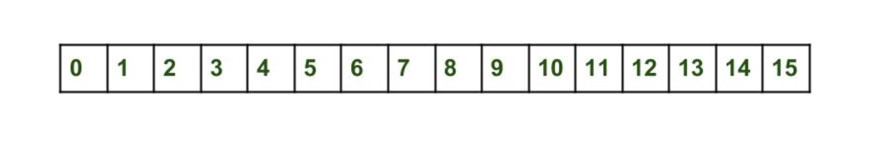
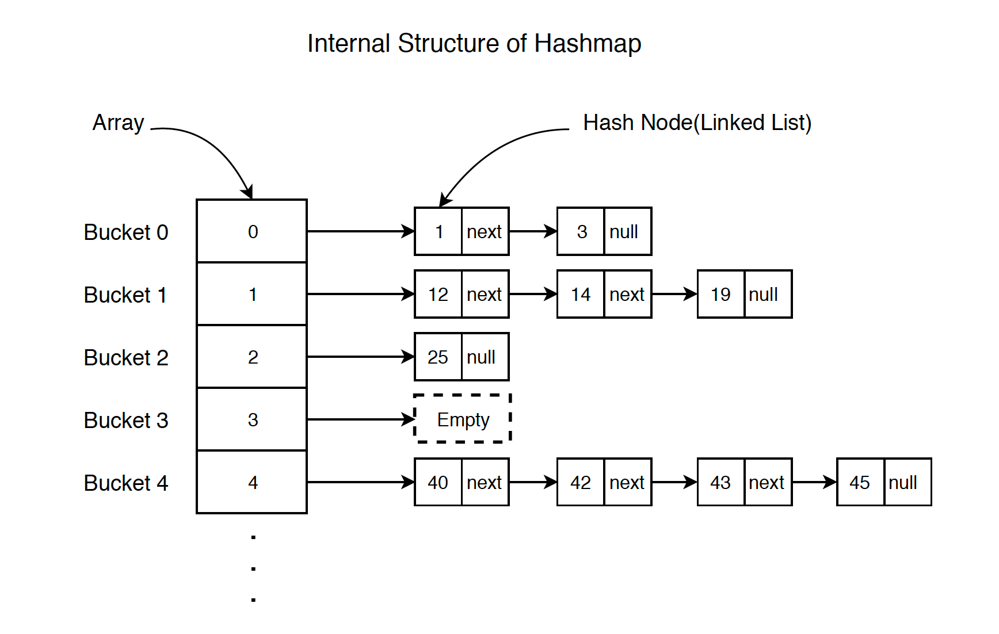

<details>
<summary>Lesson 39. HashMap. What's "under the hood"</summary>

In this lesson, we will look at how hashmap's get and put methods work internally. What operations are being performed? How hashing happens. How the value is extracted by the key. How the key-value pair is stored.
The previous article said that HashMap contains an array Node, and Node can represent a class with the following objects:

- int hash
- K key (key)
- V value (value)
- Node next (next)
  Now we will look at how it works. First, let's look at the hashing process.

## Hashing

Hashing is the process of converting an object into an integer form using the `hashCode()` method. It is important to write the `hashCode()` method correctly for the best `HashMap` performance. Here I take the key of my class so that I can override the `hashCode()` method and show different scenarios. My `Key` class:

```java
class Key
{
  String key;
  Key(String key)
  {
    this.key = key;
  }
  
  @Override
  public int hashCode() 
  {
     return (int)key.charAt(0);
  }

  @Override
  public boolean equals(Object obj)
  {
    return key.equals((String)obj);
  }
}
```
Here, the redefined `hashCode()` method returns the ASCII value of the first character as a hash code. Therefore, every time the first character of the key is the same, the hash code will be the same. You should not use these criteria in your program. It's just for demonstration. Since HashMap also allows null as a key, the null hash code will always be 0.

hashCode() method: The hashCode() method is used to get the hash code of an object. The hashCode() method of the object class returns a reference to the object's memory in integer form. The definition of the hashCode() method is public native hashCode(). This indicates that the hashCode() implementation is native, since there is no direct method in Java to get a reference to an object. You can provide your own hashCode() implementation.
In HashMap, hashCode() is used to calculate the bucket and hence the index.

equals() method: This method is used to check the equality of two objects. This method is provided by the Object class. You can override it in your class to provide your own implementation.
HashMap uses equals() to compare keys for equality. If the equals() method returns true, they are equal, otherwise they are not equal.

## Buckets

The bucket is an element of the HashMap array. It is used to store nodes. Two or more nodes can have the same bucket. In this case, the linked list structure is used to connect the nodes. Baskets have different capacities. The relationship between the bucket and the capacity is as follows:
``java
capacity = number of buckets * load factor
``
One bucket can contain more than one node, it depends on the hashCode() method. The better your hashCode() method is, the better your buckets will be used.

## Calculating the index in HashMap

The hash code of the key can be large enough to create an array. The generated hash code can be in the integer range, and if we create arrays for such a range, it will easily cause an OutOfMemoryException. Therefore, we generate an index to minimize the size of the array. To calculate the index, the following operation is performed.
``java
index = hashCode(key) & (n-1).
``
where n is the number of buckets or the size of the array. In our example, I consider n as the standard size, which is 16.

## Why is the above method used to calculate the index?

Using the bitwise AND operator is similar to bit masking, which takes into account only the lower bits of the hash integer. This, in turn, provides a very efficient method for calculating the modulus based on the hashmap length.

## Initially empty HashMap
Here the hashmap size is assumed to be 16.
```java
HashMap map = new HashMap();
```



Inserting a key-value pair: Put one key-value pair in the HashMap specified above


``map.put(new Key("java"), 20);``
Steps:
1. Calculate the hash code of the key {“java”}. It will be equal to 118.
2. Calculate the index using the index method, it will be equal to 6.
3. Create a node object as follows:
```java
{
int hash = 118

// {"java"} is not a string, but
// an object of the Key class
  Key key = {"java"}
  Integer value = 20
  Node next = null
}
```
4. Place this object on index 6 if there is no other object there.

Inserting another key-value pair: Now let's put another pair, that is:

```map.put(new Key("python"), 30);```
Steps:
1. Calculate the hash code of the key {“python”}. It will be equal to 115.
2. Calculate the index using the index method, it will be equal to 3.
3. Create a node object as follows:

```java
{
  int hash = 115
  Key key = {"python"}
  Integer value = 30
  Node next = null
}
```
In case of a collision: Now let's put another pair, that is:


```map.put(new Key("golang"), 40);```
Steps:
1. Calculate the hash code of the key {“golang”}. It will be equal to 118.
2. Calculate the index using the index method, it will be equal to 6.
3. Create a node object as follows:


```java
{
  int hash = 118
  Key key = {"golang"}
  Integer value = 40
  Node next = null
}
```
Place this object on index 6 if there is no other object there.
In this case, the node object is detected at index 6 – this is a collision case.
In this case, check with the `hashCode()` and `equals()` methods whether both keys are the same.
If the keys are the same, replace the value with the current value.
Otherwise, connect this node object to the previous node object via a linked list, and both will be stored at index 6.
Now the HashMap looks like this:
3_hasharray

### Using the get() method

Now let's try some `get` methods to get the value. The `get(K key)` method is used to get the value by its key. If you do not know the key, it is not possible to extract the value.

Get the data for the python key:

```java
map.get(new Key("python"));  
```


Steps:
1. Calculate the hash code of the key {“python”}. It will be equal to 115.
2. Calculate the index using the index method, it will be equal to 3.
3. Go to the index 3 of the array and compare the key of the first element with the specified key. If both keys match, return the value, otherwise check the next element if it exists.
   In our case, it is found as the first element, and the return value is 30.

Get the data for the golang key:

```map.get(new Key("golang"));```

Steps:
1. Calculate the hash code of the key {“golang”}. It will be equal to 118.
2. Calculate the index using the `index` method, it will be equal to 6.
3. Go to index 6 of the array and compare the key of the first element with the specified key. If both keys match, return the value, otherwise check the next element if it exists.
   In our case, the first element is not found, and the next node object is not `null'.
   If the next node is `null', return `null'.
   If the node's `next` is not `null`, go to the second element and repeat step 3 until the key is found or next is `null'.
   The time complexity is almost constant for the put and get methods until the rehashing occurs.
   In case of a collision, i.e. the indexes of two or more nodes match, the nodes are connected by a linked list, i.e. the second node refers to the first, and the third to the second, and so on.
   If this key already exists in the `HashMap`, the value is replaced with a new value.
   The hash code of the `null` key is 0.
   When an object is received by its key, the linked list is viewed until the key matches or `null` is found in the next field.



</details>

------------


<details>
<summary>Урок 39. HashMap. Что "под капотом"</summary>

В этом уроке мы рассмотрим, как внутренне работают методы get и put у hashmap. Какие операции выполняются? Как происходит хеширование. Как значение извлекается по ключу. Как хранится пара ключ-значение.
В предыдущей статье говорилось, что HashMap содержит массив Node, и Node может представлять класс со следующими объектами:

- int hash
- K key (ключ)
- V value (значение)
- Node next (следующий)
  Теперь мы рассмотрим, как это работает. Сначала рассмотрим процесс хеширования.

## Хеширование

Хеширование - это процесс преобразования объекта в целочисленную форму с использованием метода `hashCode()`. Важно правильно написать метод `hashCode()` для лучшей производительности `HashMap`. Здесь я беру ключ моего класса, чтобы мог переопределить метод `hashCode()` и показать разные сценарии. Мой класс `Key`:

```java
class Key
{
  String key;
  Key(String key)
  {
    this.key = key;
  }
  
  @Override
  public int hashCode() 
  {
     return (int)key.charAt(0);
  }

  @Override
  public boolean equals(Object obj)
  {
    return key.equals((String)obj);
  }
}
```
Здесь переопределенный метод `hashCode()` возвращает ASCII-значение первого символа в качестве хеш-кода. Поэтому каждый раз, когда первый символ ключа одинаков, хеш-код будет одинаковым. Вы не должны использовать эти критерии в вашей программе. Это просто для демонстрации. Поскольку HashMap также допускает null в качестве ключа, хеш-код null всегда будет 0.

Метод hashCode(): метод hashCode() используется для получения хеш-кода объекта. Метод hashCode() класса object возвращает ссылку на память объекта в целочисленной форме. Определение метода hashCode() - public native hashCode(). Это указывает на то, что реализация hashCode() является нативной, так как в Java нет прямого метода для получения ссылки на объект. Вы можете предоставить свою реализацию hashCode().
В HashMap hashCode() используется для вычисления корзины и, следовательно, индекса.

Метод equals(): этот метод используется для проверки равенства двух объектов. Этот метод предоставляется классом Object. Вы можете переопределить его в вашем классе, чтобы предоставить свою реализацию.
HashMap использует equals() для сравнения ключей на равенство. Если метод equals() возвращает true, они равны, в противном случае - не равны.

## Корзины (Buckets)

Корзина - это элемент массива HashMap. Она используется для хранения узлов. Два или более узлов могут иметь одну и ту же корзину. В этом случае используется структура связанного списка для соединения узлов. Корзины имеют разную вместимость. Связь между корзиной и вместимостью следующая:
```java
capacity = number of buckets * load factor
```
Одна корзина может содержать более одного узла, это зависит от метода hashCode(). Чем лучше ваш метод hashCode(), тем лучше будут использоваться ваши корзины.

## Вычисление индекса в HashMap

Хеш-код ключа может быть достаточно большим для создания массива. Сгенерированный хеш-код может находиться в диапазоне integer, и если мы создадим массивы для такого диапазона, это легко вызовет исключение outOfMemoryException. Поэтому мы генерируем индекс для минимизации размера массива. Для вычисления индекса выполняется следующая операция.
```java
index = hashCode(key) & (n-1).
```
где n - это количество корзин или размер массива. В нашем примере я рассматриваю n как стандартный размер, который равен 16.

## Почему для вычисления индекса используется указанный выше метод?

Использование побитового оператора AND аналогично маскировке битов, при которой учитываются только младшие биты целого числа хеша. Это, в свою очередь, предоставляет очень эффективный метод вычисления модуля на основе длины hashmap.

## Изначально пустой HashMap
Здесь размер hashmap принимается равным 16.
```java
HashMap map = new HashMap();
```


Вставка пары ключ-значение: Поместим одну пару ключ-значение в указанный выше HashMap


```map.put(new Key("java"), 20);```  
Шаги:
1. Вычислить хеш-код ключа {“java”}. Он будет равен 118.
2. Вычислить индекс с использованием метода index, он будет равен 6.
3. Создать объект узла следующим образом:
```java
{
  int hash = 118
  
  // {"java"} - это не строка, а
  // объект класса Key
  Key key = {"java"}
  Integer value = 20
  Node next = null
}
```
4. Разместите этот объект на индексе 6, если там нет другого объекта.

Вставка другой пары ключ-значение: Теперь поместим другую пару, то есть:

```map.put(new Key("python"), 30);```
Шаги:
1. Вычислить хеш-код ключа {“python”}. Он будет равен 115.
2. Вычислить индекс с помощью метода index, он будет равен 3.
3. Создать объект узла следующим образом:

```java
{
  int hash = 115
  Key key = {"python"}
  Integer value = 30
  Node next = null
}
```
В случае коллизии: Теперь поместим еще одну пару, то есть:


```map.put(new Key("golang"), 40);```
Шаги:
1. Вычислить хеш-код ключа {“golang”}. Он будет равен 118.
2. Вычислить индекс с помощью метода index, он будет равен 6.
3. Создать объект узла следующим образом:


```java
{
  int hash = 118
  Key key = {"golang"}
  Integer value = 40
  Node next = null
}
```
Разместите этот объект на индексе 6, если там нет другого объекта.
В этом случае объект узла обнаруживается на индексе 6 – это случай коллизии.
В таком случае проверьте с помощью методов `hashCode()` и `equals()`, являются ли оба ключа одинаковыми.
Если ключи одинаковы, замените значение текущим значением.
В противном случае соедините этот объект узла с предыдущим объектом узла через связанный список, и оба будут храниться на индексе 6.
Теперь HashMap выглядит следующим образом:
3_hasharray

### Использование метода get()

Теперь давайте попробуем некоторые методы `get`, чтобы получить значение. Метод `get(K key)` используется для получения значения по его ключу. Если вы не знаете ключ, то не возможно извлечь значение.

Получите данные для ключа python:

```java
map.get(new Key("python"));  
```


Шаги:
1. Вычислить хеш-код ключа {“python”}. Он будет равен 115.
2. Вычислить индекс с помощью метода index, он будет равен 3.
3. Перейти к индексу 3 массива и сравнить ключ первого элемента с указанным ключом. Если оба ключа совпадают, верните значение, в противном случае проверьте следующий элемент, если он существует.
   В нашем случае он найден как первый элемент, и возвращаемое значение равно 30.

Получите данные для ключа golang:

```map.get(new Key("golang"));```

Шаги:
1. Вычислить хеш-код ключа {“golang”}. Он будет равен 118.
2. Вычислить индекс с помощью метода `index`, он будет равен 6.
3. Перейти к индексу 6 массива и сравнить ключ первого элемента с указанным ключом. Если оба ключа совпадают, верните значение, в противном случае проверьте следующий элемент, если он существует.
   В нашем случае первый элемент не найден, и следующий объект узла не равен `null`.
   Если следующий узел равен `null`, верните `null`.
   Если `next` узла не равен `null`, перейдите ко второму элементу и повторите шаг 3 до тех пор, пока ключ не будет найден или next не будет равен `null`.
   Временная сложность практически постоянна для методов put и get, пока не произойдет перехэширование.
   В случае коллизии, т.е. индексы двух или более узлов совпадают, узлы соединяются связанным списком, т.е. второй узел ссылается на первый, а третий на второй и так далее.
   Если данный ключ уже существует в `HashMap`, значение заменяется новым значением.
   Хеш-код `null` ключа равен 0.
   При получении объекта по его ключу связанный список просматривается до тех пор, пока ключ не совпадет или в поле next не найдется `null`.


</details>


