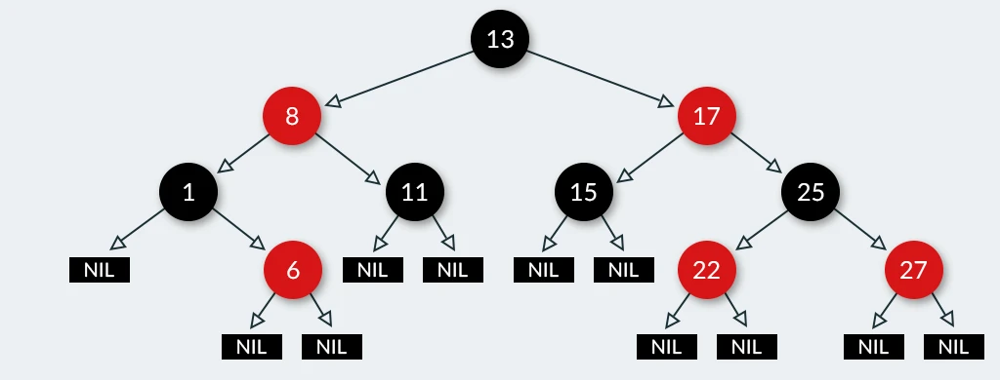
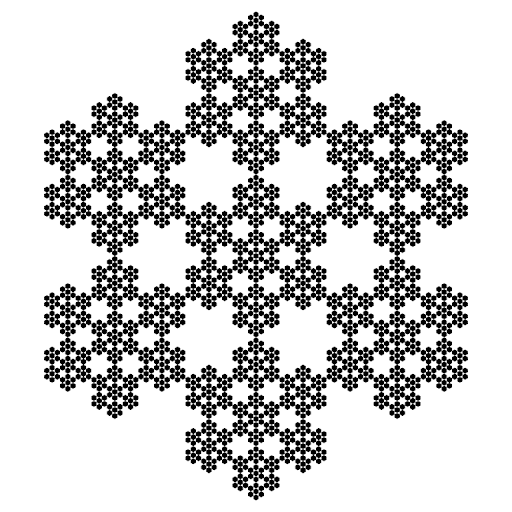
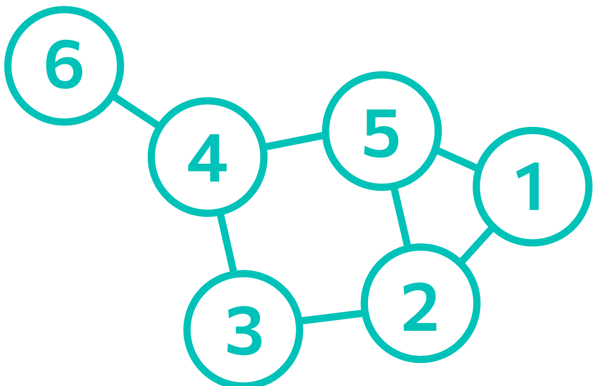

<details>
<summary>Lesson 40. Tree as data structure</summary>

# Lesson 40. Tree as data structure

## Introduction

A tree is a popular data structure that is nonlinear in nature. Unlike other data structures like arrays, stacks,
queues, and linked lists, which are linear, a tree is a hierarchical structure. The order of the tree is not important.
A tree consists of nodes and 2 pointers. These two pointers are the left child and the right child elements of the
parent node.

1. **Root** of the Tree - This is the topmost node of the tree, which doesn't have a parent node. Every tree has only
   one root node.

2. **Edge** Acts as the connecting link between the parent node and the child node.

3. **Node** that has no child elements is called a leaf node. This is the last node in the tree. A tree can have
   multiple leaf nodes.

4. **Subtree of a Node** - This is a tree considering this particular node as the root node.

5. **Depth of a Node** - This is the distance from the root node to this particular node.

6. **Height of a Node** - This is the distance from this node to the deepest node of this subtree.

7. **Height of the Tree** - This is the maximum height of any node. It is the same as the height of the root node.

## Why Use Trees?

1. One reason to use trees might be because you want to store information that naturally forms a hierarchy. For example,
   a computer's file system.

2. Trees (with some sorting, like BST) provide moderate access/search (faster than Linked Lists and slower than arrays).

3. Trees offer moderate insertion/deletion (faster than arrays and slower than unordered linked lists).

4. Like linked lists and unlike arrays, trees don’t have an upper limit on the number of nodes as nodes are linked using
   pointers.

## The main applications of trees include:

- Working with hierarchical data.
- Simplifying the search for information (see tree traversal).
- Managing sorted lists of data.
- As a workflow for compositing digital images for visual effects.
- Router algorithms.
- Multistage decision-making (see business chess).

### Properties of a Binary Tree

- The maximum number of nodes at level \( l \) of a binary tree is \( 2^l \). Here, a level is the number of nodes on
  the path from the root to the node (including the root and the node). The level of the root is 0.

- The maximum number of nodes in a binary tree of height \( h \) is \( 2^h - 1 \). Here, the height of the tree is the
  maximum number of nodes on the path from the root to a leaf. The height of a tree with one node is considered to be 1.

- In a binary tree with \( N \) nodes, the minimum possible height or the minimum number of levels is \( \log_2 (
  N+1) \).

- A binary tree with \( L \) leaves has at least \( \lceil \log_2 L \rceil + 1 \) levels.

- In a binary tree where each node has either 0 or 2 children, the number of leaf nodes is always one more than the
  number of nodes with two children.

- In a non-empty binary tree, if \( n \) is the total number of nodes, and \( e \) is the total number of edges, then \(
  e = n - 1 \).

### Types of Binary Tree

#### Full (Complete) Binary Tree

This is a special type of binary tree where every parent/internal node has either two child nodes or none. It is also
known as a proper binary tree.

```plaintext
               18                      18                      18
           /       \                 /    \                 /     \
         15         30             15     20              40       30
        /  \        /  \          /  \                            /  \
      40    50    100   40      40    50                        100   40
                              /   \
                             30   50
```

### Complete Binary Tree

A binary tree is considered a Complete Binary Tree if all levels are fully filled, except possibly for the last level,
and the keys on the last level are left as far as possible.

A complete binary tree is similar to a full binary tree but with two main differences:

- Each level must be fully filled.
- All leaf elements must lean to the left. The last leaf element may not have a right sibling, meaning a complete binary
  tree doesn't necessarily have to be a full binary tree.

```plaintext
               18
           /       \
         15         30
        /  \        /  \
      40    50    100   40
```

### Balanced Binary Tree

A binary tree is considered balanced if its height is \( O(\log n) \), where \( n \) is the number of nodes. For
example, AVL trees maintain a height of \( O(\log n) \) by ensuring that the difference between the heights of the left
and right subtrees does not exceed 1. Red-black trees maintain a height of \( O(\log n) \) by ensuring that the number
of black nodes on every path from the root to the leaf is the same, and there are no adjacent red nodes. Balanced binary
search trees are good in terms of performance as they provide \( O(\log n) \) time for search, insert, and delete
operations. AVL is an acronym formed from the first letters of its Soviet inventors Adelson-Velsky and Landis.

```plaintext
                              76
                    /                   \
                   3                   108
              /         \             /     \
             1          -13          15     205
           /   \                          /    \
          5      5                      205     205
          
          
          
      10                                           10
      /                                             \
    20                                               20
    /                                                 \
  30                                                   30
  /                                                     \
 40                                                      40
Двоичное дерево с наклоном влево                Двоичное дерево с наклоном вправо
```

### Red-Black Tree

Red-Black Tree (RB tree) is a type of self-balancing binary search tree that guarantees logarithmic growth in the height
of the tree with the number of nodes and allows for fast execution of basic search tree operations: addition, deletion,
and node search. Balance is achieved by introducing an additional attribute to the node of the tree—“color.” This
attribute can take one of two possible values—"black" or "red." Red-Black trees are used for organizing comparable data,
such as text fragments or numbers. Leaf nodes of Red-Black trees do not contain data, thus eliminating the need for
memory allocation—a null pointer in the parent node as a pointer to the offspring is sufficient. However, in some
implementations, explicit leaf nodes may be used for algorithmic simplicity. Examples include TreeMap, TreeSet.

```plaintext
                              13
                    /                   \
                   8                     17
              /         \         /            \
             1          11       15            25
          /     \     /    \    /  \        /       \
        null     6  null  null null null  22        27
               /   \                    /   \      /   \
             null  null             null  null   null  null
```

|              | Average  | Worst Case |
|--------------|----------|------------|
| Memory Usage | O(n)     | O(n)       |
| Search       | O(log n) | O(log n)   |
| Insertion    | O(log n) | O(log n)   |
| Deletion     | O(log n) | O(log n)   |

## B-tree

A B-tree (pronounced as "Bee-tree" in English) is a data structure, a search tree. From the perspective of its external
logical representation, it's a balanced and highly branching tree. It is often used for storing data in external memory.
The B-tree structure is utilized for organizing indexes in many modern databases.

```plaintext
                    [17, 35]
            /          |          \
      [5, 11]         [22]        [41, 50]
     /    |   \      /    \      /     |     \
 [2, 3] [7, 9] [12] [18, 21] [36] [40] [44, 48]

```

</details>

------------

<details>
<summary>Урок 40. Деревья, как структура данных</summary>

# Урок 40. Деревья, как структура данных

## Введение

Дерево — это популярная структура данных, нелинейная по своей природе. В отличие от других структур данных, таких как
массив, стек, очередь и связанный список, которые имеют линейный характер, дерево представляет собой иерархическую
структуру. Информация о порядке дерева не важна. Дерево содержит узлы и 2 указателя. Эти два указателя являются левым
дочерним и правым дочерними элементами родительского узла.

1. **Корень дерева** — это самый верхний узел дерева, у которого нет родительского узла. В каждом дереве есть только
   один корневой узел.

2. **Ребро выступает** в качестве связующего звена между родительским узлом и дочерним узлом.

3. **Узел**, у которого нет дочерних элементов, называется листовым узлом. Это последний узел дерева. В дереве может
   быть несколько листовых узлов.

4. **Поддерево узла** — это дерево, рассматривающее этот конкретный узел как корневой узел.

5. **Глубина узла** — это расстояние от корневого узла до этого конкретного узла.

6. **Высота узла** — это расстояние от этого узла до самого глубокого узла этого поддерева.

7. **Высота дерева** — это максимальная высота любого узла. Это то же самое, что и высота корневого узла.

## Зачем использовать деревья?

1. **Одна из причин использования деревьев** может заключаться в том, что вы хотите хранить информацию, которая
   естественным образом образует иерархию. Например, файловая система на компьютере.
2. **Деревья (с некоторым упорядочением, например, BST)** обеспечивают умеренный доступ/поиск (быстрее, чем связанный
   список, и медленнее, чем массивы).
3. **Деревья обеспечивают умеренную вставку/удаление** (быстрее, чем массивы, и медленнее, чем неупорядоченные связанные
   списки).
4. **Подобно связанным спискам и в отличие от массивов**, деревья не имеют верхнего предела количества узлов, поскольку
   узлы связаны с помощью указателей.

### К основным сферам применения деревьев относятся:

- Работа с иерархическими данными.
- Упростите поиск информации (см. обход дерева).
- Управление отсортированными списками данных.
- В качестве рабочего процесса для компоновки цифровых изображений для визуальных эффектов.
- Алгоритмы маршрутизатора.
- Форма многоступенчатого принятия решений (см. деловые шахматы).

## Свойства бинарного дерева

1. **Максимальное количество узлов на уровне l** бинарного дерева равно \(2^l\). Здесь уровень — это количество узлов на
   пути от корня к узлу (включая корень и узел). Уровень корня равен 0.
2. **Максимальное количество узлов в бинарном дереве высоты 'h'** равно \(2^h - 1\). Здесь высота дерева — это
   максимальное количество узлов на пути от корня до листа. Высота дерева с одним узлом считается равной 1.
3. **В двоичном дереве с N узлами минимально возможная высота** или минимальное количество уровней составляет \(
   \log_2 (N+1) \).
4. **Двоичное дерево с L листьями** имеет не менее \( \lceil \log_2 L \rceil + 1 \) уровней.
5. **В двоичном дереве, где каждый узел имеет 0 или 2 дочерних элемента,** количество листовых узлов всегда на один
   больше, чем узлов с двумя дочерними элементами.
6. **В непустом бинарном дереве,** если \( n \) — общее количество узлов, а \( e \) — общее количество ребер, то \( e =
   n-1 \).

## Типы бинарного дерева

### Полное (Full) бинарное дерево

Это особый тип бинарного дерева, в котором каждый родительский узел/внутренний узел имеет либо двух дочерних элементов,
либо ни одного. Он также известен как правильное бинарное дерево.

```plaintext
               18                      18                      18
           /       \                 /    \                 /     \
         15         30             15     20              40       30
        /  \        /  \          /  \                            /  \
      40    50    100   40      40    50                        100   40
                              /   \
                             30   50
```

## Заполненное двоичное дерево

Двоичное дерево является заполненным (Complete) двоичным деревом, если все уровни полностью заполнены, за исключением,
возможно, последнего уровня, а на последнем уровне все ключи оставлены максимально возможным образом.

Заполненное бинарное дерево похоже на полное бинарное дерево, но с двумя основными отличиями:

Каждый уровень должен быть полностью заполнен.
Все элементы листа должны наклоняться влево.
У последнего листового элемента может не быть правильного родственного элемента, т. е. заполненное бинарное дерево не
обязательно должно быть полным бинарным деревом.

```plaintext
               18
           /       \
         15         30
        /  \        /  \
      40    50    100   40
```

## Сбалансированное двоичное дерево.

Двоичное дерево является сбалансированным, если высота дерева равна O (Log n), где n — количество узлов. Например,
дерево AVL поддерживает высоту O(Log n), следя за тем, чтобы разница между высотами левого и правого поддеревьев не
превышала 1. Красно-черные деревья поддерживают высоту O(Log n), следя за тем, чтобы число черных узлов на
каждом пути от корня к листу одинаково, и нет соседних красных узлов. Сбалансированные деревья двоичного поиска хороши
с точки зрения производительности, поскольку они обеспечивают время O (log n) для поиска, вставки и удаления.
АВЛ — аббревиатура, образованная первыми буквами создателей (советских учёных) Адельсон-Вельского Георгия Максимовича
и Ландиса Евгения Михайловича.

```plaintext
                              76
                    /                   \
                   3                   108
              /         \             /     \
             1          -13          15     205
           /   \                          /    \
          5      5                      205     205
          
          
          
      10                                           10
      /                                             \
    20                                               20
    /                                                 \
  30                                                   30
  /                                                     \
 40                                                      40
Двоичное дерево с наклоном влево                Двоичное дерево с наклоном вправо
```

## Красно-чёрное дерево

Красно-чёрное дерево (англ. red-black tree, RB tree) — один из видов самобалансирующихся двоичных деревьев поиска,
гарантирующих логарифмический рост высоты дерева от числа узлов и позволяющее быстро выполнять основные операции дерева
поиска: добавление, удаление и поиск узла. Сбалансированность достигается за счёт введения дополнительного атрибута узла
дерева — «цвета». Этот атрибут может принимать одно из двух возможных значений — «чёрный» или «красный».
Красно-чёрное дерево используется для организации сравнимых данных, таких как фрагменты текста или числа. Листовые узлы
красно-чёрных деревьев не содержат данных, благодаря чему не требуют выделения памяти — достаточно записать в
узле-предке в качестве указателя на потомка нулевой указатель. Однако в некоторых реализациях для упрощения алгоритма
могут использоваться явные листовые узлы.
Пример TreeMap, TreeSet



```plaintext
                              13
                    /                   \
                   8                     17
              /         \         /            \
             1          11       15            25
          /     \     /    \    /  \        /       \
        null     6  null  null null null  22        27
               /   \                    /   \      /   \
             null  null             null  null   null  null
```

|               | В среднем | В худшем случае |
|---------------|-----------|-----------------|
| Расход памяти | O(n)      | O(n)            |
| Поиск         | O(log n)  | O(log n)        |
| Вставка       | O(log n)  | O(log n)        |
| Удаление      | O(log n)  | O(log n)        |

## B-дерево

B-дерево (произносится как Би-дерево) — структура данных, дерево поиска. С точки зрения внешнего логического
представления — сбалансированное, сильно ветвистое дерево. Часто используется для хранения данных во внешней памяти.
Структура B-дерева применяется для организации индексов во многих современных СУБД.

```plaintext
                    [17, 35]
            /          |          \
      [5, 11]         [22]        [41, 50]
     /    |   \      /    \      /     |     \
 [2, 3] [7, 9] [12] [18, 21] [36] [40] [44, 48]

```

## Применение:

Деревья используются во многих аспектах программирования:

 - **Структура файловой системы:** Где каталоги и файлы представлены в виде дерева.
 - **Базы данных:** Деревья (например, B-деревья) используются для индексации для ускорения поиска.
 - **Парсинг языков программирования:** Абстрактные синтаксические деревья используются для анализа и выполнения кода.
 - **Игровые движки:** Для управления сценами и объектами.
 - **Алгоритмы поиска и сортировки:** Бинарные поисковые деревья, AVL деревья, красно-черные деревья и т.д.

## Фракталы и Деревья

Фрактал - это сложная структура, которая может быть разделена на части, каждая из которых является уменьшенной копией
целого. Это понятие тесно связано с рекурсивной природой деревьев.



### Применение Фракталов

 - **Визуализация данных:** Фрактальная геометрия используется для создания более интуитивно понятных и информативных
визуализаций больших наборов данных.
 - **Компьютерная графика:** Для создания сложных и реалистичных изображений природы (например, деревьев, гор, облаков).
 - **Оптимизация алгоритмов:** Фрактальные алгоритмы могут применяться в алгоритмах поиска и оптимизации.
 - **Криптография:** Некоторые алгоритмы шифрования используют фрактальную математику.
 - **Игровые и симуляционные системы:** Для создания реалистичных ландшафтов и сред.

### Переход от Деревьев к Фракталам

Деревья в программировании могут служить основой для понимания фрактальных структур. Оба этих понятия используют
рекурсивные методы для решения задач или представления данных. Фракталы, такие как фрактальное дерево Пифагора или
множество Мандельброта, демонстрируют, как простая рекурсивная формула может создавать сложные и красивые структуры,
напоминающие деревья.

# Граф


</details>


