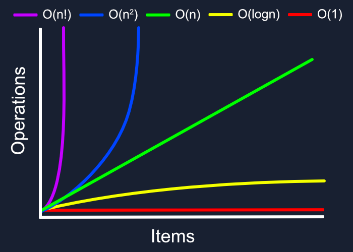

## Collections in Java

Любая группа отдельных объектов, представленных как единое целое, называется коллекцией объектов Java. В Java в JDK 1.2 определена отдельная структура под названием "Collection Framework", которая содержит все классы и интерфейсы коллекций Java.

В Java интерфейс коллекции ``(java.util.Collection)`` и интерфейс Map ``(java.util.Map)`` — два основных «корневых» интерфейса классов коллекций Java.

<p align="center">
  
</p>

---

**Какой из следующих интерфейсов наиболее подходящий для представления упорядоченного списка объектов?**

- A) List
- B) Set
- C) Map
- D) Queue

Правильный ответ — **A) List**.

**List** — это интерфейс, который представляет собой упорядоченный список объектов, где элементы могут быть доступны по индексу, и порядок их добавления сохраняется. Это делает его наилучшим выбором для представления упорядоченного списка объектов.

- **Set** не гарантирует порядок элементов.
    
- **Map** представляет коллекцию пар "ключ-значение", а не просто список объектов.
    
- **Queue** представляет очередь, где элементы обрабатываются в порядке FIFO (First-In-First-Out), что тоже не подходит для упорядоченного списка.

---
````
Feedback

List представляет упорядоченную коллекцию, где элементы могут дублироваться.
````
___


**В какой коллекции порядок элементов гарантированно сохраняется?**

- A) HashSet
- B) LinkedHashSet
- C) TreeSet
- D) HashMap

Правильный ответ — **B) LinkedHashSet**.

**LinkedHashSet** — это коллекция, которая гарантированно сохраняет порядок элементов, в котором они были добавлены. В отличие от **HashSet**, который не сохраняет порядок, и **TreeSet**, который упорядочивает элементы по их естественному порядку или по заданному компаратору, **LinkedHashSet** сохраняет порядок вставки.

- **HashSet** не сохраняет порядок элементов.
    
- **TreeSet** упорядочивает элементы в естественном порядке или с использованием компаратора.
    
- **HashMap** сохраняет порядок по ключам, но сам по себе порядок значений не гарантируется.


Таким образом, **LinkedHashSet** — это коллекция, где порядок элементов сохраняется.

___
````
Feedback

В LinkedHashSet порядок элементов сохраняется в порядке их вставки.
````
___


**Какая коллекция автоматически сортирует элементы?**

- A) HashSet
- B) LinkedHashSet
- C) TreeSet
- D) LinkedList

Правильный ответ — **C) TreeSet**.

**TreeSet** автоматически сортирует элементы. Он реализует интерфейс **Set** и использует дерево для хранения элементов, что позволяет автоматически поддерживать их в отсортированном порядке, используя их естественный порядок или заданный компаратор.

- **HashSet** не сортирует элементы.
    
- **LinkedHashSet** сохраняет порядок добавления элементов, но не сортирует их.
    
- **LinkedList** сохраняет элементы в порядке их добавления, но не сортирует их автоматически.


Таким образом, **TreeSet** — это коллекция, которая автоматически сортирует элементы.
___
````
Feedback

TreeSet автоматически сортирует элементы по естественному порядку или с использованием компаратора.
````
___


***В каком из классов допускаются ключи с null?***

- A) TreeMap
- B) HashMap
- C) LinkedHashMap
- D) HashSet

Правильный ответ — **B) HashMap**.

**HashMap** допускает ключи с **null**. Вы можете использовать **null** в качестве ключа в **HashMap** (максимум один ключ с **null**), и он будет работать корректно. Это не так для **TreeMap**, где ключи должны быть сравнимыми, и **null** не поддерживается, потому что компаратор или естественный порядок не могут быть применены к **null**.

- **TreeMap** не поддерживает ключи с **null**.
- **LinkedHashMap** поддерживает ключи с **null**, как и **HashMap**.
- **HashSet** также поддерживает **null** в качестве элемента, поскольку он основан на **HashMap**.

Таким образом, **HashMap** — это класс, где допускаются ключи с **null**.

___


**Какая структура представляет последовательность элементов в порядке "первым пришел, первым ушел" (FIFO)?**

- A) Stack
- B) Queue
- C) List
- D) Set

Правильный ответ — **Queue**.

**Queue** (очередь) представляет структуру данных, которая работает по принципу "первым пришел, первым ушел" (FIFO, First-In-First-Out). Это означает, что элементы, добавленные в очередь первыми, будут удаляться первыми.

- **Queue** — это интерфейс, реализующий структуру данных для обработки элементов в порядке их добавления (FIFO).
- Другие структуры данных, такие как **Stack** (стек), работают по принципу LIFO (Last-In-First-Out), где последний элемент, добавленный в структуру, удаляется первым.

___
```
Feedback
Очередь (Queue) представляет структуру данных в порядке FIFO.
```
___


**Какой класс представляет структуру данных "последний пришел, первым ушел" (LIFO)?**

- A) Stack
- B) Queue
- C) ArrayList
- D) TreeSet

Правильный ответ — **Stack**.

**Stack** (стек) представляет структуру данных, которая работает по принципу "последний пришел, первым ушел" (LIFO, Last-In-First-Out). Это означает, что последний элемент, добавленный в стек, будет удалён первым.

- **Stack** — класс, реализующий структуру данных стек, где элементы добавляются и удаляются с одного конца, называемого вершиной стека.

Стеки используются в различных задачах, таких как управление вызовами функций, обработка обратных польских записей и многие другие.

---
```
Feedback
Stack представляет структуру данных в порядке LIFO.
```
---


**Какой из классов реализует двусвязный список?**

- A) ArrayList
- B) LinkedList
- C) HashSet
- D) TreeSet

Правильный ответ — **LinkedList**.

**LinkedList** реализует двусвязный список. В двусвязном списке каждый элемент (узел) содержит ссылку как на следующий, так и на предыдущий элемент, что позволяет эффективно перемещаться в обоих направлениях.

- **LinkedList** — это класс, который реализует интерфейсы **List** и **Deque**, и представляет собой двусвязный список.
- Другие структуры данных, такие как **ArrayList**, основаны на массиве и не являются двусвязными списками.

Таким образом, **LinkedList** — это класс, который реализует двусвязный список.

---


**Что характерно для Set?**

- A) Сохраняет порядок элементов
- B) Позволяет дублирование элементов
- C) Не допускает дублирование элементов
- D) Использует ключ-значение

Правильный ответ — **C) Не допускает дублирование элементов**.

**Set** — это коллекция, которая **не допускает дублирование элементов**. В отличие от **List**, где могут быть повторяющиеся элементы, в **Set** каждый элемент уникален. Однако порядок элементов в **Set** не гарантируется, если только это не специфическая реализация, такая как **LinkedHashSet**, которая сохраняет порядок добавления.

- **A) Сохраняет порядок элементов** — не всегда, это зависит от реализации (например, **HashSet** не сохраняет порядок, а **LinkedHashSet** сохраняет).
- **B) Позволяет дублирование элементов** — это неверно для **Set**, так как **Set** не допускает дублирования.
- **D) Использует ключ-значение** — это свойственно структурам данных, таким как **Map**, а не **Set**.

Таким образом, **Set** — это коллекция, которая не допускает дублирования элементов.

---


**Какой интерфейс использует пары "ключ-значение"?**

- A) List
- B) Set
- C) Map
- D) Queue

Правильный ответ — **C) Map**.

**Map** — это интерфейс, который представляет коллекцию пар "ключ-значение". В **Map** каждый ключ связан с одним значением, и каждый ключ в коллекции уникален. Это позволяет эффективно искать значения по ключу.

- **List** — представляет коллекцию элементов, где порядок элементов важен, но не поддерживает пару "ключ-значение".
- **Set** — представляет коллекцию уникальных элементов, но не использует пару "ключ-значение".
- **Queue** — представляет очередь, где элементы обрабатываются в порядке FIFO, и также не использует пару "ключ-значение".

Таким образом, для пар "ключ-значение" используется интерфейс **Map**.

---


**Какой из классов обеспечивает постоянное время выполнения для основных операций, таких как add, remove и contains?**

- A) TreeSet
- B) HashSet
- C) LinkedList
- D) TreeMap

Правильный ответ — **B) HashSet**.

**HashSet** обеспечивает постоянное время выполнения (O(1)) для основных операций, таких как **add**, **remove** и **contains** в среднем случае. Это связано с тем, что **HashSet** использует хеш-таблицу для хранения элементов, что позволяет быстро находить элементы, добавлять их и удалять.

- **TreeSet** имеет логарифмическое время выполнения для основных операций (O(log n)), так как элементы хранятся в отсортированном порядке.
- **LinkedList** имеет линейное время выполнения (O(n)) для операций **add**, **remove** и **contains** в худшем случае, так как элементы должны быть пройдены по списку.
- **TreeMap** также имеет логарифмическое время выполнения для основных операций (O(log n)).

Таким образом, **HashSet** обеспечивает постоянное время выполнения для основных операций в среднем случае.

---
```
Feedback
HashSet обычно предоставляет постоянное время выполнения для основных операций за счет использования хеш-таблицы.
```
---


**Вам необходимо реализовать коллекцию, в которой вы будете часто проверять наличие элемента. Какую структуру вы выберете?**

- A) HashSet
- B) ArrayList
- C) LinkedList
- D) Stack

Правильный ответ — **A) HashSet**.

Если вам нужно часто проверять наличие элемента в коллекции, то **HashSet** будет наилучшим выбором. **HashSet** использует хеш-таблицу для хранения элементов, что позволяет проверять наличие элемента за время **O(1)** в среднем случае.

- **ArrayList** — поиск элемента в **ArrayList** выполняется за время **O(n)**, так как для этого требуется пройти весь список.
- **LinkedList** — аналогично **ArrayList**, поиск элемента в **LinkedList** также выполняется за время **O(n)**.
- **Stack** — это структура данных, реализующая принцип LIFO (Last-In-First-Out), и поиск элемента также требует линейного времени **O(n)**.

Таким образом, **HashSet** обеспечит наиболее эффективную проверку наличия элемента.

---
```
Feedback
HashSet предоставляет постоянное время выполнения для операции contains, благодаря использованию хеш-таблицы.
```
___


**Вам нужно сохранить пары ключ-значение, где порядок добавления элементов важен. Какую структуру данных вы выберете?**

- A) HashMap
- B) LinkedHashMap
- C) HashSet
- D) TreeMap

Правильный ответ — **B) LinkedHashMap**.

**LinkedHashMap** сохраняет пары "ключ-значение", при этом порядок добавления элементов сохраняется. Это позволяет вам как хранить элементы в коллекции в виде пар ключ-значение, так и гарантировать, что элементы будут в том же порядке, в котором они были добавлены.

- **HashMap** не сохраняет порядок добавления элементов.
- **HashSet** — это коллекция, которая хранит только уникальные элементы, без пар ключ-значение.
- **TreeMap** упорядочивает элементы по ключу, а не по порядку добавления.

Таким образом, если вам нужно сохранить пары ключ-значение с сохранением порядка добавления, выбирайте **LinkedHashMap**.

---
```
Feedback
LinkedHashMap сохраняет порядок вставки элементов.
```
___


**Вам нужен список, в котором вы будете часто вставлять и удалять элементы из середины. Что вы выберете?**

- A) ArrayList
- B) LinkedList
- C) HashSet
- D) Stack

Правильный ответ — **B) LinkedList**.

**LinkedList** — это структура данных, которая оптимизирована для частых вставок и удалений элементов в середине списка. В **LinkedList** добавление и удаление элементов выполняется за время **O(1)**, если у вас есть ссылка на нужный элемент, потому что элементы хранятся в виде узлов, связанных друг с другом.

- **ArrayList** использует массив для хранения элементов, что делает операции вставки и удаления в середине списка дорогими (время выполнения **O(n)**), так как требуется сдвиг элементов.
- **HashSet** — это коллекция, основанная на хеш-таблице, которая не поддерживает порядок элементов и не предоставляет прямой возможности вставки и удаления из середины.
- **Stack** — это структура данных с принципом LIFO (Last In, First Out), которая не подходит для задач, требующих частой работы с серединой списка.

Таким образом, для частых вставок и удалений из середины списка **LinkedList** будет оптимальным выбором.

---
```
Feedback
У LinkedList вставка и удаление из середины списка происходит быстрее, чем у ArrayList.
```
___


**Вам нужно сохранить набор элементов, который автоматически сортируется при добавлении нового элемента. Какую структуру вы выберете?**

- A) HashSet
- B) LinkedHashSet
- C) TreeSet
- D) LinkedList

Правильный ответ — **C) TreeSet**.

**TreeSet** автоматически сортирует элементы при их добавлении. Он реализует интерфейс **Set** и использует сбалансированное бинарное дерево (обычно красно-черное дерево) для хранения элементов, что позволяет автоматически поддерживать их в отсортированном порядке.

- **HashSet** не гарантирует порядок элементов, так как использует хеш-таблицу.
- **LinkedHashSet** сохраняет порядок добавления элементов, но не сортирует их.
- **LinkedList** сохраняет порядок добавления, но не сортирует элементы.

Таким образом, если вам нужно сохранить элементы в отсортированном порядке, вам следует выбрать **TreeSet**.

---
```
Feedback
TreeSet автоматически сортирует элементы.
```
___

**Вам нужна структура данных, которая может эффективно представлять очередь задач, выполняемых по принципу "первым пришел, первым ушел". Что вы выберете?**

- A) Stack
- B) Queue
- C) List
- D) Set

Правильный ответ — **B) Queue**.

**Queue** (очередь) представляет структуру данных, которая работает по принципу **"первым пришел, первым ушел"** (FIFO, First-In-First-Out). Это означает, что элементы добавляются в конец очереди и удаляются с её начала в том порядке, в котором они были добавлены.

- **Stack** работает по принципу **LIFO** (Last-In-First-Out), то есть последний элемент, добавленный в структуру, удаляется первым.
- **List** — это более универсальная структура данных, но она не реализует принцип FIFO.
- **Set** — это коллекция уникальных элементов, но она не поддерживает порядок добавления и удаление элементов по принципу FIFO.

Таким образом, для очереди задач по принципу **"первым пришел, первым ушел"** лучше всего подойдет **Queue**.

---
```
Feedback
Queue представляет структуру данных в порядке FIFO.
```
___


**Вам требуется хранить уникальные элементы без какой-либо дополнительной сортировки или порядка. Какую структуру вы выберете?**

- A) HashSet
- B) TreeSet
- C) LinkedList
- D) Stack

Правильный ответ — **A) HashSet**.

**HashSet** — это структура данных, которая хранит **уникальные элементы** без дополнительной сортировки или сохранения порядка. Она использует хеш-таблицу для хранения элементов, что позволяет эффективно проверять наличие элемента и добавлять новые, при этом не обеспечивает никакого порядка или сортировки.

- **TreeSet** — хранит уникальные элементы, но автоматически сортирует их.
- **LinkedList** — хранит элементы в порядке добавления, но не ограничивает их уникальностью.
- **Stack** — структура данных по принципу LIFO, не предназначенная для хранения уникальных элементов.

Таким образом, для хранения уникальных элементов без сортировки и порядка лучше всего выбрать **HashSet**.

---


**Вам нужно быстро получать значения по уникальному ключу. Что вы выберете?**

- A) HashMap
- B) LinkedHashMap
- C) LinkedList
- D) HashSet

Правильный ответ — **A) HashMap**.

**HashMap** — это структура данных, которая предоставляет очень быстрый доступ к значениям по уникальному ключу. Она использует хеш-таблицу, что позволяет выполнять операции **get** и **put** за время **O(1)** в среднем случае.

- **LinkedHashMap** тоже использует хеш-таблицу и обеспечивает доступ по ключу, но также сохраняет порядок добавления элементов, что может быть полезно в некоторых случаях, но не влияет на время доступа.
- **LinkedList** — это структура данных для хранения элементов в последовательности, где доступ по индексу или ключу работает за **O(n)**.
- **HashSet** — это коллекция для хранения уникальных элементов, но она не работает с ключами и значениями, как **HashMap**.

Таким образом, для быстрого получения значений по уникальному ключу наилучший выбор — **HashMap**.

---


**Основной особенностью этой структуры данных является то, что каждый элемент имеет ссылку на следующий элемент, формируя таким образом последовательность элементов.**

- A) Упорядоченный массив
- B) Связный список (LinkedList)
- C) Красно-черное дерево
- D) Очередь (Queue)

Правильный ответ — **B) Связный список (LinkedList)**.

**Связный список (LinkedList)** — это структура данных, в которой каждый элемент (узел) содержит данные и ссылку на следующий элемент, формируя таким образом последовательность элементов. Существуют два основных типа связных списков: односвязный и двусвязный, в которых элементы могут ссылаться как на следующий, так и на предыдущий элемент.

- **Упорядоченный массив** — это структура данных, где элементы хранятся в массиве в отсортированном порядке, и каждый элемент доступен по индексу.
- **Красно-черное дерево** — это сбалансированное двоичное дерево поиска, где элементы хранятся в виде узлов дерева.
- **Очередь (Queue)** — это структура данных, которая работает по принципу FIFO (первым пришел — первым ушел), но она не хранит элементы с помощью ссылок на следующие элементы, как в связном списке.

Таким образом, **Связный список (LinkedList)** является структурой данных, где каждый элемент имеет ссылку на следующий элемент.

___
```
Feedback
Связный список состоит из нод, каждая из которых содержит данные и ссылку на следующий элемент.
```
___


**Эта структура данных основана на таблице с хеш-функцией, которая отображает ключи на индексы массива, в котором хранятся значения.**

- A) Упорядоченный массив
- B) Двусвязный список
- C) Хеш-таблица (HashMap)
- D) Очередь (Queue)

Правильный ответ — **C) Хеш-таблица (HashMap)**.

**Хеш-таблица (HashMap)** — это структура данных, которая использует хеш-функцию для отображения ключей на индексы массива, в котором хранятся соответствующие значения. Это позволяет эффективно искать, добавлять и удалять элементы с постоянным временем выполнения в среднем случае **O(1)**.

- **Упорядоченный массив** — это структура данных, где элементы хранятся в отсортированном порядке, но не используют хеш-функцию.
- **Двусвязный список** — это структура данных, в которой каждый элемент содержит ссылки на предыдущий и следующий элементы, но не использует хеш-функцию для доступа.
- **Очередь (Queue)** — это структура данных, которая работает по принципу FIFO (первым пришел — первым ушел), но также не использует хеш-функцию.

Таким образом, **Хеш-таблица (HashMap)** — это структура данных, которая использует хеш-функцию для отображения ключей на индексы массива.

---
```
Feedback
Хеш-таблица использует хеш-функцию для отображения ключей на индексы массива, где хранятся значения.
```
___


**Эта структура данных обеспечивает хранение элементов в порядке их добавления и позволяет доступ как к началу, так и к концу коллекции.**

- A) Упорядоченный массив
- B) Декью (Dequeue)
- C) Красно-черное дерево
- D) Хеш-таблица (HashMap)

Правильный ответ — **B) Декью (Dequeue)**.

**Декью (Deque)** — это структура данных, которая позволяет хранить элементы в порядке их добавления и предоставляет доступ как к началу, так и к концу коллекции. Она поддерживает операции добавления и удаления элементов с обеих сторон (как с начала, так и с конца), что делает её гибкой для использования в различных сценариях.

- **Упорядоченный массив** — это структура данных, где элементы хранятся в отсортированном порядке, но она не предоставляет прямой доступ к началу и концу с таким же удобством, как **Deque**.
- **Красно-черное дерево** — это сбалансированное двоичное дерево поиска, которое не предоставляет доступ с обеих сторон, как **Deque**.
- **Хеш-таблица (HashMap)** — это структура данных для хранения пар ключ-значение, которая не организует элементы в порядке их добавления и не предоставляет доступ к началу и концу коллекции.

Таким образом, **Deque** — это структура данных, которая обеспечивает хранение элементов в порядке их добавления и позволяет доступ как к началу, так и к концу коллекции.

---
```
Feedback
Дек позволяет добавлять и удалять элементы как с начала, так и с конца.
```
___


**Эта структура данных хранит элементы в бинарном дереве, где каждый узел имеет два дочерних элемента: один с меньшим значением и один с большим значением.**

- A) Упорядоченный массив
- B) Двусвязный список
- C) Двоичное дерево поиска (Binary Search Tree)
- D) Очередь (Queue)

Правильный ответ — **C) Двоичное дерево поиска (Binary Search Tree)**.

**Двоичное дерево поиска (Binary Search Tree, BST)** — это структура данных, которая хранит элементы в бинарном дереве, где каждый узел имеет два дочерних элемента: один с меньшим значением (слева) и один с большим значением (справа). Это позволяет быстро искать, вставлять и удалять элементы в среднем за **O(log n)** времени, если дерево сбалансировано.

- **Упорядоченный массив** — это массив, в котором элементы хранятся в отсортированном порядке, но это не бинарное дерево.
- **Двусвязный список** — это структура данных, в которой каждый элемент связан с предыдущим и следующим, но она не использует бинарное дерево для организации данных.
- **Очередь (Queue)** — это структура данных, которая работает по принципу FIFO (первым пришел — первым ушел), и не использует бинарное дерево.

Таким образом, **Двоичное дерево поиска (BST)** — это структура данных, которая хранит элементы в бинарном дереве с двумя дочерними узлами для каждого элемента.

---
```
Feedback
Двоичное дерево поиска хранит элементы таким образом, что левое поддерево каждого узла содержит элементы с меньшими значениями, а правое поддерево — с большими значениями.
```
___


**Эта структура данных обеспечивает доступ к элементам на основе "первым пришел, последним ушел" (LIFO), позволяя добавлять и удалять элементы только с верхушки структуры.**

- A) Упорядоченный массив
- B) Двусвязный список
- C) Двоичное дерево поиска (Binary Search Tree)
- D) Стек (Stack)

Правильный ответ — **D) Стек (Stack)**.

**Стек (Stack)** — это структура данных, которая работает по принципу **"первым пришел, последним ушел" (LIFO)**. В стеке элементы добавляются и удаляются только с верхушки, что делает его подходящим для задач, где нужно обработать элементы в обратном порядке их добавления (например, в алгоритмах поиска, обработки выражений и т.д.).

- **Упорядоченный массив** — это структура данных, в которой элементы хранятся в отсортированном порядке, но она не реализует принцип LIFO.
- **Двусвязный список** — это структура данных, которая хранит элементы с ссылками на следующий и предыдущий элементы, но не работает по принципу LIFO.
- **Двоичное дерево поиска (Binary Search Tree)** — это структура данных, которая хранит элементы в бинарном дереве, и не использует принцип LIFO для доступа.

Таким образом, **Стек (Stack)** — это структура данных, обеспечивающая доступ к элементам по принципу **"первым пришел, последним ушел" (LIFO)**.

---
```
Feedback
Стек позволяет добавлять и удалять элементы только с верхушки структуры, обеспечивая таким образом порядок LIFO.
```
___


**Какая структура данных предоставляет следующий метод:
`.containsValue(Object o)`?**  

- A) Set
- B) Map
- C) List
- D) Queue

Правильный ответ — **B) Map**.

Метод **`.containsValue(Object o)`** используется в интерфейсе **Map** для проверки наличия определенного значения в коллекции, где хранятся пары "ключ-значение". Этот метод возвращает **true**, если указанное значение присутствует в коллекции значений, связанных с ключами.

- **Set** — это коллекция, которая хранит уникальные элементы, но не пары "ключ-значение", и не поддерживает метод `.containsValue()`.
- **List** — это коллекция, которая хранит элементы в определенном порядке, но также не работает с парами "ключ-значение" и не имеет метода `.containsValue()`.
- **Queue** — это структура данных для организации элементов по принципу FIFO (первым пришел — первым ушел), и не поддерживает метод `.containsValue()`.

Таким образом, метод **`.containsValue(Object o)`** доступен в **Map**.

---
```
Feedback
Метод .containsValue(Object o) принадлежит интерфейсу Map и позволяет проверить, содержится ли указанное значение в этой карте.
```
___


**Какая структура данных предоставляет следующий метод:
`.addFirst(E e)`?**

- A) Set
- B) Map
- C) List
- D) Deque

Правильный ответ — **D) Deque**.

Метод **`.addFirst(E e)`** используется в интерфейсе **Deque** для добавления элемента в начало очереди. **Deque** (Double-Ended Queue) позволяет добавлять и удалять элементы как с начала, так и с конца коллекции.

- **Set** — это коллекция уникальных элементов, которая не поддерживает методы для добавления элементов в начало или конец.
- **Map** — это коллекция пар "ключ-значение", и она не поддерживает метод **`.addFirst()`**.
- **List** — это коллекция, которая поддерживает порядок элементов, но не имеет метода **`.addFirst()`**. Вместо этого для добавления в начало используется метод **`.add(0, e)`**.
- **Deque** — это структура данных, которая позволяет добавлять и удалять элементы как с начала, так и с конца, и поддерживает метод **`.addFirst()`**.

Таким образом, метод **`.addFirst(E e)`** доступен в **Deque**.

---
```
Feedback
Метод .addFirst(E e) принадлежит интерфейсу Deque, который предоставляет методы для добавления элементов в начало или конец двусторонней очереди.
```
___


**Какая структура данных предоставляет следующий метод: `.get(int index)`?**  

- A) Set
- B) Map
- C) List
- D) Queue

Правильный ответ — **C) List**.

Метод **`.get(int index)`** используется в интерфейсе **List** для получения элемента по индексу. **List** — это коллекция, которая хранит элементы в определенном порядке, и элементы могут быть доступны по индексу.

- **Set** — это коллекция, которая хранит уникальные элементы и не предоставляет доступ к элементам по индексу.
- **Map** — это коллекция пар "ключ-значение", и она не предоставляет метод для получения элементов по индексу, только по ключу.
- **Queue** — это структура данных, которая работает по принципу FIFO (первым пришел, первым ушел), и элементы обычно доступны через методы **poll()**, **peek()**, а не через индекс.

Таким образом, метод **`.get(int index)`** доступен в **List**.

---
```
Feedback
Метод .get(int index) принадлежит интерфейсу List и позволяет получить элемент по указанному индексу.
```
___


**Какая структура данных предоставляет следующий метод: `.poll()`?**  

- A) Set
- B) Map
- C) List
- D) Queue

Правильный ответ — **D) Queue**.

Метод **`.poll()`** используется в интерфейсе **Queue** для извлечения и удаления элемента из начала очереди. Если очередь пуста, метод возвращает **null**. Этот метод является частью коллекции **Queue**, которая организует элементы по принципу **FIFO** (первым пришел, первым ушел).

- **Set** — это коллекция, которая хранит уникальные элементы, но не предоставляет метода **`.poll()`**.
- **Map** — это коллекция пар "ключ-значение", и она не поддерживает метод **`.poll()`**.
- **List** — это коллекция, которая хранит элементы в определенном порядке, но она не использует метод **`.poll()`**.

Таким образом, метод **`.poll()`** доступен в **Queue**.

---
```
Feedback
Метод .poll() принадлежит интерфейсу Queue и позволяет извлечь и удалить головной элемент этой очереди, возвращая null, если очередь пуста.
```
___


**Какая структура данных предоставляет следующий метод: `.push(E item)`?** 

- A) Set
- B) Map
- C) List
- D) Stack

Правильный ответ — **D) Stack**.

Метод **`.push(E item)`** используется в классе **Stack** для добавления элемента в верхнюю часть стека. Стек (Stack) — это структура данных, работающая по принципу **LIFO** (Last In, First Out), то есть последний добавленный элемент извлекается первым.

- **Set** — это коллекция уникальных элементов, и она не поддерживает метод **`.push()`**.
- **Map** — это коллекция пар "ключ-значение", и она не предоставляет метод **`.push()`**.
- **List** — это коллекция, которая хранит элементы в определенном порядке, но вместо метода **`.push()`** для добавления элементов используются другие методы, такие как **`.add()`**.

Таким образом, метод **`.push(E item)`** используется в **Stack**.

---
```
Feedback
Метод .push(E item) принадлежит классу Stack и позволяет добавить элемент на вершину этого стека.
```
___


## Вычиcление Big O


Термин "терм" в контексте анализа временной сложности алгоритмов обычно относится к отдельному слагаемому в математическом выражении, которое описывает как растет время выполнения алгоритма в зависимости от размера входных данных.

Когда мы говорим об O-нотации (например, O(n^2 + n)), каждое слагаемое (n^2, n) внутри скобок считается отдельным "термом". Терм может включать в себя переменные, константы и операторы.

В контексте анализа временной сложности алгоритмов нас обычно интересует терм, который растет быстрее всех остальных при увеличении размера входных данных, поскольку именно этот терм в конечном итоге будет доминировать и определять общую эффективность алгоритма. В примере O(n^2 + n) при больших значениях n терм n^2 будет расти гораздо быстрее, чем терм n, и поэтому n^2 считается доминирующим термом, определяющим временную сложность алгоритма.




---
**Какова финальная временная сложность алгоритма, части которого выполняются за O(2n+nlog(n)+10)?**

- A. O(n)
- B. O(n log(n))
- C. O(n + log(n))
- D. O(2n + 10)

Разберём выражение \( O(2n + n\log(n) + 10) \) по частям:

1. \( O(2n) \) — линейная сложность, но константа \( 2 \) в Big-O отбрасывается, так что остаётся \( O(n) \).
2. \( O(n\log n) \) — доминирующая часть, так как логарифмический множитель растёт быстрее, чем линейный.
3. \( O(10) \) — это константа, а константы в асимптотическом анализе не учитываются.

Теперь найдём доминирующий член. В данном случае сравниваем \( O(n) \) и \( O(n\log n) \). Поскольку \( n\log n \) растёт быстрее, чем \( n \) при больших значениях \( n \), итоговая сложность определяется именно им.

**Финальный ответ:** ``O(n \log n)``

> **Feedback**
>
>**Пояснение:** Поскольку мы предполагаем, что n стремится к очень большим значениям, линейный терм 2n и константный терм 10 будут иметь незначительное влияние на общую производительность по сравнению с термом n log(n). Следовательно, мы можем их игнорировать, и итоговая временная сложность будет O(n log(n)).

---


**Какова временная сложность следующего алгоритма: O(n^2 + 3n + 20)?**

- A. O(n)
- B. O(n^2)
- C. O(3n + 20)
- D. O(n^2 + 3n)

Рассмотрим выражение \( O(n^2 + 3n + 20) \):

1. \( O(n^2) \) — квадратичная сложность.
2. \( O(3n) \) — линейная сложность, но по сравнению с \( O(n^2) \) она незначительна для больших \( n \).
3. \( O(20) \) — это константа, которая не влияет на асимптотическую сложность.

Согласно правилам Big-O, мы оставляем только наиболее значимый член, который доминирует при больших \( n \). В данном случае это **\( O(n^2) \)**.

**Финальный ответ:** ``O(n^2)``

> **Feedback**
>
> **Пояснение:** Квадратичный терм n^2 будет расти значительно быстрее, чем линейный терм 3n и константный терм 20, когда n стремится к большим значениям. Таким образом, он доминирует и определяет итоговую временную сложность, которая составляет O(n^2).

---


**Определите временную сложность: O(5n^3 + 10n^2 + 50).**

- A. O(n^3)
- B. O(5n^3 + 10n^2)
- C. O(10n^2)
- D. O(n^3 + 10n^2)

Рассмотрим выражение \( O(5n^3 + 10n^2 + 50) \):

1. \( O(5n^3) \) — кубическая сложность.
2. \( O(10n^2) \) — квадратичная сложность, но она растёт медленнее, чем \( O(n^3) \).
3. \( O(50) \) — константа, которая не влияет на асимптотику.

Согласно правилам Big-O, оставляем **доминирующий член**, который растёт быстрее всего при больших \( n \). В данном случае это **\( O(n^3) \)** (коэффициент 5 не учитывается).

**Финальный ответ:** ``O(n^3)``


> **Feedback**
>
> **Пояснение:** Кубический терм 5n^3 будет доминировать в выражении временной сложности, поскольку он растет быстрее, чем квадратичный терм 10n^2 и константный терм 50, когда n стремится к большим значениям. Таким образом, итоговая временная сложность будет O(n^3).

---


**Чему равна временная сложность следующего алгоритма: O(100n^2 + n log(n) + 1000)?**

- A. O(n^2)
- B. O(100n^2 + n log(n))
- C. O(n log(n))
- D. O(100n^2)

Разберём выражение \( O(100n^2 + n\log n + 1000) \) по частям:

1. \( O(100n^2) \) — квадратичная сложность.
2. \( O(n\log n) \) — сложность, растущая медленнее, чем \( O(n^2) \), но быстрее, чем линейная.
3. \( O(1000) \) — константа, которая не влияет на асимптотику.

Согласно правилам Big-O, оставляем **наиболее доминирующий член**, который в данном случае — **\( O(n^2) \)**, так как он растёт быстрее, чем \( O(n\log n) \).

**Финальный ответ:**  ``O(n^2)``

> **Feedback**
>
> **Пояснение:** Квадратичный терм 100n^2 будет иметь наибольшее влияние на общую производительность алгоритма при больших значениях n, даже несмотря на то, что есть также логарифмически масштабируемый терм n log(n). Константный терм 1000 и линейный терм будут иметь незначительное влияние и могут быть проигнорированы. Таким образом, итоговая временная сложность составляет O(n^2).

---


**Какова временная сложность алгоритма с термами O(n! + n^2)?**

- A. O(n!)
- B. O(n! + n^2)
- C. O(n^2)
- D. O(n! + n)

Рассмотрим выражение **\( O(n! + n^2) \)**:

1. **\( O(n!) \)** — факториальная сложность.
2. **\( O(n^2) \)** — квадратичная сложность.

Факториальная сложность **\( O(n!) \)** растёт значительно быстрее, чем **\( O(n^2) \)** при больших значениях \( n \). Например:
- Для \( n = 5 \): \( 5! = 120 \), а \( 5^2 = 25 \).
- Для \( n = 10 \): \( 10! = 3,628,800 \), а \( 10^2 = 100 \).
- Для \( n = 20 \): \( 20! \approx 2.43 \times 10^{18} \), а \( 20^2 = 400 \).

Очевидно, что \( O(n!) \) доминирует над \( O(n^2) \).

**Финальный ответ:** ``O(n!)``

> **Feedback**
>
> **Пояснение:** Факториальный терм n! растет экстремально быстро, даже быстрее, чем квадратичный терм n^2. При очень больших значениях n, n! будет настолько велико, что другие термы можно будет проигнорировать. Таким образом, итоговая временная сложность будет O(n!).

---


**Определите временную сложность: O(2^n + n^2).**

- A. O(2^n)
- B. O(2^n + n^2)
- C. O(n^2)
- D. O(2^n + n)

Рассмотрим выражение **\( O(2^n + n^2) \)**:

1. **\( O(2^n) \)** — экспоненциальная сложность.
2. **\( O(n^2) \)** — квадратичная сложность.

Экспоненциальная функция **\( 2^n \)** растёт гораздо быстрее, чем **\( n^2 \)** при больших \( n \). Например:
- Для \( n = 10 \): \( 2^{10} = 1024 \), \( 10^2 = 100 \).
- Для \( n = 20 \): \( 2^{20} = 1,048,576 \), \( 20^2 = 400 \).
- Для \( n = 50 \): \( 2^{50} \approx 1.13 \times 10^{15} \), \( 50^2 = 2500 \).

Очевидно, что **\( O(2^n) \)** доминирует над **\( O(n^2) \)**.

**Финальный ответ:** ``O(2^n)``

> **Feedback**
>
> **Пояснение:** Экспоненциальный терм 2^n будет расти значительно быстрее, чем квадратичный терм n^2, когда n стремится к большим значениям. Таким образом, он доминирует и определяет итоговую временную сложность, которая составляет O(2^n).

---


**Какова временная сложность следующего алгоритма: O(n^3 + 10n + 100)?**

- A. O(n^3)
- B. O(n^3 + 10n)
- C. O(n + 100)
- D. O(n^3 + 10n + 100)

Разберём выражение **\( O(n^3 + 10n + 100) \)**:

1. **\( O(n^3) \)** — кубическая сложность.
2. **\( O(10n) \)** — линейная сложность, которая растёт медленнее, чем \( O(n^3) \).
3. **\( O(100) \)** — константа, которая не влияет на асимптотику.

Согласно правилам Big-O, оставляем **наиболее доминирующий член**, который в данном случае — **\( O(n^3) \)**, так как он растёт быстрее, чем \( O(n) \) при больших значениях \( n \).

**Финальный ответ:** ``O(n^3)``

> **Feedback**
>
> **Пояснение:** Кубический терм n^3 будет расти значительно быстрее, чем линейный терм 10n и константный терм 100, когда n стремится к большим значениям. Таким образом, он доминирует и определяет итоговую временную сложность, которая составляет O(n^3).

---


**Чему равна временная сложность следующего алгоритма: O(n^2 + n^3)?**

- A. O(n^3)
- B. O(n^2 + n^3)
- C. O(n^2)
- D. O(n^3 + n^2)

Рассмотрим выражение **\( O(n^2 + n^3) \)**:

1. **\( O(n^2) \)** — квадратичная сложность.
2. **\( O(n^3) \)** — кубическая сложность.

Так как **\( n^3 \)** растёт быстрее, чем **\( n^2 \)** при больших \( n \), квадратичный член становится незначительным.

Согласно правилам Big-O, оставляем **доминирующий член**, которым является **\( O(n^3) \)**.

**Финальный ответ:** ``O(n^3)``

> **Feedback**
>
> **Пояснение:** Кубический терм n^3 будет расти значительно быстрее, чем квадратичный терм n^2, когда n стремится к большим значениям. Таким образом, он доминирует и определяет итоговую временную сложность, которая составляет O(n^3).

---


**Определите временную сложность: O(mn + m + n).**

- A. O(mn)
- B. O(mn + m + n)
- C. O(m + n)
- D. O(mn + n)

Рассмотрим выражение **\( O(mn + m + n) \)**:

1. **\( O(mn) \)** — произведение двух переменных, это доминирующий член, если \( m \) и \( n \) достаточно велики.
2. **\( O(m) \)** и **\( O(n) \)** — линейные члены, которые растут медленнее, чем \( O(mn) \).

Согласно правилам Big-O, оставляем **наиболее доминирующий член**, которым является **\( O(mn) \)**, так как оно растёт быстрее, чем \( O(m) \) и \( O(n) \).

**Финальный ответ:** ``O(mn)``

> **Feedback**
>
> **Пояснение:** В этом случае у нас есть две переменные, m и n. Терм mn будет расти быстрее, чем линейные термы m и n, когда обе переменные стремятся к большим значениям. Следовательно, итоговая временная сложность будет O(mn).

---


**Какова временная сложность алгоритма с термами O(n log(n) + n^2 + n)?**

- A. O(n^2)
- B. O(n log(n) + n^2)
- C. O(n log(n))
- D. O(n^2 + n)

Разберём выражение **\( O(n \log n + n^2 + n) \)**:

1. **\( O(n \log n) \)** — сложность, которая растёт быстрее, чем \( O(n) \), но медленнее, чем \( O(n^2) \).
2. **\( O(n^2) \)** — квадратичная сложность, которая доминирует над \( O(n \log n) \) и \( O(n) \).
3. **\( O(n) \)** — линейная сложность, самая медленно растущая часть.

Поскольку квадратичный член **\( O(n^2) \)** растёт быстрее, чем остальные, он доминирует в асимптотике.

**Финальный ответ:** ``O(n^2)``

> **Feedback**
>
> **Пояснение:** Квадратичный терм n^2 будет доминировать в выражении временной сложности, так как он растет быстрее, чем логарифмически масштабируемый терм n log(n) и линейный терм n, когда n стремится к большим значениям. Следовательно, итоговая временная сложность составляет O(n^2).