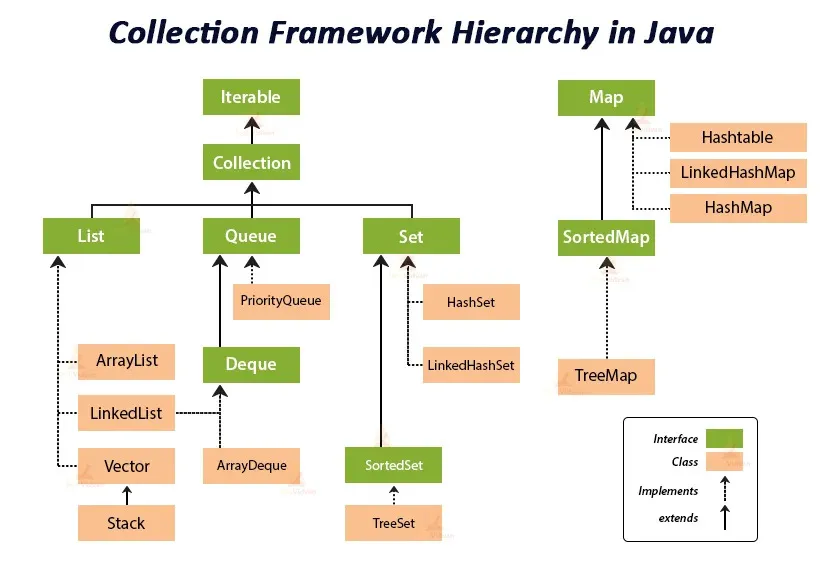

# Сборник усных вопросов и ответы к ним

---
<details>
<summary><span style="font-size: 35px;">👩🏻‍💻 Вопросы заданные на уроке</span></summary>
<details>

<summary>📦 Что такое примитивные типы данных в Java?</summary>

## 🔢 Примитивные типы данных в Java
### ⚠️ Ответ:

Примитивные типы данных — это **встроенные, базовые типы**, которые **не являются объектами** и используются для хранения **простых значений**.

<details>
<summary>↪️ Подробнее...⚠️</summary>

---

### 📘 Список примитивных типов (8 штук)

| Тип       | Размер | Диапазон значений / Особенности                  | Пример |
|-----------|--------|--------------------------------------------------|--------|
| `byte`    | 1 байт | -128 до 127                                      | `byte b = 100;` |
| `short`   | 2 байта| -32,768 до 32,767                                | `short s = 10000;` |
| `int`     | 4 байта| -2^31 до 2^31-1                                  | `int i = 123456;` |
| `long`    | 8 байт | -2^63 до 2^63-1                                  | `long l = 123456789L;` |
| `float`   | 4 байта| 6–7 знаков после запятой                         | `float f = 3.14f;` |
| `double`  | 8 байт | до 15 знаков после запятой                      | `double d = 3.141592653;` |
| `char`    | 2 байта| Один символ (UTF-16)                            | `char c = 'A';` |
| `boolean` | 1 бит  | `true` или `false`                               | `boolean flag = true;` |

---

### 🧠 Особенности и различия

- **Не объекты**: Примитивы не имеют методов и не наследуются от `Object`.
- **Быстрее** и **меньше по размеру** по сравнению с объектами (например, `Integer`).
- **Не могут быть null**, в отличие от ссылочных типов.

---

### 🧮 Когда использовать примитивы?

| Сценарий                            | Использовать      |
|------------------------------------|-------------------|
| Для математических вычислений      | `int`, `double`   |
| Для логики (флаги, условия)        | `boolean`         |
| Для символов (буквы, символы)      | `char`            |
| Когда важна производительность     | Примитивы         |
| При работе с коллекциями (обычно)  | Обёртки (`Integer`, `Boolean` и т.д.) |

---

### 🧬 Модель памяти: где хранятся примитивы?

| Тип памяти | Что хранится?                           |
|------------|------------------------------------------|
| **Stack**  | Примитивы, объявленные в методах         |
| **Heap**   | Объекты (например, массив `new int[10]`) |

Примитивы занимают **меньше памяти** и **хранятся ближе к стеку**, что делает их более **производительными**.

---

### 📌 Обёртки (Wrapper-классы)

Иногда примитивы **автоматически преобразуются** в объекты:

```java
int i = 10;
Integer obj = i;  // Autoboxing
int j = obj;      // Unboxing
```

---

### 🧠 Итог:

- ✅ Примитивов — **8**
- ✅ Не объекты, но очень быстрые
- ✅ Используются для **экономии памяти** и **быстрого доступа**
- ✅ Часто применяются внутри циклов, вычислений, и при создании массивов

---
</details>
</details>

<details>
<summary>🔤 Что такое <code>char</code> в Java?</summary>

## 🔤 Примитивный тип `char` в Java
### ⚠️ Ответ:

Тип `char` используется для хранения **одного символа** в формате **Unicode (UTF-16)**. Это может быть буква, цифра, спецсимвол или даже символ из других алфавитов.

<details>
<summary>↪️ Подробнее...⚠️</summary>

---

### 📌 Основные характеристики

| Свойство        | Значение                       |
|------------------|-------------------------------|
| Размер           | 2 байта (16 бит)              |
| Диапазон         | от `\u0000` до `\uffff` (0 до 65,535) |
| Тип хранения     | **Целочисленный**, но интерпретируется как символ |
| Значение по умолчанию | `\u0000` (нулевой символ) |

---

### 🔡 Примеры использования

```java
char a = 'A';            // символ 'A'
char digit = '7';        // символ '7'
char symbol = '#';       // спецсимвол
char unicode = '\u03A9'; // символ Омега (Ω) — Unicode
```

---

### 📚 Как `char` связан с Unicode?

В Java каждый символ — это 16-битное целое число (в отличие от ASCII, который использует 7/8 бит). Это позволяет использовать символы из **любого языка мира**, включая кириллицу, китайский, арабский и т.д.

```java
char c = 'Ж'; // русский символ
System.out.println((int)c); // Выводит числовой код Unicode
```

---

### 🔄 `char` как число

Тип `char` можно использовать как `int`, так как он хранит **числовое значение Unicode-символа**:

```java
char a = 'A';
int code = a; // 65
char next = (char) (a + 1); // 'B'
```

---

### 💬 Пример: перебор всех букв алфавита

```java
for (char c = 'A'; c <= 'Z'; c++) {
    System.out.print(c + " ");
}
// Вывод: A B C D ... Z
```

---

### 🧠 Где применяют `char`?

| Применение                     | Пример                    |
|-------------------------------|---------------------------|
| Символьные операции           | Проверка на `'a'`, `'z'`  |
| Сравнение символов            | `if (c == 'y')`           |
| Работа с `String` (посимвольно) | `charAt(i)`               |
| Хранение Unicode-символов     | `'\uXXXX'`                |

---

### ❗ Важно

- `char` — **не строка**! Это **один символ**, а `String` — объект, состоящий из `char[]`.
- Для одного символа используем **одинарные кавычки** `'A'`, а для строки — **двойные** `"A"`.

---

### 🧠 Итог:

| Свойство        | Значение                  |
|------------------|--------------------------|
| Размер           | 2 байта (16 бит)         |
| Диапазон         | Unicode `\u0000`–`\uffff`|
| Тип              | Целочисленный (символьный)|
| Поддержка языка  | Любой (UTF-16)           |
| Отличие от `String` | `char` — один символ, `String` — объект |

> `char` идеально подходит, когда нужно работать с **одиночными символами**, **обрабатывать текст**, **анализировать ввод**, и **перебирать алфавиты**.

---
</details>
</details>

<details>
<summary>🔗 Что такое ссылочные типы данных в Java?</summary>

## 🔗 Ссылочные типы данных (Reference Types)

---

### ❓ Что это такое?
### ⚠️ Ответ:

В Java **ссылочные типы данных** — это все типы, **которые не являются примитивами**. Они **не хранят значение напрямую**, а **содержат ссылку (адрес) на объект в памяти**.

<details>
<summary>↪️ Подробнее...⚠️</summary>

---

### 🧠 В отличие от примитивов:

| Тип данных      | Что хранит              | Где хранится        |
|------------------|-------------------------|----------------------|
| `int a = 5;`     | Само значение `5`       | 🧠 Stack (стек)      |
| `String s = "Hi"`| Ссылка на объект String | 📦 Heap (куча)       |

---

### 📦 Где хранятся?

- **Stack** — хранит переменные и ссылки
- **Heap** — хранит **объекты** (реальные данные)
- **Ссылочные переменные** указывают на объекты в **куче (Heap)**

```java
String text = "Hello"; // text в стеке → указывает на "Hello" в куче
```

---

### 🧾 Примеры ссылочных типов:

| Категория       | Примеры                           |
|------------------|------------------------------------|
| Классы           | `String`, `Scanner`, `Random`, `Object`, `Person` |
| Интерфейсы       | `List`, `Set`, `Map`, `Runnable`   |
| Массивы          | `int[]`, `String[]`, `Person[]`    |
| Пользовательские | Любой `class` или `interface`      |

> ⚠️ Даже массив примитивов — это **ссылочный тип!**

```java
int[] nums = {1, 2, 3}; // nums — ссылка на массив в куче
```

---

### 📌 Когда применять ссылочные типы?

| Когда                         | Почему                                  |
|-------------------------------|------------------------------------------|
| Нужно хранить **объекты**     | Например, `String`, `List`, `CustomClass` |
| Нужно использовать **массивы**| Все массивы — ссылочные                 |
| Работа с **коллекциями**      | Все они — классы (`List`, `Map`, `Set`) |

---

### 🧮 Разница между ссылкой и копией

```java
Person a = new Person("Alex");
Person b = a;

b.name = "Ivan";

System.out.println(a.name); // ➡️ "Ivan" — потому что `a` и `b` ссылаются на один и тот же объект!
```

---

### 🧠 Модель памяти Java (упрощённо)

```
Stack (быстрая память)
├── text --> ─┐
│            ▼
Heap (медленная память, хранит объекты)
└── "Hello"
```

---

### ✅ Вывод

| Характеристика            | Ссылочные типы                             |
|----------------------------|---------------------------------------------|
| Хранят                    | **Ссылку (адрес)** на объект в куче         |
| Примеры                  | `String`, `List`, `Scanner`, массивы и т.д. |
| Где хранятся объекты     | 🧠 В **куче (Heap)**                         |
| Где хранятся ссылки      | В **стеке (Stack)**                         |
| Отличие от примитивов     | Примитивы содержат **значение**, а не ссылку |

---

</details>
</details>

<details>
<summary>📦 Что такое массивы в Java? Полный разбор</summary>

---

## 1️⃣ Что такое массивы?

➡️ **Массив (Array)** — это структура данных, которая позволяет хранить **фиксированное количество элементов одного типа** в непрерывной области памяти.

```java
int[] numbers = new int[5]; // массив из 5 элементов типа int
```

---

## 2️⃣ Зачем нужны массивы? Какую проблему они решают?

Массивы позволяют:

- 📦 Хранить связанные данные одного типа
- 🔁 Перебирать их циклом (например, `for`)
- 📍 Обращаться к любому элементу по индексу
- ⚡ Работать быстро и эффективно с данными

> 🧠 Вместо создания множества переменных — массив позволяет **объединить** всё в одной структуре.

---

## 3️⃣ Преимущества и недостатки массивов

| 🧩 Характеристика     | ✅ Преимущества                              | ⚠️ Недостатки                                 |
|------------------------|---------------------------------------------|-----------------------------------------------|
| 📏 Размер              | Эффективен по памяти                        | Размер фиксированный, нельзя изменить         |
| 🚀 Быстродействие     | Мгновенный доступ по индексу `O(1)`         | Нет встроенных методов вставки/удаления       |
| 💡 Простота           | Прост в использовании                       | Нет гибкости как у `ArrayList`                |
| 🧹 Работа с данными    | Хорош для числовых вычислений               | Неудобен для частых изменений                 |

---

## 4️⃣ Что можно хранить в массивах?

Массивы хранят **примитивы** или **объекты**:

```java
// Примитивы
int[] scores = {90, 85, 100};

// Объекты
String[] names = {"Alice", "Bob", "Charlie"};
```

---

## 5️⃣ Сравнение: Массивы, списки, картежи, БД, системы хранения

| 🏷️ Структура             | 🧩 Особенности                                                              |
|--------------------------|----------------------------------------------------------------------------|
| **Array (массив)**       | Фиксированный размер, однотипные элементы, быстро работает                  |
| **Tuple (кортеж)**       | В Java нет, эмулируется через `List<Object>` или `record`                  |
| **List (список)**        | Динамический размер, множество методов (`add`, `remove`, `contains` и др.) |
| **Database (БД)**        | Хранение на диске, структурированный доступ, используется в приложениях    |
| **Storage Systems**      | Общее понятие: включает в себя БД, файлы, кеши и др.                        |

---

## 📏 Как узнать размер массива?

```java
int[] array = {1, 2, 3, 4, 5};
System.out.println(array.length); // 5
```

---

## 🎯 Как получить доступ к элементам массива?

```java
int[] arr = {10, 20, 30};
System.out.println(arr[0]); // 10

arr[1] = 99;
System.out.println(arr[1]); // 99
```

> ⚠️ Индексация начинается с **0** — первый элемент имеет индекс `0`.

---

## 🧠 Вывод:

Массивы — это **простая и быстрая** структура для хранения однотипных данных, особенно полезна при **работе с фиксированным объёмом данных**. Но для гибкости лучше использовать коллекции (`List`, `Set`, `Map`).

---
</details>

<details>
<summary>🧱 Принципы ООП, объекты, инициализация и уничтожение</summary>

---

## 🧩 1) Что такое **принципы ООП** и для чего они нужны?

➡️ **ООП (Объектно-Ориентированное Программирование)** — это подход к разработке, в котором программы строятся из объектов.

### 🔑 Основные принципы ООП:

| Принцип           | Описание                                                                 |
|-------------------|--------------------------------------------------------------------------|
| **Инкапсуляция**  | Сокрытие внутренней реализации от внешнего мира                          |
| **Наследование**  | Позволяет создавать новые классы на основе существующих                  |
| **Полиморфизм**   | Один интерфейс — разное поведение                                        |
| **Абстракция**    | Сокрытие сложной реализации за простым интерфейсом                       |

### 🧠 Зачем это нужно?

- Повышает читаемость кода
- Упрощает сопровождение и расширение
- Снижает связность между частями программы

---

## 🧩 2) Чем отличаются объекты? Как они существуют? 🔄 Жизненный цикл объекта

➡️ **Объект** — это экземпляр класса. Каждый объект:

- Имеет своё **состояние** (через поля)
- Имеет своё **поведение** (через методы)

### 🔄 Жизненный цикл объекта:

| Стадия            | Описание                                                                 |
|-------------------|--------------------------------------------------------------------------|
| **Создание**      | С помощью ключевого слова `new`                                          |
| **Инициализация** | Установка начального состояния объекта                                    |
| **Использование** | Вызов методов, изменение состояний                                       |
| **Уничтожение**   | Когда объект более не используется — передаётся **GC (сборщику мусора)** |

```java
MyClass obj = new MyClass(); // создание и инициализация
obj.doSomething();           // использование
```

---

## 🧩 3) Что такое инициализация и уничтожение?

### 🟢 Инициализация:

➡️ Это процесс присвоения начальных значений полям объекта. Может быть:

- Через **конструктор**
- Через **инициализаторы**
- Через **статические блоки**

```java
public class Car {
    String model;

    public Car(String model) { // конструктор
        this.model = model;
    }
}
```

### 🔴 Уничтожение:

➡️ Объект уничтожается **автоматически**, когда:

- На него **больше нет ссылок**
- Он становится **"недостижимым"** для программы

Тогда его удаляет **Garbage Collector (GC)**.

```java
obj = null; // теперь объект может быть удалён GC
```

> ⚠️ В Java нельзя явно уничтожить объект (как в C++), только "предложить" системе освободить память.

---

## 🧠 Вывод:

- ООП структурирует код и делает его понятнее
- Объекты — это центральные элементы ООП
- Их жизненный цикл управляется JVM (создание → работа → сборка мусора)

---

</details>

<details>
<summary>🔒 Инкапсуляция — применение и назначение</summary>

---

## ❓ Что такое **инкапсуляция**?
### ⚠️ Ответ:

➡️ **Инкапсуляция** — это принцип ООП, при котором **внутренние данные и реализация класса скрываются** от внешнего мира, и доступ к ним осуществляется **только через публичные методы**.

<details>
<summary>↪️ Подробнее...⚠️</summary>

---

## 🎯 Назначение инкапсуляции

| Цель                         | Описание                                                                 |
|------------------------------|--------------------------------------------------------------------------|
| ✅ Безопасность данных       | Защищает поля от некорректного изменения извне                         |
| ✅ Упрощение интерфейса      | Предоставляет понятный и ограниченный способ взаимодействия             |
| ✅ Гибкость реализации       | Внутреннюю логику можно менять, не затрагивая внешний код              |
| ✅ Поддержка инвариантов     | Позволяет контролировать, чтобы объект всегда был в корректном состоянии |

---

## ⚙️ Применение инкапсуляции

### 📌 Пример:

```java
public class BankAccount {
    private double balance; // 👈 приватное поле

    public BankAccount(double initialBalance) {
        if (initialBalance >= 0) {
            this.balance = initialBalance;
        }
    }

    public void deposit(double amount) {
        if (amount > 0) {
            balance += amount;
        }
    }

    public void withdraw(double amount) {
        if (amount > 0 && amount <= balance) {
            balance -= amount;
        }
    }

    public double getBalance() {
        return balance;
    }
}
```

### 💡 Объяснение:

- Поле `balance` **недоступно напрямую** (private)
- Вся работа с балансом — только через **методы `deposit()`, `withdraw()` и `getBalance()`**
- Это даёт **контроль над логикой**, исключает ошибки (например, отрицательный баланс)

---

## 📊 Таблица: Уровни доступа

| Модификатор     | Доступ внутри класса | В том же пакете | Наследники | Вне пакета |
|------------------|----------------------|------------------|-------------|-------------|
| `private`        | ✅                   | ❌               | ❌          | ❌          |
| `default` (нет)  | ✅                   | ✅               | ❌          | ❌          |
| `protected`      | ✅                   | ✅               | ✅          | ❌*         |
| `public`         | ✅                   | ✅               | ✅          | ✅          |

> `protected`: доступен в других пакетах **только при наследовании**

---

## 🧠 Вывод:

Инкапсуляция делает код:

- Надёжным ✅
- Удобным для поддержки ✅
- Читабельным ✅
- Гибким для расширения ✅

> 📌 **Инкапсуляция — "защищаем внутренности, открываем только нужное"**

---
</details>
</details>

<details>
<summary>🧬 Наследование — что это и для чего нужно?</summary>

---

## 📘 Что такое наследование в ООП?
### ⚠️ Ответ:

➡️ **Наследование** — это механизм в объектно-ориентированном программировании, который позволяет **одному классу (подклассу)** **наследовать** поля и методы **другого класса (суперкласса)**.

> 📌 Ключевое слово: `extends`

<details>
<summary>↪️ Подробнее...⚠️</summary>

---

## 🎯 Зачем нужно наследование?

| Назначение                         | Описание |
|-----------------------------------|----------|
| ♻️ **Повторное использование кода** | Позволяет использовать уже существующую логику |
| 🔧 **Расширяемость**               | Легко добавлять новую функциональность |
| 🔍 **Упрощение структуры**         | Создаётся иерархия типов |
| 💬 **Переопределение поведения**  | Подкласс может переопределить поведение методов суперкласса |

---

## ✅ Пример:

```java
// Суперкласс (родитель)
public class Animal {
    protected String name;

    public void speak() {
        System.out.println("Животное издаёт звук");
    }
}
```

```java
// Подкласс (наследник)
public class Dog extends Animal {
    @Override
    public void speak() {
        System.out.println("Собака лает: гав-гав");
    }
}
```

```java
public class Main {
    public static void main(String[] args) {
        Dog dog = new Dog();
        dog.speak();  // 🐶 Выведет: Собака лает: гав-гав
    }
}
```

---

## 🧠 Кратко:

| Понятие | Объяснение |
|--------|------------|
| 🔗 Наследование | Связь «родитель-потомок» между классами |
| 📂 Родительский класс (суперкласс) | Общий класс, содержащий базовую логику |
| 🧬 Дочерний класс (подкласс) | Наследует функциональность и может её расширять |
| 🔄 Переопределение (`@Override`) | Подкласс меняет поведение метода родителя |

---

## 🚫 Важно помнить:

- В Java **нет множественного наследования классов**, но можно реализовать через **интерфейсы**
- Конструкторы **не наследуются**
- Доступ к полям/методам зависит от **модификаторов доступа**

---

## 🧩 Когда использовать:

- Когда несколько классов имеют **общие характеристики**
- Когда нужно реализовать **шаблон поведения** и позволить подклассам его адаптировать

> ✅ Наследование помогает **структурировать и переиспользовать** код, делая его более читаемым и поддерживаемым.

---
</details>
</details>

<details>
<summary>🌀 Полиморфизм — что это и для чего?</summary>

---

## 📘 Что такое полиморфизм?
### ⚠️ Ответ:

➡️ **Полиморфизм** (от греч. _poly_ — много, _morph_ — форма) — это способность **одного интерфейса** представлять **несколько форм поведения**.

> В Java это означает, что **один и тот же метод** может вести себя **по-разному**, в зависимости от того, **в каком классе он реализован**.

<details>
<summary>↪️ Подробнее...⚠️</summary>

---

## 🧩 Виды полиморфизма:

| Вид | Описание | Пример |
|-----|----------|--------|
| ✅ **Компиляционный (перегрузка)** | Один метод с разными параметрами | `print(String)`, `print(int)` |
| ✅ **Выполнения (переопределение)** | Один метод с разной реализацией в подклассах | `speak()` у `Dog`, `Cat`, `Bird` |

---

## 🔧 Зачем нужен полиморфизм?

| Назначение | Преимущество |
|------------|--------------|
| 🎯 Универсальность | Позволяет обращаться к объектам через общий интерфейс или родительский класс |
| ♻️ Гибкость | Поведение можно менять без изменения вызова метода |
| 🔍 Чистый код | Уменьшает дублирование и упрощает поддержку |
| 📦 Расширяемость | Легко добавлять новые реализации |

---

## ✅ Пример: Полиморфизм в действии

```java
public class Animal {
    public void speak() {
        System.out.println("Животное издаёт звук");
    }
}

public class Dog extends Animal {
    @Override
    public void speak() {
        System.out.println("Собака лает");
    }
}

public class Cat extends Animal {
    @Override
    public void speak() {
        System.out.println("Кошка мяукает");
    }
}
```

```java
public class Zoo {
    public static void makeItSpeak(Animal a) {
        a.speak(); // Вызовет speak() соответствующего подкласса
    }

    public static void main(String[] args) {
        Animal dog = new Dog();
        Animal cat = new Cat();

        makeItSpeak(dog); // 🐶 Собака лает
        makeItSpeak(cat); // 🐱 Кошка мяукает
    }
}
```

---

## 🧠 Кратко:

| Термин | Пояснение |
|--------|-----------|
| 🔄 Переопределение (Override) | Поведение метода переопределяется в подклассе |
| ➕ Перегрузка (Overload) | Один метод с разными параметрами |
| ☑️ Позднее связывание | Какой метод вызвать — решается **во время выполнения** |

---

## 📦 Где применяется:

- При работе с интерфейсами и абстрактными классами
- В коллекциях (`List<Animal>` может содержать `Cat`, `Dog`, `Bird`)
- В шаблонах проектирования (например, **Strategy** или **Factory**)

---

> ✅ **Полиморфизм** — ключ к **гибкому и расширяемому** коду в объектно-ориентированном программировании.

---

</details>
</details>

<details>
<summary>🧩 Что такое интерфейс в Java и зачем он нужен?</summary>

---

## 📘 Что такое интерфейс?
### ⚠️ Ответ:

➡️ **Интерфейс** — это **контракт**, который определяет **набор методов**, которые **должны быть реализованы** классом, но **не содержит их реализацию** (до Java 8 включительно).

> Интерфейс говорит: «Если ты меня реализуешь — ты должен уметь это делать.»

<details>
<summary>↪️ Подробнее...⚠️</summary>

---

### 🧱 Синтаксис интерфейса:

```java
public interface Animal {
    void speak(); // метод без реализации
}
```

Класс реализует интерфейс с ключевым словом `implements`:

```java
public class Dog implements Animal {
    @Override
    public void speak() {
        System.out.println("Собака лает");
    }
}
```

---

## 🧭 Зачем нужны интерфейсы?

| Назначение | Описание |
|------------|----------|
| 🔌 Абстракция | Интерфейс описывает **что** объект может делать, но не **как** |
| 🧩 Гибкость | Класс может реализовывать **несколько интерфейсов**, даже при отсутствии наследования |
| 🔁 Модульность | Упрощает замену и тестирование компонентов |
| 🤝 Совместимость | Позволяет **разным объектам** использовать **один и тот же интерфейс** |

---

## ✅ Пример: использование интерфейса

```java
public interface Flyable {
    void fly();
}

public class Bird implements Flyable {
    @Override
    public void fly() {
        System.out.println("Птица летит");
    }
}

public class Plane implements Flyable {
    @Override
    public void fly() {
        System.out.println("Самолёт летит");
    }
}

public class FlightTest {
    public static void makeFly(Flyable f) {
        f.fly(); // Вызовет fly() того объекта, который передали
    }

    public static void main(String[] args) {
        makeFly(new Bird());   // Птица летит
        makeFly(new Plane());  // Самолёт летит
    }
}
```

---

## 💡 Особенности интерфейсов:

| Особенность | Есть? |
|-------------|-------|
| Поля | Только `public static final` (константы) |
| Методы | Только `public abstract` (до Java 8) |
| Множественное наследование | ✅ Да, можно реализовать **несколько интерфейсов** |
| `default`-методы | ✅ С Java 8 — можно добавлять реализацию по умолчанию |
| `static` методы | ✅ С Java 8 — можно добавлять статические методы |
| `private` методы | ✅ С Java 9 — можно использовать внутри интерфейса |

---

## 🧠 Интерфейсы vs Абстрактные классы

| Характеристика | Интерфейс | Абстрактный класс |
|----------------|-----------|--------------------|
| Поля | Только `public static final` | Любые |
| Методы с реализацией | Только `default` / `static` | Да |
| Наследование | Можно реализовать **много** интерфейсов | Только **один** родитель |
| Конструкторы | ❌ Нет | ✅ Да |

---

> ✅ **Интерфейсы** позволяют проектировать **гибкую**, **расширяемую** и **модульную** архитектуру, где **объекты можно заменять без изменения основного кода**.

---
</details>
</details>

<details>
<summary>🔍 <code>equals()</code> и <code>hashCode()</code> — Определение равенства объектов в Java + отличие от <code>==</code></summary>

---

## 📌 Что такое `equals()` и `hashCode()`?
### ⚠️ Ответ:

В Java объекты сравниваются по значению с помощью метода `equals()` и используются в коллекциях (например, `HashMap`, `HashSet`) через метод `hashCode()`.

<details>
<summary>↪️ Подробнее...⚠️</summary>

---

### 🔷 Метод `equals(Object obj)`

Метод `equals()` определяет, **считаются ли два объекта равными по содержанию**.

🔧 По умолчанию (в классе `Object`) он сравнивает **ссылки**, как `==`.

Чтобы сравнение происходило **по значениям полей**, нужно **переопределить** `equals()`.

---

### 🧮 Метод `hashCode()`

Метод `hashCode()` возвращает **целое число**, которое используется в **хеш-структурах** (например, `HashSet`, `HashMap`, `HashTable`).

> Если два объекта равны по `equals()`, то их `hashCode()` **обязан быть одинаковым**.

---

### 🔀 Отличие от `==`

| Оператор / Метод | Что сравнивает | Поведение |
|------------------|----------------|-----------|
| `==` | Сравнивает **ссылки** (адреса в памяти) | Возвращает `true`, если обе переменные указывают на **один и тот же объект** |
| `equals()` | Сравнивает **значения** (если переопределён) | Возвращает `true`, если **содержимое объектов одинаковое** |

🔍 Пример:

```java
String a = new String("hello");
String b = new String("hello");

System.out.println(a == b);       // ❌ false — разные ссылки
System.out.println(a.equals(b));  // ✅ true — одинаковое содержимое
```

---

## 📐 Контракт между `equals()` и `hashCode()`

| Условие | Обязательное поведение |
|--------|-------------------------|
| `a.equals(b)` → `true` | `a.hashCode() == b.hashCode()` |
| `a.hashCode() == b.hashCode()` | `equals()` может быть `true` или `false` |

---

## ✅ Пример: Переопределение `equals()` и `hashCode()`

```java
public class Person {
    private String name;
    private int age;

    public Person(String name, int age) {
        this.name = name;
        this.age = age;
    }

    @Override
    public boolean equals(Object obj) {
        if (this == obj) return true;
        if (obj == null || getClass() != obj.getClass()) return false;

        Person person = (Person) obj;
        return age == person.age && name.equals(person.name);
    }

    @Override
    public int hashCode() {
        return Objects.hash(name, age);
    }
}
```

---

## 🔄 Использование в коллекциях

```java
Set<Person> set = new HashSet<>();
set.add(new Person("Alex", 30));
set.add(new Person("Alex", 30)); // ❌ если нет переопределения — добавит второй раз

System.out.println(set.size()); // ✅ 1, если equals/hashCode переопределены правильно
```

---

## 🧠 Вывод

| Что сравниваем? | Использовать |
|-----------------|--------------|
| Ссылки на объект | `==` |
| Содержимое объектов | `equals()` + `hashCode()` |

> 🔑 Всегда переопределяй `equals()` и `hashCode()` вместе, если планируешь использовать объект в коллекциях или сравнивать по содержимому!

---
</details>
</details>

<details>
<summary>🧮 <code>Comparator</code> — сравнение объектов в Java</summary>

---

## 📌 Что такое `Comparator`?
### ⚠️ Ответ:

`Comparator<T>` — это **функциональный интерфейс** в Java, который позволяет **внешне определить способ сравнения объектов одного типа**.

Он используется для:
- сортировки коллекций (`List`, `ArrayList`)
- задания **нестандартных правил сравнения** (по имени, дате, длине и т.д.)
- работы с методами сортировки (`Collections.sort()`, `List.sort()`, `Stream.sorted()`)

---

## 🔧 Зачем нужен?

Когда у нас есть **несколько вариантов сравнения объектов**. Например:

- по имени
- по возрасту
- по дате рождения

...и мы **не хотим или не можем изменить** класс объекта (например, он из сторонней библиотеки), как это нужно при реализации `Comparable`.

<details>
<summary>↪️ Подробнее...⚠️</summary>

---

## 🔨 Как работает?

Интерфейс `Comparator` требует реализации **одного метода**:

```java
int compare(T o1, T o2);
```

Возвращаемое значение:

| Возврат | Значение |
|--------|----------|
| `< 0` | `o1 < o2` |
| `== 0` | `o1 == o2` |
| `> 0` | `o1 > o2` |

---

## ✅ Пример 1: Сортировка по имени

```java
class Person {
    String name;
    int age;

    // Конструктор, геттеры, сеттеры и т.д.
}
```

```java
Comparator<Person> byName = new Comparator<>() {
    @Override
    public int compare(Person p1, Person p2) {
        return p1.name.compareTo(p2.name);
    }
};
```

```java
List<Person> people = ...;
Collections.sort(people, byName);
```

---

## ✅ Пример 2: Сортировка по возрасту (лямбда)

```java
people.sort((p1, p2) -> Integer.compare(p1.age, p2.age));
```

или

```java
people.sort(Comparator.comparingInt(p -> p.age));
```

---

## 🔁 Объединение компараторов

```java
Comparator<Person> byNameThenAge = Comparator
    .comparing((Person p) -> p.name)
    .thenComparingInt(p -> p.age);
```

---

## 📚 Где используется?

- `TreeSet` / `TreeMap` — можно передать `Comparator` в конструктор
- `Collections.sort(list, comparator)`
- `List.sort(comparator)`
- `Stream.sorted(comparator)`

---

## 🧠 Вывод:

| Характеристика | Comparator |
|----------------|------------|
| Где реализуется | Отдельный класс / анонимный класс / лямбда |
| Можно иметь несколько сравнений | ✅ Да |
| Подходит для сторонних классов | ✅ Да |
| Используется для сортировки | ✅ Да |

---

### 🔁 Сравнение с `Comparable`:

|                | `Comparable` | `Comparator` |
|----------------|--------------|--------------|
| Где реализуется | В самом классе | В отдельном классе |
| Один способ сортировки | ✅ Да | ❌ Можно много |
| Меняется класс объекта | ✅ Да | ❌ Нет |
| Удобен для сторонних классов | ❌ Нет | ✅ Да |

---
</details>
</details>

<details>
<summary>📚 Java Collection Framework — что это, зачем и как использовать?</summary>

---

## 📌 Что такое **Java Collection Framework (JCF)?**
### ⚠️ Ответ:

**Java Collection Framework** — это **набор интерфейсов и классов**, предназначенных для хранения, управления и обработки **групп объектов (коллекций)**.

<details>
<summary>↪️ Подробнее...⚠️</summary>

---

## 🎯 Зачем нужен?

Java Collections решают проблему хранения **динамического количества объектов** и предоставляют инструменты для:

- добавления/удаления элементов
- поиска, сортировки, фильтрации
- итерации по данным
- работы со структурами данных: **списки, множества, очереди, словари**

---

<p align="center">
  
</p>

## 🧱 Основные интерфейсы:

| Интерфейс    | Назначение |
|--------------|------------|
| `Collection` | Корневой интерфейс |
| `List`       | Упорядоченный список (с доступом по индексу) |
| `Set`        | Множество уникальных элементов |
| `Queue`      | Очередь (FIFO) |
| `Map`        | Хранение пар **ключ-значение** |

---

## 🧰 Часто используемые классы:

| Интерфейс | Реализация | Особенности |
|----------|-------------|-------------|
| `List`   | `ArrayList`, `LinkedList` | Позволяет дубликаты, поддерживает порядок |
| `Set`    | `HashSet`, `TreeSet`, `LinkedHashSet` | Уникальные элементы |
| `Queue`  | `PriorityQueue`, `ArrayDeque` | FIFO |
| `Map`    | `HashMap`, `TreeMap`, `LinkedHashMap` | Ключи уникальны |

---

## ✅ Пример использования:

```java
import java.util.*;

public class Main {
    public static void main(String[] args) {
        List<String> fruits = new ArrayList<>();
        fruits.add("Banana");
        fruits.add("Apple");
        fruits.add("Orange");

        // Сортировка
        Collections.sort(fruits); // По алфавиту
        System.out.println(fruits); // [Apple, Banana, Orange]
    }
}
```

---

## 🔁 Сортировка `List` с `Comparator`

```java
fruits.sort(Comparator.reverseOrder()); // Обратный порядок
```

---

## 🔎 Почему использовать коллекции:

| Без коллекций           | С коллекциями |
|-------------------------|---------------|
| Фиксированный размер массива | Динамическое расширение |
| Нет встроенных методов сортировки, фильтрации и поиска | ✅ Методы сортировки, фильтрации, итерации |
| Нет единого интерфейса | ✅ Унифицированная структура |
| Трудно поддерживать код | ✅ Читаемый и масштабируемый код |

---

## 🧠 Вывод:

> Java Collection Framework — мощный и гибкий инструмент для работы с группами объектов. Он **упрощает разработку, делает код чистым, эффективным и легко масштабируемым.**

---

</details>
</details>

<details>
<summary>📋 Что такое <code>List</code> в Java?</summary>

## 🧩 Что такое `List`?
### ⚠️ Ответ:

`List` — это **интерфейс** в Java Collection Framework, который представляет **упорядоченную коллекцию элементов**, допускающую **дублирующиеся значения**.

<details>
<summary>↪️ Подробнее...⚠️</summary>

---

### ✅ Основные особенности:

| Свойство                        | Значение                           |
|---------------------------------|------------------------------------|
| Порядок элементов               | ✅ Да, сохраняет порядок добавления |
| Дублирующиеся элементы          | ✅ Разрешены                        |
| Индексированный доступ          | ✅ Через `get(int index)`          |
| Коллекция                      | ✅ Наследует интерфейс `Collection`|

---

### 🧰 Популярные реализации:

| Класс        | Описание                                                                 |
|--------------|--------------------------------------------------------------------------|
| `ArrayList`  | Быстрый доступ по индексу, медленная вставка/удаление в середине списка |
| `LinkedList` | Быстрая вставка/удаление, медленный доступ по индексу                   |
| `Vector`     | Устаревший потокобезопасный список                                       |
| `Stack`      | Устаревшая LIFO-структура, наследует `Vector`                           |

---

### 📦 Что хранит `List`?

`List` хранит **объекты (ссылки на объекты)**. Тип объектов указывается в <> при объявлении:

```java
List<String> names = new ArrayList<>();
List<Integer> numbers = new LinkedList<>();
```

---

### 🚀 Примеры использования:

```java
List<String> fruits = new ArrayList<>();
fruits.add("Apple");
fruits.add("Banana");
fruits.add("Apple"); // ✅ Дубликаты допустимы
System.out.println(fruits.get(1)); // Banana
```

---

### 🛠️ Специальные методы `List`:

| Метод                    | Описание                                         |
|--------------------------|--------------------------------------------------|
| `add(E e)`               | Добавляет элемент в конец списка                 |
| `add(int index, E e)`    | Вставляет элемент по индексу                     |
| `get(int index)`         | Получает элемент по индексу                      |
| `set(int index, E e)`    | Заменяет элемент по индексу                      |
| `remove(int index)`      | Удаляет элемент по индексу                       |
| `indexOf(Object o)`      | Возвращает индекс первого вхождения элемента     |
| `lastIndexOf(Object o)`  | Индекс последнего вхождения                      |
| `subList(int from, int to)` | Возвращает подсписок                        |
| `contains(Object o)`     | Проверяет наличие элемента                      |
| `size()`                 | Размер списка                                   |

---

### ⚖️ Отличия от других интерфейсов:

| Интерфейс | Порядок | Дубликаты | Индексация | Особенности                              |
|-----------|---------|-----------|------------|-------------------------------------------|
| `List`    | ✅ Да    | ✅ Да      | ✅ Да       | Упорядочен, доступ по индексу             |
| `Set`     | ❌ Нет   | ❌ Нет     | ❌ Нет      | Только уникальные элементы                |
| `Queue`   | Частично| Возможно  | ❌ Нет      | FIFO, методы добавления/удаления в очереди|
| `Map`     | ❌ Нет   | По ключам | ❌ Нет      | Пары ключ–значение                        |

---

### 🧠 Вывод:

> `List` — это **гибкая упорядоченная коллекция**, которая идеально подходит для хранения **последовательностей элементов** с возможностью доступа по индексу. Поддерживает множество операций для эффективной работы со списками.

---
</details>
</details>

<details>
<summary>📋 Что такое <code>Set</code> в Java?</summary>

## 🧩 Что такое `Set`?
### ⚠️ Ответ:

`Set` — это **интерфейс** из Java Collection Framework, представляющий **множество уникальных элементов**. В отличие от `List`, **не допускает дубликатов**.

<details>
<summary>↪️ Подробнее...⚠️</summary>

---

### ✅ Основные особенности:

| Свойство                 | Значение                             |
|--------------------------|--------------------------------------|
| Порядок элементов        | ❌ Не гарантирован (зависит от реализации) |
| Дублирующиеся элементы   | ❌ Не допускаются                    |
| Индексированный доступ   | ❌ Нет                               |
| Коллекция                | ✅ Наследует интерфейс `Collection` |

---

### 🧰 Популярные реализации:

| Класс             | Особенности                                                                 |
|-------------------|------------------------------------------------------------------------------|
| `HashSet`         | 🔹 Быстрая работа, порядок не сохраняется                                   |
| `LinkedHashSet`   | 🔹 Сохраняет порядок добавления                                             |
| `TreeSet`         | 🔹 Сортирует элементы по естественному порядку или с помощью `Comparator`   |
| `EnumSet`         | 🔹 Высокопроизводительный `Set` для `enum`-типов                            |
| `CopyOnWriteArraySet` | 🔹 Потокобезопасный, подходит для многопоточности                     |

---

### 📦 Что хранит `Set`?

Как и все коллекции, `Set` хранит **объекты**. При этом важным условием является наличие корректной реализации методов:

- `equals()` — для сравнения объектов
- `hashCode()` — для корректной работы `HashSet`, `LinkedHashSet`

```java
Set<String> colors = new HashSet<>();
colors.add("Red");
colors.add("Blue");
colors.add("Red"); // ❌ Повтор не будет добавлен
System.out.println(colors); // [Red, Blue]
```

---

### 🛠️ Специальные методы `Set` (наследуются от `Collection`):

| Метод            | Описание                                |
|------------------|------------------------------------------|
| `add(E e)`       | Добавляет элемент (если ещё не существует) |
| `contains(Object o)` | Проверяет наличие элемента         |
| `remove(Object o)` | Удаляет элемент                       |
| `size()`         | Возвращает количество элементов         |
| `isEmpty()`      | Проверяет, пустой ли `Set`              |
| `clear()`        | Удаляет все элементы                    |
| `iterator()`     | Возвращает итератор                     |

---

### ⚖️ Отличия от других интерфейсов:

| Интерфейс | Порядок | Дубликаты | Индексация | Особенности                            |
|-----------|---------|-----------|------------|-----------------------------------------|
| `List`    | ✅ Да    | ✅ Да      | ✅ Да       | Порядок, доступ по индексу              |
| `Set`     | ❌ Нет*  | ❌ Нет     | ❌ Нет      | Только уникальные значения              |
| `Queue`   | Частично| Возможно  | ❌ Нет      | FIFO, структуры очереди                 |
| `Map`     | ❌ Нет   | ❌ По ключу | ❌ Нет      | Хранит пары ключ–значение               |

> *Если используете `LinkedHashSet` — порядок сохраняется, `TreeSet` — сортируется.

---

### 🧠 Преимущества `Set`:

- 🔐 Исключение дубликатов без дополнительной логики
- ⚡ Быстрый поиск (`HashSet`)
- 📋 Сортировка (`TreeSet`)
- 🔄 Удобен при проверке наличия уникальных значений

---

### 🧠 Вывод:

> `Set` — идеальный выбор, когда нужно **хранить уникальные элементы**, **быстро проверять наличие** и не важен порядок (или он задается отдельно).

---
</details>
</details>

<details>
<summary>📘 Что такое <code>Map</code> в Java?</summary>

## 🧩 Что такое `Map`?
### ⚠️ Ответ:

`Map` — это интерфейс из Java Collection Framework, предназначенный для **хранения пар "ключ–значение"**. В отличие от `List` и `Set`, он **не наследует** `Collection`, так как представляет **ассоциированную структуру данных**, а не просто набор элементов.

<details>
<summary>↪️ Подробнее...⚠️</summary>

---

### ✅ Основные особенности:

| Свойство                  | Значение                            |
|---------------------------|-------------------------------------|
| Структура хранения        | Ключ → Значение (`Key → Value`)    |
| Уникальность ключей       | ✅ Да (ключи не дублируются)        |
| Уникальность значений     | ❌ Нет (значения могут повторяться) |
| Порядок элементов         | ❌ Не гарантируется (зависит от реализации) |

---

### 🧰 Популярные реализации:

| Класс             | Особенности                                                               |
|-------------------|----------------------------------------------------------------------------|
| `HashMap`         | 🔹 Быстрая работа, порядок не сохраняется                                  |
| `LinkedHashMap`   | 🔹 Сохраняет порядок добавления                                            |
| `TreeMap`         | 🔹 Сортирует ключи по естественному порядку или через `Comparator`        |
| `Hashtable`       | 🔹 Потокобезопасный, устаревший по стилю                                  |
| `ConcurrentHashMap` | 🔹 Потокобезопасная, быстрая реализация для многопоточности            |
| `EnumMap`         | 🔹 Для ключей типа `enum`, очень производительный                          |
| `WeakHashMap`     | 🔹 Ключи могут быть удалены сборщиком мусора                              |

---

### 📦 Что хранит `Map`?

Хранит **пары**: `ключ → значение`.

- Ключи должны быть уникальными (`equals()` и `hashCode()` должны быть реализованы корректно)
- Значения могут повторяться

```java
Map<String, Integer> ages = new HashMap<>();
ages.put("Alice", 25);
ages.put("Bob", 30);
ages.put("Alice", 28); // Перезапишет значение ключа "Alice"
System.out.println(ages); // {Bob=30, Alice=28}
```

---

### 🛠️ Специальные методы `Map`:

| Метод                      | Описание                                               |
|----------------------------|--------------------------------------------------------|
| `put(K key, V value)`      | Добавляет или обновляет значение по ключу             |
| `get(Object key)`          | Возвращает значение по ключу                          |
| `remove(Object key)`       | Удаляет запись по ключу                               |
| `containsKey(Object key)`  | Проверяет наличие ключа                               |
| `containsValue(Object val)`| Проверяет наличие значения                            |
| `size()`                   | Возвращает количество пар                             |
| `isEmpty()`                | Проверяет, пуста ли коллекция                         |
| `keySet()`                 | Возвращает множество всех ключей                      |
| `values()`                 | Возвращает коллекцию всех значений                    |
| `entrySet()`               | Возвращает набор всех пар `Map.Entry<K, V>`           |
| `forEach(BiConsumer)`      | Упрощённый обход `Map` в Java 8+                      |

---

### ⚖️ Отличия от других интерфейсов:

| Интерфейс | Хранит               | Уникальность | Доступ по ключу / индексу | Пары ключ–значение |
|-----------|----------------------|--------------|----------------------------|---------------------|
| `List`    | Элементы (Object)    | ❌ Нет       | ✅ Индекс                  | ❌ Нет              |
| `Set`     | Элементы (Object)    | ✅ Да        | ❌                         | ❌ Нет              |
| `Map`     | Ключ → Значение      | ✅ (ключи)   | ✅ По ключу                | ✅ Да               |

---

### 🧠 Преимущества `Map`:

- 🔎 Быстрый доступ к значениям по ключу
- 🔐 Исключение дублирования ключей
- 💡 Идеально для хранения конфигураций, справочников, кэшей
- 🔁 Возможность легко перебрать ключи, значения и пары

---

### 🧠 Вывод:

> `Map` — мощная структура для ситуаций, где нужно **связывать одно значение с другим** (например: имя → возраст, логин → пароль, код → описание). Он дополняет коллекции `List` и `Set`, предоставляя **ассоциативную модель хранения** данных.

---
</details>
</details>

<details>
<summary>📘 Что такое <code>Stack</code> в Java?</summary>

## 🧩 Что такое `Stack`?
### ⚠️ Ответ:

`Stack` (стек) — это **структура данных**, реализующая принцип **LIFO** (_Last-In-First-Out_, «последним пришёл — первым ушёл»).  
В Java стек представлен как **класс `Stack<E>`**, который расширяет `Vector` и входит в пакет `java.util`.

<details>
<summary>↪️ Подробнее...⚠️</summary>

---

### 📦 Что хранит стек?

- Элементы одного типа (`E`)
- Упорядочены по принципу "верхушки"
- Доступ к элементам осуществляется **только через вершину**

```java
Stack<String> stack = new Stack<>();
stack.push("Java");
stack.push("Python");
stack.push("C++");
System.out.println(stack.pop()); // 👉 "C++"
```

---

### 🛠️ Специальные методы `Stack`:

| Метод          | Описание                                                          |
|----------------|-------------------------------------------------------------------|
| `push(E item)` | 📌 Помещает элемент на вершину стека                              |
| `pop()`        | 🔽 Удаляет и возвращает элемент с вершины стека                   |
| `peek()`       | 👀 Возвращает верхний элемент, не удаляя его                      |
| `empty()`      | 🧪 Проверяет, пуст ли стек                                         |
| `search(Object o)` | 🔍 Возвращает позицию элемента от вершины (1 — верхний) или -1 |

---

### 📊 Пример:

```java
Stack<Integer> numbers = new Stack<>();
numbers.push(1);
numbers.push(2);
numbers.push(3);
System.out.println(numbers.peek()); // 👉 3
System.out.println(numbers.pop());  // 👉 3
System.out.println(numbers);        // 👉 [1, 2]
```

---

### ✅ Преимущества `Stack`:

| Преимущество            | Пояснение                                                      |
|-------------------------|-----------------------------------------------------------------|
| Простота использования  | Удобный API: `push()`, `pop()`, `peek()`                        |
| Управление потоком      | Используется в **рекурсии**, **вычислениях**, **парсинге**     |
| Реализация из `Vector`  | Наследует методы `List` и синхронизирован по умолчанию         |

---

### ⚖️ Отличие от других интерфейсов:

| Структура | Принцип        | Доступ к элементу | Уникальность | Основные методы      |
|-----------|----------------|-------------------|---------------|-----------------------|
| `List`    | Упорядованный  | По индексу        | ❌ Нет        | `add()`, `get()`      |
| `Set`     | Уникальные     | Перебор           | ✅ Да         | `add()`, `contains()` |
| `Map`     | Ключ–значение  | По ключу          | ✅ (по ключам)| `put()`, `get()`      |
| `Queue`   | FIFO           | Из головы/хвоста  | ❌ Нет        | `offer()`, `poll()`   |
| `Stack`   | LIFO           | Только вершина    | ❌ Нет        | `push()`, `pop()`     |

---

### ❗ Недостатки:

- Основан на устаревшем `Vector`, что делает его **синхронизированным и не очень производительным** для одиночного потока.
- Альтернатива: `Deque` (например, `ArrayDeque`) — более современная реализация стека.

---

### 💡 Рекомендуется:

> Вместо `Stack` в новых проектах **предпочтительно использовать `Deque`** (`ArrayDeque`), реализующий стековые операции быстрее и безопаснее.

```java
Deque<String> stack = new ArrayDeque<>();
stack.push("A");
stack.push("B");
System.out.println(stack.pop()); // 👉 "B"
```

---

### 🧠 Вывод:

> `Stack` — это удобная структура данных для задач, где важен **обратный порядок обработки** элементов.  
> Он используется в **алгоритмах обработки выражений, обратного прохода, undo-операциях, парсинге HTML/XML** и других задачах.

---
</details>
</details>

<details>
<summary>📘 Что такое <code>Queue</code> в Java?</summary>

## 🧩 Что такое `Queue`?
### ⚠️ Ответ:

`Queue` (очередь) — это структура данных, реализующая принцип **FIFO** (_First-In-First-Out_, «первым пришёл — первым вышел»).  
В Java `Queue` — это **интерфейс**, находящийся в пакете `java.util`, который расширяет `Collection`.

<details>
<summary>↪️ Подробнее...⚠️</summary>

---

### 📦 Что хранит `Queue`?

- Элементы одного типа (`E`)
- Порядок добавления **сохраняется**
- Доступ только к **голове и хвосту очереди**

```java
Queue<String> queue = new LinkedList<>();
queue.add("Java");
queue.add("Python");
queue.add("C++");
System.out.println(queue.poll()); // 👉 "Java"
```

---

### 🛠️ Специальные методы `Queue`:

| Метод            | Описание                                                                  |
|------------------|---------------------------------------------------------------------------|
| `add(E e)`       | ➕ Добавляет элемент в конец очереди. Выбрасывает исключение при неудаче. |
| `offer(E e)`     | ➕ Добавляет элемент, но возвращает `false` при неудаче (без исключения). |
| `poll()`         | 🔽 Удаляет и возвращает элемент из головы очереди или `null`, если пусто. |
| `remove()`       | 🔽 Как `poll()`, но выбрасывает исключение, если очередь пуста.            |
| `peek()`         | 👀 Просматривает элемент головы, не удаляя, возвращает `null`, если пусто. |
| `element()`      | 👀 Как `peek()`, но выбрасывает исключение, если очередь пуста.            |

---

### ✅ Преимущества `Queue`:

| Преимущество           | Пояснение                                                           |
|------------------------|---------------------------------------------------------------------|
| Упорядоченность        | Элементы извлекаются в порядке добавления                          |
| Разные реализации      | Например: `LinkedList`, `PriorityQueue`, `ArrayDeque`               |
| Подходит для задач     | Планирование задач, очереди на обслуживание, многопоточность       |
| Наличие безопасных API | `offer`, `poll`, `peek` — безопасные версии без выброса исключений |

---

### 🔄 Разновидности очередей:

| Тип              | Особенность                                   |
|------------------|-----------------------------------------------|
| `LinkedList`     | Простая очередь (FIFO), может работать как стек |
| `PriorityQueue`  | Элементы извлекаются по приоритету            |
| `ArrayDeque`     | Быстрая очередь, можно использовать как стек   |
| `ConcurrentLinkedQueue` | Потокобезопасная очередь (без блокировок) |

---

### ⚖️ Отличие от других интерфейсов:

| Структура | Принцип        | Доступ к элементу | Уникальность | Основные методы          |
|-----------|----------------|-------------------|---------------|---------------------------|
| `List`    | Упорядованный  | По индексу        | ❌ Нет        | `add()`, `get()`          |
| `Set`     | Уникальные     | Перебор           | ✅ Да         | `add()`, `contains()`     |
| `Map`     | Ключ–значение  | По ключу          | ✅ (по ключам)| `put()`, `get()`          |
| `Stack`   | LIFO           | Только вершина    | ❌ Нет        | `push()`, `pop()`         |
| `Queue`   | FIFO           | Голова и хвост    | ❌ Нет        | `offer()`, `poll()`, `peek()` |

---

### 📊 Пример:

```java
Queue<Integer> queue = new LinkedList<>();
queue.offer(10);
queue.offer(20);
queue.offer(30);

System.out.println(queue.poll()); // 👉 10
System.out.println(queue.peek()); // 👉 20
```

---

### ❗ Недостатки:

- Нельзя напрямую получить доступ по индексу
- Некоторые реализации (`PriorityQueue`) не гарантируют порядок при переборе

---

### 🧠 Вывод:

> `Queue` — это отличный выбор для **упорядоченного хранения и последовательной обработки данных**.  
> Подходит для реализации **очередей задач, буферов сообщений, принтеров, планировщиков** и многих других случаев.

---
</details>
</details>

<details>
<summary>🧠 HashMap в Java — как устроен, как работает, зачем нужен</summary>

## 🔹 Что такое `HashMap`?
#### ⚠️ Ответ:

`HashMap` — это реализация интерфейса `Map` в Java, предназначенная для хранения пар **ключ–значение**. Он **неупорядоченный** и **не синхронизирован**. Основная цель — **быстрый доступ** к данным по ключу.

<details>
<summary>↪️ Подробнее...⚠️</summary>
---

## ⚙️ Принцип работы “под капотом”

1. **Каждый ключ** преобразуется с помощью `hashCode()` → в хеш.
2. Хеш указывает на **индекс в массиве (бакте)**.
3. В этом индексе хранится **связанный список** или **двоичное дерево** (начиная с Java 8).
4. При совпадении хеша у нескольких ключей — происходит **коллизия**, и значения размещаются в цепочке.

🔧 Под капотом:
- Внутри используется массив `Node<K, V>[] table`.
- Класс `Node` — это объект, содержащий: `hash`, `key`, `value`, `next`.

---

## 🗃 Что хранит HashMap?

- **Ключи (key)** — уникальные (только один объект на ключ).
- **Значения (value)** — любые объекты, включая `null`.

```java
Map<String, Integer> map = new HashMap<>();
map.put("apple", 3);
map.put("banana", 5);
```

---

## 🚀 Преимущества `HashMap`

| Преимущество              | Описание |
|---------------------------|----------|
| 🔸 Быстрый доступ         | `O(1)` в идеале при `put()` и `get()`
| 🔸 Гибкость                | Можно хранить любые объекты
| 🔸 Поддерживает `null`     | Один `null`-ключ и сколько угодно `null`-значений
| 🔸 Удобен для реализации   | Кешей, индексов, словарей

---

## 📌 Специальные методы

| Метод                    | Назначение                                |
|--------------------------|--------------------------------------------|
| `put(K key, V value)`    | Добавить или заменить значение по ключу   |
| `get(Object key)`        | Получить значение по ключу                |
| `remove(Object key)`     | Удалить по ключу                          |
| `containsKey(Object k)`  | Проверить наличие ключа                   |
| `containsValue(Object v)`| Проверить наличие значения                |
| `keySet()`               | Получить все ключи                        |
| `values()`               | Получить все значения                     |
| `entrySet()`             | Получить пары ключ-значение               |
| `size()`                 | Размер                                   |
| `isEmpty()`              | Пуст ли                                   |
| `clear()`                | Очистить всё                              |

---

## ⚠️ Особенности:

- Если у ключа плохо реализован `hashCode()` и `equals()`, возможны **проблемы с производительностью**.
- **Коллизии** замедляют доступ, особенно при большом количестве элементов.
- С Java 8 при достижении определённого размера цепочка заменяется на **красно-чёрное дерево** для ускорения поиска.

---

## 📦 Пример:

```java
Map<Integer, String> map = new HashMap<>();
map.put(1, "One");
map.put(2, "Two");
System.out.println(map.get(1)); // One
```

---

## 🧠 Вывод:

| Свойство         | Значение              |
|------------------|------------------------|
| Структура        | Хеш-таблица            |
| Доступ           | Быстрый по ключу (`O(1)`) |
| Упорядоченность  | Нет                    |
| `null` ключи     | Допускается 1          |
| Использование    | Кеши, словари, индексы |

> `HashMap` — это **мощный инструмент** для хранения и быстрого доступа к данным, когда порядок не имеет значения.

---

</details>
</details>

<details>
<summary>💥 Исключения и ошибки в Java: что это, как возникают и как обрабатывать</summary>

## ❓ Исключения и ошибки в Java — что это?
### ⚠️ Ответ:

**Исключения и ошибки в Java** — это объекты, которые сигнализируют о **проблемах в работе программы**.  
Они **прерывают нормальный поток выполнения** и позволяют **обрабатывать сбои** через конструкции `try/catch`.

- `Exception` — ошибки в логике или внешней среде (можно обрабатывать)
- `Error` — критические ошибки JVM (обычно не обрабатываются)

> Всё наследуется от базового класса `Throwable`.

<details>
<summary>↪️ Подробнее...⚠️</summary>

## 🔍 1) Как возникают ошибки и исключения?

Ошибки и исключения в Java — это события, которые **прерывают нормальный поток выполнения программы**.  
Они могут возникать:

- Из-за **программных ошибок** (деление на ноль, неправильный индекс массива)
- Из-за **внешних факторов** (отсутствие файла, потеря соединения)
- Из-за **логики программы** (неверные условия, ошибки в алгоритме)

---

## 🛠️ 2) Как это обрабатывается?

Java использует механизм **обработки исключений** через конструкции:

```java
try {
    // Код, который может вызвать исключение
} catch (Exception e) {
    // Обработка исключения
} finally {
    // Блок, который выполнится всегда (опционально)
}
```

Также можно использовать `throw` и `throws`:

```java
public void myMethod() throws IOException {
    // может выбросить исключение
}
```

---

## 📚 3) Какие бывают типы ошибок?

| Категория        | Описание                            |
|------------------|-------------------------------------|
| **Ошибки компиляции** | Синтаксические ошибки (неправильный код) |
| **Ошибки времени выполнения (RunTime)** | Исключения, возникающие при выполнении |
| **Логические ошибки** | Программа работает, но результат неверен |

---

## ❓ 4) Могут ли быть ошибки в правильно написанном коде?

✅ Да. Даже если код **компилируется**, он может **выполняться некорректно** из-за:

- Плохой логики
- Неправильной обработки условий
- Ошибок во входных данных

---

## ⚠️ 5) Примеры логических ошибок

```java
int x = 10;
int y = 5;
System.out.println("Среднее: " + (x + y) / 2); // Правильно
System.out.println("Среднее: " + x + y / 2);   // ❌ Ошибка: 10 + (5 / 2) = 12
```

---

## 🔧 6) Примеры ошибок, которые мы закладываем сами

```java
if (age < 0) {
    throw new IllegalArgumentException("Возраст не может быть отрицательным!");
}
```

---

## 🔄 7) Чем отличаются **ошибки (Error)** от **исключений (Exception)**?

| Критерий         | Exception                     | Error                                |
|------------------|-------------------------------|--------------------------------------|
| Обрабатываются   | ✅ Да (try/catch)              | ❌ Нет, не обрабатываются             |
| Цель             | Ошибки в логике, вводе, сети  | Ошибки JVM, нехватка памяти и т.п.   |
| Примеры          | `IOException`, `NullPointerException` | `OutOfMemoryError`, `StackOverflowError` |

---

## 🌳 8) Иерархия исключений

```text
Object
 └── Throwable
     ├── Error               ← Критические ошибки JVM
     └── Exception
         ├── RuntimeException ← Исключения времени выполнения
         └── (checked exceptions)
```

---

## 🧱 9) Базовый класс исключений

| Класс        | Описание                                    |
|--------------|---------------------------------------------|
| `Throwable`  | 🔝 Родитель всех исключений и ошибок        |
| `Error`      | ❌ Нельзя или не нужно обрабатывать         |
| `Exception`  | ✅ Можно и нужно обрабатывать               |
| `RuntimeException` | ❕ Необязательные для обработки       |

### Примеры:

#### `Error`:
- `OutOfMemoryError`
- `StackOverflowError`

#### `Exception`:
- **Checked (проверяемые)**: `IOException`, `SQLException`
- **Unchecked (непроверяемые)**: `NullPointerException`, `IllegalArgumentException`

---

## 📥 10) Методы класса `Throwable` (доступны всем исключениям):

| Метод                  | Назначение                              |
|------------------------|------------------------------------------|
| `getMessage()`         | Получить сообщение об ошибке            |
| `printStackTrace()`    | Вывести стек вызовов                    |
| `getStackTrace()`      | Получить массив стековых трасс          |
| `toString()`           | Краткое описание исключения             |
| `initCause(Throwable)` | Указать причину текущего исключения     |

---

## 🧪 11) Какие ошибки можно не проверять?

Это **непроверяемые (unchecked)** исключения — потомки `RuntimeException`.

| Пример                          | Описание                        |
|--------------------------------|---------------------------------|
| `NullPointerException`         | Доступ к null                   |
| `ArrayIndexOutOfBoundsException` | Выход за границы массива      |
| `IllegalArgumentException`     | Некорректный аргумент           |

📌 Их можно **не указывать в `throws`** и **не оборачивать в try/catch** (по желанию).

---

### 🧠 Вывод:

> Исключения и ошибки — мощный инструмент Java, позволяющий **безопасно управлять проблемами** во время выполнения программы.  
> Понимание их иерархии и правильное использование — залог устойчивого к сбоям кода.

---
</details>
</details>

<details>
<summary>❓ Чем отличается <code>throw</code> от <code>throws</code> в Java?</summary>

## ⚔️ Разница между <code>throw</code> и <code>throws</code>:

| Ключевое слово | Где используется            | Что делает                                             | Пример                         |
|----------------|-----------------------------|--------------------------------------------------------|--------------------------------|
| `throw`        | В теле метода               | **Выбрасывает** конкретное исключение (объект `Throwable`) | `throw new Exception();`      |
| `throws`       | В объявлении метода         | **Сообщает**, что метод **может выбросить** исключение | `void myMethod() throws IOException` |

---

### 🔹 `throw` — выбрасывает **один объект исключения**

```java
public void test() {
    throw new IllegalArgumentException("Неверный аргумент");
}
```

- Используется для генерации исключения вручную.
- Можно использовать только **один раз** за вызов (одно исключение).

---

### 🔹 `throws` — **объявляет** возможность исключения

```java
public void readFile(String path) throws IOException {
    // Код, который может вызвать IOException
}
```

- Служит **предупреждением компилятору и вызывающему коду**.
- Позволяет **передать ответственность** за обработку исключения выше по стеку вызовов.

---

### 🧠 Итого:

| `throw`                                 | `throws`                                |
|----------------------------------------|-----------------------------------------|
| Выбрасывает исключение                 | Объявляет потенциальные исключения      |
| Используется **внутри** метода         | Используется **в сигнатуре** метода     |
| Нужен объект типа `Throwable`          | Просто указывает тип исключения         |
| Активно создает исключение             | Лишь предупреждает                     |

> 💡 **Обычно используются вместе**: `throws` в объявлении метода, а `throw` — внутри его тела.

---
</details>

<details>
<summary>❓ Какие существуют типы исключений в Java?</summary>

## 📚 Типы исключений в Java

Все исключения в Java являются подклассами класса `Throwable`. Иерархия делится на два основных типа:

---

### 1️⃣ `Error` — **Серьёзные ошибки**, не подлежат обработке

| Примеры ошибок (`Error`)                | Описание                                 |
|----------------------------------------|------------------------------------------|
| `OutOfMemoryError`                     | Недостаточно памяти в JVM                |
| `StackOverflowError`                   | Переполнение стека вызовов               |
| `VirtualMachineError`                 | Проблема с виртуальной машиной Java      |

🔴 **Не следует обрабатывать** с помощью `try-catch`, чаще всего программа должна завершиться.

---

### 2️⃣ `Exception` — **Обрабатываемые исключения**

#### ➤ 2.1. Checked Exceptions (Проверяемые)

✅ Должны быть **объявлены** с `throws` или обработаны через `try-catch`.

| Исключение                      | Описание                                     |
|--------------------------------|----------------------------------------------|
| `IOException`                  | Ошибка при работе с файлами/потоками         |
| `SQLException`                 | Ошибка при работе с базой данных             |
| `ClassNotFoundException`       | Класс не найден во время выполнения          |
| `InterruptedException`         | Прерывание потока                            |

---

#### ➤ 2.2. Unchecked Exceptions (Непроверяемые)

❗ Могут быть **не объявлены** в `throws`, обрабатываются по желанию.

| Исключение                         | Описание                                 |
|-----------------------------------|------------------------------------------|
| `NullPointerException`           | Обращение к `null`-ссылке                 |
| `ArrayIndexOutOfBoundsException` | Выход за пределы массива                 |
| `IllegalArgumentException`       | Неверный аргумент                        |
| `ArithmeticException`            | Деление на ноль                          |

---

### 📊 Общая иерархия:

```
Object
└── Throwable
    ├── Error (НЕ обрабатывать)
    │   └── OutOfMemoryError, StackOverflowError, ...
    └── Exception (обрабатываемые)
        ├── Checked (IOException, SQLException, ...)
        └── Unchecked (RuntimeException)
            └── NullPointerException, IllegalArgumentException, ...
```

---

### 🧠 Вывод:

- `Error` — критические, **не обрабатываются**
- `Exception` — стандартные, **обрабатываются**
    - `Checked` — **обязательны к обработке**
    - `Unchecked` — **необязательны**, но желательно
---
</details>

<details>
<summary>🌿 Git и ветки: основы и практика</summary>

---

## 1️⃣ Что такое Git и для чего он нужен?

🔧 **Git** — это **распределённая система управления версиями**.

### 🔍 Зачем нужен Git:

| Возможность                          | Описание |
|-------------------------------------|----------|
| 📜 Отслеживание изменений           | Хранит всю историю изменений файлов проекта |
| ♻️ Откат к предыдущим версиям       | Можно вернуться к любому этапу проекта |
| 🧪 Параллельная работа (ветки)       | Позволяет работать над несколькими фичами одновременно |
| 👥 Командная работа                 | Несколько разработчиков могут работать над одним проектом |
| 💾 Безопасность данных              | Локальное и удалённое хранение (например, GitHub) |

---

## 2️⃣ Что такое ветки в Git и зачем они нужны?

🌿 **Ветка (branch)** — это отдельная "линия разработки" в вашем проекте.

### 📌 Зачем нужны ветки:

| Сценарий                         | Пример |
|----------------------------------|--------|
| 🚧 Разработка новой фичи         | `feature/login-form` |
| 🐞 Исправление бага              | `bugfix/header-error` |
| 🧪 Эксперимент без риска         | `test/api-new-logic` |
| 📦 Подготовка к релизу          | `release/v2.0` |

### ⚙️ Часто используемые команды:

```bash
git branch           # 🔍 Список всех веток
git checkout -b new-feature  # ➕ Создание и переход в новую ветку
git checkout main    # 🔄 Переход в другую ветку
git merge new-feature  # 🔁 Слияние ветки
git branch -d old-feature  # 🗑 Удаление ветки
```

---

## 🎮 Прокачай Git через игру

🔗 **Учебная игра: [learngitbranching.js.org](https://learngitbranching.js.org/?locale=ru_RU)**

> 🕹️ Отличный способ научиться Git визуально!

### Что можно освоить через игру:

- Создание веток
- Перемещение по истории
- Слияние и ребейз
- Работа с удалёнными репозиториями

> 📌 Подходит и новичкам, и тем, кто хочет "допрокачать" навыки.

---

## ✅ Вывод:

| Вопрос                      | Ответ |
|-----------------------------|--------|
| Что такое Git?              | Система управления версиями |
| Зачем нужны ветки?          | Параллельная разработка без конфликтов |
| Как прокачать Git?          | Через [визуальный симулятор](https://learngitbranching.js.org/?locale=ru_RU) |

> 💡 **Git делает работу безопасной, упорядоченной и удобной, особенно в команде.**

---
</details>

<details>
<summary>🚫 Можно ли унаследоваться от <code>final</code> класса?</summary>

## ❓Можно ли унаследоваться от `final` класса и почему?
### ⚠️ Ответ:

Нет, **нельзя унаследоваться от класса, объявленного как `final`**.

<details>
<summary>↪️ Подробнее...⚠️</summary>

### 📌 Объяснение:
Ключевое слово `final` в Java, когда применяется к **классу**, означает, что **этот класс не может быть расширен** (унаследован). Это делается для защиты класса от изменения поведения через наследование.

### ✅ Пример:

```java
public final class Animal {
    public void makeSound() {
        System.out.println("Some sound");
    }
}

// Ошибка! Нельзя унаследовать final-класс
public class Dog extends Animal {
    // Ошибка компиляции
}
```

### 🧠 Почему так делают?
- Чтобы предотвратить изменение логики, заложенной в классе.
- Для повышения безопасности и предсказуемости (особенно в `String`, `Integer` и других core-классах Java).
- Иногда — для оптимизации производительности (JVM может делать оптимизации, если уверена, что класс не будет переопределён).

---
</details>
</details>
<details>
<summary>🔒 Можно ли унаследовать приватные поля <code>private</code>?</summary>

## ❓Можно ли унаследовать приватные поля `private`?
### ⚠️ Ответ:

➡️ Нет, приватные поля нельзя унаследовать напрямую.

<details>
<summary>↪️ Подробнее...⚠️</summary>

---
🔐 Что такое `private`?
Ключевое слово private означает, что **поле или метод доступны только внутри самого класса.** Даже подклассы (дочерние классы) **не имеют прямого доступа к этим полям.**


### 👇 Пример:

```java
public class Parent {
    private int secretNumber = 42;
}

public class Child extends Parent {
    public void printSecret() {
        // System.out.println(secretNumber); ❌ Ошибка: поле secretNumber недоступно
    }
}
```

---

### ❗Но! Приватные поля **существуют в объекте подкласса**, просто они **недоступны напрямую.**
Мы можем получить к ним доступ через **геттеры/сеттеры** или через `protected`/`public` методы.

---


### ✅ Как сделать поле доступным для наследников?

1. Используя `protected`:
```java
public class Parent {
    protected int secretNumber = 42;
}
```

2. Или через геттер:
```java
public class Parent {
    private int secretNumber = 42;

    public int getSecretNumber() {
        return secretNumber;
    }
}
```

---

### 🧠 Вывод:
- Приватные поля **не наследуются в смысле доступа**.
- Но они **присутствуют** в объекте подкласса.
- Доступ к ним возможен через методы или изменение модификатора доступа.

---
</details>
</details>
<details>
<summary>📦 Можно ли унаследовать статические (<code>static</code>) поля в Java?</summary>

## ❓Можно ли унаследовать **статические (`static`) поля** в Java?
### ⚠️ Ответ:

➡️ **Да, можно унаследовать, но нельзя переопределить.**

<details>
<summary>↪️ Подробнее...⚠️</summary>

---

### 🔍 Что это значит:

- Статическое поле принадлежит **классу**, а не объекту.
- Оно **одинаковое для всех экземпляров** и **наследуется** потомками, **но не переопределяется**.

---

### ✅ Пример:

```java
public class Parent {
    public static String staticField = "Hello from Parent";
}

public class Child extends Parent {
    // не создаёт новое поле, просто наследует staticField
}
```

```java
System.out.println(Child.staticField); // Выведет: Hello from Parent
```

---

### ⚠️ Но если мы **в классе-наследнике создадим поле с тем же именем**, это будет **скрытие** (shadowing), а не переопределение:

```java
public class Child extends Parent {
    public static String staticField = "Hello from Child";
}
```

Теперь:

```java
System.out.println(Parent.staticField); // Hello from Parent
System.out.println(Child.staticField);  // Hello from Child
```

> Это **два разных поля**, несмотря на одинаковое имя.

---

### 🧠 Вывод:
| Вопрос                          | Ответ        |
|----------------------------------|--------------|
| Унаследуются ли static поля?     | ✅ Да        |
| Можно ли их переопределить?      | ❌ Нет       |
| Можно ли "спрятать" (shadow)?    | ✅ Да, но не рекомендуется |

---

</details>
</details>
<details>
<summary>⚡ Можно ли унаследовать статические методы в Java?</summary>

## ❓Можно ли унаследовать **статические методы** в Java?
### ⚠️ Ответ:

➡️ **Да, статические методы наследуются, но они не полиморфны и не переопределяются.**

<details>
<summary>↪️ Подробнее...⚠️</summary>

---

### 📌 Ключевые факты:

- Статические методы принадлежат **классу**, а не объекту.
- Они **унаследуются**, но:
    - ❗ **не поддерживают переопределение (overriding)**.
    - ✅ Возможно **скрытие (hiding)**.

---

### ✅ Пример: Наследование статического метода

```java
public class Parent {
    public static void sayHello() {
        System.out.println("Hello from Parent");
    }
}

public class Child extends Parent {
    // метод sayHello() унаследован
}
```

```java
Child.sayHello(); // Выведет: Hello from Parent
```

---

### ⚠️ Пример скрытия (hiding):

```java
public class Child extends Parent {
    public static void sayHello() {
        System.out.println("Hello from Child");
    }
}
```

```java
Parent.sayHello(); // Hello from Parent
Child.sayHello();  // Hello from Child
```

> ⛔ Но это **не переопределение**, а **скрытие** — статический метод вызывается **по типу класса**, а не по типу объекта.

---

### ❌ Полиморфизм НЕ работает:

```java
Parent obj = new Child();
obj.sayHello(); // Вызовет Parent.sayHello(), а не Child.sayHello()
```

📌 Это поведение отличается от обычных (нестатических) методов, где работает полиморфизм.

---

### 🧠 Вывод:

| Вопрос                                 | Ответ        |
|----------------------------------------|--------------|
| Наследуются ли `static` методы?        | ✅ Да        |
| Можно ли их переопределить (`override`)? | ❌ Нет       |
| Можно ли скрыть (`hide`)?              | ✅ Да        |
| Работает ли полиморфизм?               | ❌ Нет       |

---

</details>
</details>
<details>
<summary>🛡️ Можно ли получить доступ к <code>protected</code> полю из другой директории (пакета)?</summary>

## ❓Можно ли получить доступ к `protected` полю из другой директории (пакета)?
### ⚠️ Ответ:

➡️ **Да, но только при наследовании.**
<details>
<summary>↪️ Подробнее...⚠️</summary>

---

### 📌 Правило доступа `protected`:

| Где находится код | Наследник? | Доступ разрешён? |
|-------------------|------------|-------------------|
| В **том же пакете**         | ❌ Не важно | ✅ Да         |
| В **другом пакете**         | ✅ Да      | ✅ Да (через наследника) |
| В **другом пакете**         | ❌ Нет     | ❌ Нет        |

---

### ✅ Пример (разные директории / пакеты):

```java
// В пакете a
package a;

public class Parent {
    protected int value = 42;
}
```

```java
// В пакете b
package b;

import a.Parent;

public class Child extends Parent {
    public void printValue() {
        System.out.println(this.value); // ✅ Работает: доступ через наследование
    }
}
```

НО:

```java
// В пакете b
package b;

import a.Parent;

public class Unrelated {
    public void test() {
        Parent p = new Parent();
        System.out.println(p.value); // ❌ Ошибка: protected, но НЕ наследник
    }
}
```

---

### 🧠 Вывод:

| Ситуация | Доступ к `protected` полю |
|----------|----------------------------|
| В том же пакете — любой класс | ✅ Да |
| В другом пакете, но класс — наследник | ✅ Да (через `this`) |
| В другом пакете, не наследник | ❌ Нет |

> То есть, **protected — это "package-private + наследникам из других пакетов"**.

---
</details>
</details>

<details>
<summary>🧩 Является ли класс-наследник таким же типом данных, как и класс-родитель?</summary>

## ❓ Является ли класс-наследник таким же типом данных, как и класс-родитель?
### ⚠️ Ответ:
➡️ **Нет, но наследник _может использоваться как родитель_ — благодаря принципу подстановки (Liskov Substitution Principle).**

<details>
<summary>↪️ Подробнее...📚</summary>

---

### 📌 Объяснение:

В Java (и в ООП в целом):

- Класс-наследник **имеет собственный тип**, отличный от типа родителя.
- Однако, **объект наследника можно присвоить переменной родительского типа** — это и есть полиморфизм.

---

### ✅ Пример:

```java
class Animal {
    void speak() {
        System.out.println("Some sound");
    }
}

class Dog extends Animal {
    void speak() {
        System.out.println("Bark");
    }
}

public class Main {
    public static void main(String[] args) {
        Animal animal = new Dog(); // ✅ Это работает!
        animal.speak(); // Выведет: "Bark"
    }
}
```

- `Dog` и `Animal` — разные типы.
- Но `Dog` — **подтип** (`subtype`) `Animal`.

---

### 🧠 Ключевая идея:

| Вопрос | Ответ |
|--------|-------|
| `Dog` — это `Animal`? | ✅ Да, по типу иерархии |
| `Dog` имеет тот же тип, что и `Animal`? | ❌ Нет, типы разные |
| Можно ли использовать `Dog` там, где ожидается `Animal`? | ✅ Да, благодаря наследованию |

> Это называется **upcasting** — неявное приведение типа к родителю.

---

</details>
</details>

<details>
<summary>🔑 Ключевые слова <code>this</code> и <code>super</code> в Java</summary>

## ❓Что такое `this` и `super`?
### ⚠️ Ответ:

Оба ключевых слова используются **внутри класса** и относятся к объекту, для которого выполняется метод:

| Ключевое слово | Описание |
|----------------|----------|
| `this`         | Ссылается на **текущий объект** текущего класса |
| `super`        | Ссылается на **объект родительского класса** (внутри подкласса) |

---

<details>
<summary>📍 <code>this</code> — текущий объект</summary>

### 🧠 Применение:

- Используется, когда нужно различить **поля класса и параметры конструктора или метода** с одинаковыми именами.
- Может использоваться для вызова **другого конструктора** внутри класса.

### ✅ Пример:

```java
public class Person {
    String name;

    public Person(String name) {
        this.name = name; // this.name = поле класса, name = параметр конструктора
    }

    public void introduce() {
        System.out.println("Hi, I'm " + this.name);
    }
}
```

</details>

---

<details>
<summary>📍 <code>super</code> — доступ к родительскому классу</summary>

### 🧠 Применение:

- Вызывает **конструктор родительского класса**.
- Получает доступ к **переопределённым методам или полям** родителя.

### ✅ Пример:

```java
class Animal {
    String name = "Animal";

    void speak() {
        System.out.println("Generic animal sound");
    }
}

class Dog extends Animal {
    String name = "Dog";

    void printNames() {
        System.out.println(this.name);  // Dog
        System.out.println(super.name); // Animal
    }

    void speak() {
        super.speak(); // Вызов метода родителя
        System.out.println("Bark");
    }
}
```

</details>

---

### 🧠 Сравнение:

| Особенность          | `this`                 | `super`                      |
|----------------------|------------------------|-------------------------------|
| Ссылается на         | текущий объект         | родительский объект          |
| Вызов конструктора   | `this(...)`            | `super(...)`                 |
| Доступ к полям       | `this.field`           | `super.field`                |
| Доступ к методам     | `this.method()`        | `super.method()`             |

---

</details>

<details>
<summary>❓ В какие именно Set-структуры можно добавить <code>null</code>, и почему?</summary>

## ✅ Можно ли добавить `null` в Set?
### ⚠️ Ответ:

➡️ **Да, но не во все. Всё зависит от конкретной реализации интерфейса `Set`.**

<details>
<summary>↪️ Подробнее...⚠️</summary>

---

### 📊 Таблица поддержки `null`:

| Коллекция      | Можно ли добавить `null`? | Причина |
|----------------|----------------------------|---------|
| `HashSet`       | ✅ Да                      | Использует `HashMap`, который допускает `null` как ключ |
| `LinkedHashSet` | ✅ Да                      | Наследуется от `HashSet`, та же реализация |
| `TreeSet`       | ⚠️ **Нет** (по умолчанию) | Основан на **сравнении элементов** — `null` не может быть сравнён |

---

### ⚠️ Почему `TreeSet` не поддерживает `null`?

- `TreeSet` использует **натуральную сортировку** (`Comparable`) или **Comparator**.
- Если в коллекции появляется `null`, возникает `NullPointerException` при попытке сравнения.

```java
TreeSet<String> set = new TreeSet<>();
set.add(null); // ❌ NullPointerException
```

Если указать **собственный `Comparator`, допускающий `null`**, то `TreeSet` сможет работать:

```java
TreeSet<String> set = new TreeSet<>(Comparator.nullsFirst(Comparator.naturalOrder()));
set.add(null); // ✅ Теперь работает
```

---

### 🧠 Вывод:

| Коллекция       | Поддержка `null` | Примечание |
|-----------------|------------------|-------------|
| `HashSet`        | ✅ Да            | Основан на `HashMap` |
| `LinkedHashSet`  | ✅ Да            | Поведение как у `HashSet` |
| `TreeSet`        | ❌ Нет (если не задан `Comparator`) | Сравнение `null` недопустимо |

---

### 🧪 Рекомендации:

- ✅ Используйте `HashSet` или `LinkedHashSet`, если нужно хранить `null`.
- ⚠️ Используйте `TreeSet` с `Comparator.nullsFirst/nullsLast` для поддержки `null`.

</details>
</details>

<details>  
<summary>⚠️ Что будет, если добавить <code>null</code> в Set, который не поддерживает его?</summary>

## ❓Что произойдёт при добавлении `null` в Set, который не поддерживает его?
### ⚠️ Ответ:

➡️ **Будет выброшено исключение** — обычно `NullPointerException`.

---

<details>
<summary>↪️ Подробнее... ⚠️</summary>

---

### 📌 Почему возникает ошибка?

Некоторые коллекции, такие как `TreeSet`, используют **естественную сортировку** элементов через `compareTo()` или предоставленный `Comparator`. Но:

- `null` **не может быть сравнен** с другими объектами.
- Попытка сделать это вызывает **`NullPointerException`**.

---

### 📉 Пример ошибки:

```java
import java.util.TreeSet;

public class Example {
    public static void main(String[] args) {
        TreeSet<String> set = new TreeSet<>();
        set.add(null); // ❌ Ошибка!
    }
}
```

🛑 **Результат:**
```
Exception in thread "main" java.lang.NullPointerException
```

---

### ✅ Пример с поддержкой `null` (через Comparator):

```java
import java.util.*;

TreeSet<String> set = new TreeSet<>(
    Comparator.nullsFirst(Comparator.naturalOrder())
);
set.add(null); // ✅ Работает
```

> Здесь `null` помещается в начало множества.

---

### 📋 Сравнительная таблица:

| Коллекция         | Поддерживает `null`? | Примечание |
|-------------------|----------------------|------------|
| `HashSet`         | ✅ Да                 | Хэш-код `null` допустим |
| `LinkedHashSet`   | ✅ Да                 | `null` сохраняется в порядке вставки |
| `TreeSet`         | ❌ Нет (по умолчанию) | Выбросит `NullPointerException`, если не указан `Comparator`, поддерживающий `null` |

---

### 🧠 Вывод:

Если вы не уверены, поддерживает ли коллекция `null`, проверьте:

- Есть ли **сортировка**?
- Используется ли **Comparator**?
- **Поддерживает ли он `null`**?

> 📝 Хорошая практика — **избегать использования `null` в коллекциях**, если это не оправдано логикой программы.

</details>  
</details>

<details>  
<summary>🔒 Может ли вложенный класс быть <code>private</code>— каким образом и для чего?</summary>

## ❓ Может ли вложенный класс быть `private`?
### ⚠️ Ответ:
➡️ **Да, вложенный (вложенный нестатический или статический) класс может быть объявлен `private`, но только если он находится внутри другого класса.**

<details>  
<summary>↪️ Подробнее… 📘</summary>  

---

### 📌 Где можно объявить `private` класс?
#### ⚠️ Ответ:

В Java **только вложенные (inner или static nested) классы** могут быть `private`.  
Верхнеуровневые (top-level) классы **не могут быть `private`** — иначе компилятор выдаст ошибку.

---

### ✅ Пример `private` вложенного класса:

```java
public class OuterClass {

    private class InnerPrivate {
        void display() {
            System.out.println("Приватный вложенный класс");
        }
    }

    public void test() {
        InnerPrivate inner = new InnerPrivate();
        inner.display(); // ✅ Доступ есть внутри внешнего класса
    }
}
```

📛 Но **вне `OuterClass` нельзя создать экземпляр `InnerPrivate`**:

```java
public class Other {
    public void tryAccess() {
        OuterClass.InnerPrivate obj = new OuterClass().new InnerPrivate(); 
        // ❌ Ошибка: InnerPrivate имеет private-доступ
    }
}
```

---

### 🧠 Для чего используют `private` вложенные классы?

| Назначение | Объяснение |
|------------|-------------|
| 🔐 Инкапсуляция | Скрыть реализацию, чтобы использовать только внутри внешнего класса |
| 🔧 Вспомогательные классы | Используются для логики, которая нужна только в одном месте |
| 💡 Упрощение интерфейса | Наружу — только нужные API, без деталей реализации |

---

### 🧠 Вывод:

| Вопрос | Ответ |
|--------|--------|
| Может ли класс быть `private`? | ✅ Да, если он **вложенный** |
| Может ли верхнеуровневый класс быть `private`? | ❌ Нет |
| Для чего это нужно? | 🔒 Инкапсуляция и организация логики внутри внешнего класса |

---
</details>  
</details>

<details>  
<summary>🔐 Ключевое слово <code>final</code> — где и зачем используется?</summary>  

## 🔑 Ключевое слово `final` в Java
### ⚠️ Ответ:
`final` используется для ограничения **возможности изменения**:
- значения переменной
- поведения метода
- наследования класса

---

<details>  
<summary>📍 <code>final</code> поле (переменная)</summary>  

### ✅ Что значит?
Поле нельзя изменить после инициализации.

```java
final int x = 10;
x = 20; // ❌ Ошибка компиляции
```

### 📌 Где может использоваться?

| Где объявляется | Что означает |
|------------------|--------------|
| Поле класса (вне метода) | Значение нельзя изменить |
| Внутри метода | Локальная переменная, которую нельзя переопределить |
| Аргумент метода | Нельзя изменить значение параметра внутри метода |

---

### 🧠 Зачем?
- Безопасность и предсказуемость кода
- Используется в константах (`public static final`)
- Объекты `final` могут менять **состояние**, но не могут быть переназначены:
```java
final List<String> list = new ArrayList<>();
list.add("Hi"); // ✅ Можно
list = new ArrayList<>(); // ❌ Нельзя
```

</details>  

---

<details>  
<summary>🔧 <code>final</code> метод</summary>  

### ✅ Что значит?
Метод нельзя переопределить в подклассе.

```java
class Parent {
    final void doSomething() {
        System.out.println("Can't override this!");
    }
}

class Child extends Parent {
    void doSomething() {} // ❌ Ошибка: метод final
}
```

### 🧠 Зачем?
- Защита важной логики от изменения
- Увеличение безопасности и стабильности поведения
- Чаще всего применяется в `framework`-ах и `SDK`

</details>  

---

<details>  
<summary>🏛️ <code>final</code> класс</summary>  

### ✅ Что значит?
Класс нельзя расширить (унаследовать).

```java
final class MathUtils {
    public static int square(int x) {
        return x * x;
    }
}

class AdvancedMath extends MathUtils {} // ❌ Ошибка
```

### 🧠 Зачем?
- Защита от наследования (например, `String`, `Integer` — final)
- Безопасность и контроль
- Часто используется для utility-классов

</details>  

---

<details>  
<summary>📦 <code>final</code> локальная переменная (в методе)</summary>  

### ✅ Пример:

```java
public void printLength(final String text) {
    System.out.println(text.length());
    // text = "other"; // ❌ Ошибка: нельзя изменить
}
```

> В лямбдах и анонимных классах **обязательно** использовать `final` или **эффективно final** переменные.

</details>  

---

### 🧠 Общая сводка:

| Применение | Что означает |
|------------|-------------------------------|
| `final` переменная | Нельзя изменить значение (переназначить) |
| `final` метод | Нельзя переопределить в подклассе |
| `final` класс | Нельзя расширить (унаследовать) |

---

> ✅ `final` = **"один раз и навсегда"** — запрещает изменение, переопределение или наследование.

</details>

<details>
<summary>🆚 Разница между <code>Stack</code> и <code>Queue</code> в Java</summary>

## 🔁 Stack vs Queue — сравнение структур данных

| Характеристика        | `Stack`                            | `Queue`                              |
|------------------------|-------------------------------------|---------------------------------------|
| 📚 Тип доступа         | **LIFO** (Last In, First Out)       | **FIFO** (First In, First Out)        |
| ➕ Добавление          | `push(E item)`                      | `offer(E e)` или `add(E e)`           |
| ➖ Удаление            | `pop()`                             | `poll()` или `remove()`               |
| 🔍 Просмотр вершины    | `peek()`                            | `peek()` или `element()`              |
| 📌 Расширение интерфейса | `Vector` (через `java.util.Stack`) | `Queue` (интерфейс), `Deque`, `LinkedList` и др. |
| 📦 Реализации          | `Stack`, `Deque`                    | `LinkedList`, `ArrayDeque`, `PriorityQueue` и др. |

---

<details>
<summary>📌 <code>Stack</code> — пример</summary>

```java
import java.util.Stack;

public class StackExample {
    public static void main(String[] args) {
        Stack<String> stack = new Stack<>();
        stack.push("A");     // добавление
        stack.push("B");
        System.out.println(stack.peek());  // B (смотрим верхний элемент)
        System.out.println(stack.pop());   // B (удаляем верхний элемент)
        System.out.println(stack);         // [A]
    }
}
```
</details>

---

<details>
<summary>📌 <code>Queue</code> — пример</summary>

```java
import java.util.LinkedList;
import java.util.Queue;

public class QueueExample {
    public static void main(String[] args) {
        Queue<String> queue = new LinkedList<>();
        queue.add("A");       // добавление
        queue.add("B");
        System.out.println(queue.peek());  // A (смотрим первый элемент)
        System.out.println(queue.poll());  // A (удаляем первый элемент)
        System.out.println(queue);         // [B]
    }
}
```
</details>

---

### 🧠 Вывод:

| Структура | Подходит для... |
|-----------|------------------|
| `Stack`   | Когда нужно работать по принципу **последний пришёл — первый ушёл**. Например: отмена действий, рекурсия. |
| `Queue`   | Когда нужен **очередной** доступ к элементам, например: планирование задач, обработка событий. |

> ❗ В современном коде лучше использовать `ArrayDeque` вместо устаревшего `Stack`.

---
</details>

<details>
<summary>🔁 Что такое рекурсивные вызовы в Java?</summary>

## 🔁 Рекурсивные вызовы: определение, типы, применение

---

### 📌 Что такое рекурсия?
#### ⚠️ Ответ:

**Рекурсия** — это техника, при которой метод **вызывает сам себя** для решения задачи.

<details>  
<summary>↪️ Подробнее… 📘</summary>  

---

```java
public int factorial(int n) {
    if (n == 1) return 1;       // Базовый случай
    return n * factorial(n - 1); // Рекурсивный вызов
}
```

---

### 📚 Где применяется рекурсия?

| Сфера применения         | Примеры задач                              |
|--------------------------|--------------------------------------------|
| Математика               | Факториал, Фибоначчи, GCD                  |
| Структуры данных         | Обход дерева, графа                        |
| Алгоритмы                | Сортировки (быстрая, слиянием), поиск      |
| Парсинг / компиляция     | Обработка выражений                        |
| Игры / ИИ                | Поиск решений, деревья решений             |

---

### 🧠 Компоненты рекурсивной функции

1. **Базовый случай** (условие выхода)
2. **Рекурсивный вызов** (функция вызывает сама себя)

```java
// Пример: Обратный отсчёт
void countdown(int n) {
    if (n <= 0) return; // базовый случай
    System.out.println(n);
    countdown(n - 1);   // рекурсивный вызов
}
```

---

### 🔀 Виды рекурсии

| Тип рекурсии              | Описание                                      | Пример                      |
|---------------------------|-----------------------------------------------|-----------------------------|
| Прямая (прямая рекурсия)   | Метод вызывает сам себя один раз              | `factorial(n)`             |
| Косвенная                 | Метод A вызывает B, а B вызывает A            | `methodA() → methodB() → methodA()` |
| Хвостовая (tail recursion)| Рекурсивный вызов — последняя операция        | `sum(n, acc)`              |
| Множественная             | Метод вызывает себя несколько раз             | `fibonacci(n-1) + fibonacci(n-2)` |

---

### ⚠️ Потенциальные проблемы

- **StackOverflowError** — если нет условия выхода
- Рекурсия может быть **менее эффективна**, чем цикл, из-за накладных расходов на стек

---

### 📊 Сравнение: цикл vs рекурсия

| Критерий       | Цикл                | Рекурсия                |
|----------------|---------------------|--------------------------|
| Скорость       | Быстрее              | Медленнее (если не оптимизирована) |
| Память         | Меньше               | Больше (использует стек вызовов)  |
| Читаемость     | Иногда хуже          | Иногда понятнее (например, при обходе дерева) |
| Управление     | Легче                | Сложнее (нужно следить за условиями) |

---

### ✅ Примеры использования

```java
// 1. Сумма чисел от 1 до n
public int sum(int n) {
    if (n == 1) return 1;
    return n + sum(n - 1);
}

// 2. Обход дерева
public void traverse(Node node) {
    if (node == null) return;
    traverse(node.left);
    System.out.println(node.value);
    traverse(node.right);
}
```

---

### 🧠 Вывод:

| Характеристика    | Значение                                     |
|-------------------|----------------------------------------------|
| Рекурсия — это    | Метод, вызывающий сам себя                   |
| Условия           | Нужен базовый случай                         |
| Использует        | Стек вызовов                                 |
| Применение        | Алгоритмы, деревья, математические задачи    |
| Важно помнить     | Без условия выхода — `StackOverflowError`    |

> Рекурсия — мощный инструмент, если использовать её **обдуманно** и **с базовым случаем**.

---
</details>
</details>

<details>
<summary>📈 Алгоритмическая сложность и аннотация Big O</summary>

## 📈 Что такое сложность алгоритма и аннотация Big O?

---

### ❓ Зачем нужна сложность?

Алгоритмическая сложность (англ. **Time Complexity**) — это способ **оценить эффективность алгоритма**, измеряя:

- ⏱ **Скорость выполнения** (время)
- 💾 **Использование памяти** (пространственная сложность)

Используется, чтобы понять, **как будет вести себя программа при увеличении входных данных**.

---

### 🔤 Что такое Big O (О-большое)?

**Big O нотация** — это математическая аннотация, которая описывает, **как время выполнения алгоритма зависит от размера входа `n`**.

```java
for (int i = 0; i < n; i++) {
    System.out.println(i);
}
// O(n)
```

---

### 📊 Частые типы сложности

| Big O       | Название                   | Пример                                | Эффективность |
|-------------|----------------------------|----------------------------------------|----------------|
| `O(1)`      | Константная                | Доступ по индексу в массиве            | ✅ Отлично      |
| `O(log n)`  | Логарифмическая            | Бинарный поиск                         | ✅ Очень хорошо |
| `O(n)`      | Линейная                   | Поиск в списке                         | ☑️ Хорошо       |
| `O(n log n)`| Линейно-логарифмическая    | Быстрая сортировка                     | ⚠️ Средне       |
| `O(n²)`     | Квадратичная               | Двойной цикл                           | 🚫 Плохо        |
| `O(2ⁿ)`     | Экспоненциальная           | Рекурсия без мемоизации (Фибоначчи)    | 🚫 Очень плохо  |
| `O(n!)`     | Факториальная              | Все перестановки элементов             | 💀 Крайне плохо |

---

### 🔎 Как вычислять сложность

1. **Смотри на количество операций, зависящих от `n`**:
    - Цикл от `0` до `n` = `O(n)`
    - Вложенные циклы по `n` = `O(n²)`

2. **Игнорируй константы и менее значимые части**:
    - `O(3n + 5)` → `O(n)`
    - `O(n + log n)` → `O(n)`

3. **Фокус на наихудший случай** (worst-case), если не сказано иначе.

---

### ✅ Примеры:

```java
// O(1) — константа
int a = arr[0];

// O(n) — один цикл
for (int i = 0; i < n; i++) {
    System.out.println(i);
}

// O(n²) — вложенные циклы
for (int i = 0; i < n; i++) {
    for (int j = 0; j < n; j++) {
        System.out.println(i * j);
    }
}
```

---

### 🧠 Почему это важно?

- Улучшает **эффективность программ**
- Помогает выбрать **лучший алгоритм**
- Часто спрашивают на **собеседованиях**
- Не позволяет программе "зависнуть" на больших данных

---

### 📝 Дополнительно: Пространственная сложность

Кроме времени, можно оценить и **объём используемой памяти**:

| Описание                     | Пространственная сложность |
|------------------------------|-----------------------------|
| Переменная                  | O(1)                        |
| Массив на `n` элементов     | O(n)                        |
| Матрица `n x n`             | O(n²)                       |

---

### 📌 Вывод

| Пункт                 | Суть                                     |
|-----------------------|------------------------------------------|
| Big O описывает       | Как быстро/эффективно работает алгоритм |
| Важен при             | Оптимизации, масштабировании            |
| Лучший вариант        | `O(1)`, `O(log n)`                      |
| Следует избегать      | `O(n²)`, `O(2ⁿ)`                        |

> **Оценивай сложность — пиши оптимальный код!**

---
</details>

<details>
<summary>🕒 Каким образом и что именно оценивается во времени выполнения?</summary>

## 🕒 Время выполнения: что это и как оценивается?

---

### ❓ Что оценивается?

**Время выполнения** (или **временная сложность**) — это **оценка количества операций**, которые должен выполнить алгоритм в зависимости от размера входных данных `n`.

🔍 **Измеряется не в секундах, а в количестве шагов (операций)** — это позволяет оценивать **эффективность** независимо от железа.

---

### 📐 Как оценивается?

✔️ С помощью **асимптотической нотации Big O (О-большое)**  
Она показывает, **как будет расти количество операций**, если увеличить входные данные.

---

### 📊 Примеры временных сложностей:

| Нотация      | Название            | Пример                                | Что означает |
|--------------|---------------------|----------------------------------------|---------------|
| `O(1)`       | Константное время   | Доступ к элементу массива по индексу   | Не зависит от размера |
| `O(n)`       | Линейное время      | Один `for` по массиву                  | Прямо пропорционально |
| `O(n²)`      | Квадратичное время  | Два вложенных `for`                    | Быстро растёт |
| `O(log n)`   | Логарифмическое     | Бинарный поиск                         | Очень быстро |
| `O(n log n)` | Лог-линейное        | Быстрая сортировка                     | Часто оптимально |
| `O(2ⁿ)`      | Экспоненциальное    | Рекурсия без кеша (Фибоначчи)          | Очень дорого |
| `O(n!)`      | Факториальная       | Полный перебор (напр. перестановки)    | Почти всегда плохо |

---

### 🔧 Что считается "операцией"?

✅ Любое **базовое действие**, которое выполняется независимо от размера данных:

- Присваивание переменной
- Сравнение (`if`)
- Итерация по циклу
- Вызов функции
- Активация рекурсии

```java
for (int i = 0; i < n; i++) {
    System.out.println(i); // выполняется n раз => O(n)
}
```

---

### 📌 Почему это важно?

- Позволяет сравнивать **алгоритмы по эффективности**
- Помогает выбрать **лучшее решение**
- Важно при работе с **большими объемами данных**
- Помогает понимать, где программа может "тормозить"

---

### 🧠 Как оценивать вручную?

1. Игнорируй **константы и малозначимые части**:
    - `O(2n) → O(n)`
    - `O(n + 10) → O(n)`
2. Учитывай **вложенные циклы**:
    - `for` в `for` → `O(n²)`
3. Рекурсия? Построй дерево вызовов (пример: Фибоначчи).
4. Сортировка? Смотри на метод: `Arrays.sort()` → `O(n log n)`

---

### ✅ Пример:

```java
public static void printAllPairs(int n) {
    for (int i = 0; i < n; i++) {
        for (int j = 0; j < n; j++) {
            System.out.println(i + ", " + j);
        }
    }
}
```

📈 Сложность: `O(n²)`, потому что 2 вложенных цикла от `n`.

---

### 📦 Вывод:

| Вопрос                         | Ответ                                   |
|-------------------------------|------------------------------------------|
| Что оценивается?              | Количество операций алгоритма            |
| Как измеряется?               | Через нотацию Big O                      |
| Зачем нужно?                  | Чтобы понять эффективность               |
| Что считается операцией?      | Любое базовое действие (цикл, сравнение) |
| Какие сложности бывают?       | От `O(1)` до `O(n!)`                     |

---

</details>

<details>
<summary>📚 Алгоритмы сортировки и поиска — что это, какие бывают, как работают?</summary>

## 🔍 Что такое алгоритмы **сортировки** и **поиска**?

---
#### ⚠️ Ответ:

### ✅ Алгоритмы **поиска** — это методы **нахождения нужного элемента** в структуре данных.

### ✅ Алгоритмы **сортировки** — это методы **упорядочивания элементов** по определённому правилу (например, по возрастанию).

<details>
<summary>↪️ Подробнее...⚠️</summary>

---

## 🔡 Сортировка: виды, принципы, сложности

### 📊 Виды алгоритмов сортировки:

| Название (рус.)       | Название          | Принцип работы                                | Сложность     | Стабильность  |
|------------------------|-------------------|-----------------------------------------------|---------------|---------------|
| Сортировка пузырьком   | Bubble Sort       | Сравнивает соседей, меняет местами            | O(n²)         | ✅ Да         |
| Сортировка выбором     | Selection Sort    | Находит минимальный и ставит на место         | O(n²)         | ❌ Нет        |
| Сортировка вставками   | Insertion Sort    | Вставляет элемент на нужную позицию           | O(n²)         | ✅ Да         |
| Сортировка слиянием    | Merge Sort        | Делит, сортирует и сливает                    | O(n log n)    | ✅ Да         |
| Быстрая сортировка     | Quick Sort        | Делит по опорному элементу (pivot)            | O(n log n)    | ❌ Нет        |
| Пирамидальная сортировка | Heap Sort        | Использует структуру кучи                     | O(n log n)    | ❌ Нет        |
| Tim Sort               | Tim Sort (в Java) | Гибридный (Merge + Insertion)                 | O(n log n)    | ✅ Да         |

---

### ✅ Пример (Bubble Sort):

```java
for (int i = 0; i < array.length; i++) {
    for (int j = 0; j < array.length - 1 - i; j++) {
        if (array[j] > array[j + 1]) {
            int temp = array[j];
            array[j] = array[j + 1];
            array[j + 1] = temp;
        }
    }
}
```

---

## 🔎 Поиск: виды, принципы, сложности

| Название (рус.)         | Название (англ.)   | Принцип работы                                   | Сложность     | Условия                     |
|--------------------------|--------------------|--------------------------------------------------|---------------|-----------------------------|
| Линейный поиск          | Linear Search      | Последовательно проверяет каждый элемент        | `O(n)`        | Любые данные                |
| Бинарный поиск          | Binary Search      | Делит массив пополам, ищет в нужной половине     | `O(log n)`    | Требуется **отсортированный** массив |
| Поиск по хеш-таблице    | Hash Lookup        | Использует хеш-функцию (хеш-таблица)            | `O(1)`        | В `HashMap`, `HashSet` и т.п. |
| Прыжковый поиск         | Jump Search        | Прыгает по блокам, затем линейный поиск в блоке | `O(√n)`       | Сортированные данные        |


> **Примечания:**
> 1. **Прыжковый поиск** также называют **блочным поиском**.
> 2. **Hash Lookup** зависит от реализации хеш-таблицы (коллизии могут увеличить время).
> 3. **Бинарный поиск** иногда упоминается как **двоичный поиск**.
---

### ✅ Пример (Бинарный поиск):

```java
public int binarySearch(int[] arr, int target) {
    int low = 0;
    int high = arr.length - 1;

    while (low <= high) {
        int mid = (low + high) / 2;
        if (arr[mid] == target) return mid;
        else if (arr[mid] < target) low = mid + 1;
        else high = mid - 1;
    }
    return -1;
}
```

---

## 📦 Когда использовать какой?

| Ситуация                                 | Алгоритм                        |
|------------------------------------------|----------------------------------|
| Маленький массив                         | Insertion Sort                  |
| Большой и несортированный массив         | Quick Sort / Merge Sort         |
| Нужно сохранить порядок одинаковых эл.   | Merge Sort, Tim Sort            |
| Нужно найти быстро элемент               | Binary Search (на отсортированном) |
| Часто ищем по ключу                      | HashMap (`O(1)`)                |

---

## 🧠 Вывод:

| Тип        | Что делает              | Примеры                       |
|------------|-------------------------|-------------------------------|
| Сортировка | Упорядочивает данные    | Bubble, Quick, Merge, Tim     |
| Поиск      | Находит нужный элемент  | Linear, Binary, Hash Lookup   |

> Алгоритмы помогают **оптимизировать работу с данными**, делая программы **быстрее и эффективнее**.

---

</details>
</details>

<details>  
<summary>🧮 Хеш-таблицы — что это, как работают и зачем нужны</summary>  

###  🔹 Что такое хеш-таблици, как работают и зачем нужны?
#### ⚠️ Ответ: 
**Хеш-таблица** — это структура данных, которая хранит пары **ключ–значение** и обеспечивает **быстрый доступ** к данным через **хеш-функцию**, обычно за **O(1)**.

---

<details>  
<summary>↪️ Подробнее... ⚠️</summary>  

## 🔹 Что такое хеш-таблица?

Хеш-таблица (или **Hash Table**) — структура, которая:
- Использует **ключ** для доступа к **значению**
- Применяет **хеш-функцию** для вычисления индекса (или "ячейки") массива, куда сохраняется значение

```java
Map<String, Integer> hashMap = new HashMap<>();
hashMap.put("apple", 1);
```

---

## ⚙️ Как это работает

1. Ключ проходит через **хеш-функцию** (`hashCode()`), которая возвращает целое число.
2. Это число используется для определения индекса в **внутреннем массиве**.
3. Если несколько ключей попадают в одну ячейку (коллизия), данные связываются в список (`LinkedList` или `Tree` — в зависимости от реализации).

---

## 📌 Пример

```java
Map<String, String> capitals = new HashMap<>();
capitals.put("Germany", "Berlin");
capitals.put("France", "Paris");
capitals.get("Germany"); // вернёт "Berlin"
```

---

## ✅ Преимущества

| Преимущество         | Описание                                      |
|----------------------|-----------------------------------------------|
| ⚡ Быстрота           | Доступ, вставка и удаление — `O(1)` в среднем |
| 🧩 Гибкость           | Ключи могут быть любыми объектами             |
| 🔍 Удобство поиска    | Не нужен перебор всех элементов               |

---

## ❌ Недостатки

| Недостаток            | Почему это важно                            |
|------------------------|---------------------------------------------|
| 📉 Возможны коллизии   | Приводит к снижению производительности      |
| 🧠 Требует хорошей хеш-функции | Чтобы равномерно распределять данные |
| 🚫 Нет порядка         | Элементы не сортированы и не упорядочены    |
| 💾 Использует больше памяти | Массив + цепочки + загрузка             |

---

## 🛠 Где применимы

| Область применения        | Пример                                     |
|---------------------------|---------------------------------------------|
| 📚 Базы данных            | Индексация данных                          |
| 🧭 Кеширование            | Быстрый доступ к ранее вычисленным данным  |
| 🔐 Хранение конфигураций  | Ключ–значение для настроек                 |
| 📖 Частотный анализ слов  | Подсчёт повторов слов в тексте            |

---

## 🏁 Вывод

- Хеш-таблицы — основа коллекций типа `HashMap`, `HashSet`
- Подходят для задач, где важна **скорость доступа**
- Не подходят, если нужен **порядок** или **сортировка**

> Это один из самых мощных инструментов в арсенале программиста — при правильной хеш-функции обеспечивают почти мгновенный доступ к данным.

</details>
</details>

---
</details>


<details>
<summary><span style="font-size: 35px;">👨‍🎓 Вопросы на собеседование по Java Core (Junior)</span></summary>

<details>
<summary><span style="font-size: 25px;">❓ Общие вопросы</span></summary>

## Общие вопросы по Java Core

---
<details>
<summary>1. 📦 Массив в Java — что это и как он отличается от ArrayList</summary>

> 1. **Что такое массив в Java? Чем отличается от ArrayList?**

## 🔹 Что такое массив (Array)?
#### ⚠️ Ответ:

Массив в Java — это **контейнер фиксированной длины**, предназначенный для хранения **однородных** элементов (одного типа), с **индексацией с нуля**.

```java
int[] numbers = {1, 2, 3, 4};
String[] names = new String[3];
```

---

<details>
<summary>↪️ Подробнее...⚠️</summary>

## 🧠 Особенности массива:

| Свойство            | Значение                            |
|---------------------|-------------------------------------|
| Размер              | Фиксированный после создания        |
| Индексация          | Начинается с `0`                    |
| Производительность  | Очень высокая (меньше абстракций)  |
| Тип элементов       | Примитивы или объекты одного типа  |
| Синтаксис           | Прост и встроен в язык              |

---

## 💡 Преимущества массива:

- 🔸 Быстрый доступ по индексу: `O(1)`
- 🔸 Минимум накладных расходов
- 🔸 Простота при работе с примитивами

## ⚠️ Недостатки массива:

- 🔹 **Фиксированный размер**
- 🔹 Нет встроенных методов добавления/удаления
- 🔹 Неудобно управлять списками, если размер изменяется

---

## 🔄 Отличие от `ArrayList`

| Свойство         | Массив (`Array`)             | `ArrayList`                    |
|------------------|-------------------------------|---------------------------------|
| Размер           | Фиксированный                 | Динамически изменяется         |
| Тип данных       | Примитивы и объекты           | Только **объекты**             |
| Методы           | Нет встроенных методов        | Есть методы (`add`, `remove`)  |
| Производительность | Выше                         | Чуть ниже (обёртки, динамика)  |
| Синхронизация    | Нет                           | Нет (но можно через `Collections.synchronizedList`) |
| Коллекция        | Нет (это часть языка)         | Да (`java.util` коллекция)     |

---

## 📌 Примеры

**Массив:**
```java
int[] arr = new int[3];
arr[0] = 10;
System.out.println(arr[0]); // 10
```

**ArrayList:**
```java
ArrayList<Integer> list = new ArrayList<>();
list.add(10);
System.out.println(list.get(0)); // 10
```

---

## 📎 Вывод:

| Массив                        | `ArrayList`                                  |
|------------------------------|----------------------------------------------|
| Лучше для **фиксированного** объёма | Лучше для **динамически изменяющихся** данных |
| Работает с **примитивами** напрямую | Только с **объектами** (автоупаковка)         |
| Быстрее, но **менее гибок**   | Медленнее, но **функциональнее**             |

> Массив — основа. `ArrayList` — инструмент на его базе для более гибкой работы с коллекциями.

</details>

---

</details>

---  
<details>  
<summary>2. 📚 Коллекции в Java — какие бывают и зачем они нужны</summary>  

> 2. **Какие бывают коллекции в Java и для чего они нужны?**

## 🔹 Что такое коллекции в Java?
#### ⚠️ Ответ:

**Коллекции** — это структуры данных из пакета `java.util`, предназначенные для хранения, управления и обработки **группы объектов**.

📦 Они заменяют массивы, когда необходимо:
- добавлять/удалять элементы на лету
- избегать ограничения фиксированной длины
- работать с различными структурами: списками, множествами, словарями и очередями

---

## 🧱 Основные интерфейсы Java Collections Framework (JCF)

| Интерфейс  | Назначение                                | Примеры реализаций                 |
|------------|--------------------------------------------|------------------------------------|
| `List`     | Упорядоченные коллекции, поддерживают дубли | `ArrayList`, `LinkedList`          |
| `Set`      | Множество уникальных элементов              | `HashSet`, `LinkedHashSet`, `TreeSet` |
| `Queue`    | Очередь (FIFO или другие виды)              | `LinkedList`, `PriorityQueue`      |
| `Deque`    | Двусторонняя очередь                        | `ArrayDeque`, `LinkedList`         |
| `Map`      | Хранение пар ключ-значение                  | `HashMap`, `TreeMap`, `LinkedHashMap` |

---

<details>  
<summary>↪️ Подробнее о типах коллекций...</summary>  

## 🔸 `List` — список

- **Сохраняет порядок добавления**
- **Допускает дубликаты**
- Можно обращаться по индексу

📌 Примеры: `ArrayList`, `LinkedList`

---

## 🔸 `Set` — множество

- **Не содержит дубликатов**
- Может быть неупорядоченным (`HashSet`) или упорядоченным (`TreeSet`)

📌 Примеры: `HashSet`, `TreeSet`

---

## 🔸 `Queue` и `Deque`

- Поддерживают **очередь элементов**
- `Queue` — обычная очередь (первый вошёл — первый вышел)
- `Deque` — двусторонняя очередь (можно добавлять/удалять с обеих сторон)

📌 Примеры: `ArrayDeque`, `PriorityQueue`

---

## 🔸 `Map` — отображение (dictionary)

- Хранит **ключ-значение**
- Ключи **уникальны**, значения — могут повторяться

📌 Примеры: `HashMap`, `TreeMap`

</details>  

---

## 💡 Зачем использовать коллекции?

✅ Универсальность: работают с любыми объектами  
✅ Гибкость: легко добавлять и удалять элементы  
✅ Много инструментов: сортировка, фильтрация, поиск  
✅ Интерфейсы: можно легко подменить реализацию

---

## 🔧 Специальные методы (на примере `List`)

```java
List<String> names = new ArrayList<>();
names.add("Alex");
names.get(0);          // Получить элемент
names.remove("Alex");  // Удалить
names.size();          // Размер
names.contains("Max"); // Проверка наличия
```

---

## 📎 Вывод

| Коллекция  | Ключевые особенности                          |
|------------|-----------------------------------------------|
| `List`     | Упорядоченность, дубликаты допустимы           |
| `Set`      | Уникальность элементов                        |
| `Queue`    | Очередь обработки элементов                   |
| `Map`      | Парная структура: ключ → значение             |

> 💬 Коллекции — это расширение массивов, удобный инструмент для работы с динамическими данными в Java.

</details>

---

<details>
<summary>3. 🔀 В чем разница между <code>ArrayList</code> и <code>LinkedList</code>?</summary>

### 3. **В чем разница между `ArrayList` и `LinkedList`? Преимущества и недостатки каждого.**
#### ⚠️ Ответ:

`ArrayList` — это динамический массив, а `LinkedList` — связный список.  
`ArrayList` быстрее при доступе по индексу, а `LinkedList` — при вставке/удалении в середине.

---

<details>
<summary>↪️ Подробнее... ⚠️</summary>

## 🔹 Что такое `ArrayList`?
Это **список на основе массива**, хранящий элементы **в непрерывном блоке памяти**.

```java
List<String> arrayList = new ArrayList<>();
arrayList.add("Java");
```

## 🔹 Что такое `LinkedList`?
Это **двусвязный список**, где каждый элемент хранит **ссылку на предыдущий и следующий**.

```java
List<String> linkedList = new LinkedList<>();
linkedList.add("Java");
```

---

## 📊 Сравнение `ArrayList` и `LinkedList`

| Критерий             | `ArrayList`                                 | `LinkedList`                                 |
|----------------------|----------------------------------------------|----------------------------------------------|
| ⏱️ Доступ по индексу  | 🔹 Очень быстрый: `O(1)`                      | 🔸 Медленный: `O(n)` (нужно пройти список)   |
| ➕ Вставка/удаление   | 🔸 Медленно: `O(n)` (сдвиг элементов)         | 🔹 Быстро: `O(1)` (при наличии ссылки)       |
| 📦 Память             | 🔹 Эффективнее: меньше памяти                 | 🔸 Больше памяти (2 ссылки на каждый узел)   |
| 🔁 Итерация           | 🔹 Быстрая                                   | 🔸 Чуть медленнее                             |
| 🚀 Скорость           | 🔹 Лучше при частом доступе                  | 🔹 Лучше при частом изменении                |
| 📚 Использование      | Универсальные коллекции с высокой скоростью | Очереди, буферы, частые вставки              |

---

## 📌 Примеры

```java
ArrayList<String> aList = new ArrayList<>();
aList.add("Apple"); aList.add("Banana");
System.out.println(aList.get(1)); // Быстро: "Banana"
```

```java
LinkedList<String> lList = new LinkedList<>();
lList.add("Apple"); lList.add("Banana");
lList.addFirst("Orange"); // Быстро вставили в начало
```

---

## ✅ Когда использовать?

| Ситуация                                 | Лучше использовать       |
|------------------------------------------|---------------------------|
| Частый доступ по индексу                 | `ArrayList`               |
| Частая вставка/удаление в начало/середину| `LinkedList`              |
| Ограниченный объём, быстрый поиск        | `ArrayList`               |
| Большой поток вставок/удалений           | `LinkedList`              |

---

## 🧠 Вывод

- `ArrayList` = оптимален для **чтения и доступа по индексу**.
- `LinkedList` = оптимален для **изменений и вставок** в середину/начало.

> Выбор зависит от задачи: если важно быстро обращаться к элементам — бери `ArrayList`, если часто модифицируешь структуру — используй `LinkedList`.

</details>

---

</details>

---  
<details>  
<summary>4. 🗺️ Какие есть реализации интерфейса <code>Map</code> и в чем их отличия?</summary>  

###  **Какие есть реализации интерфейса `Map` и в чем их отличия?**
#### ⚠️ Ответ:
Интерфейс `Map<K, V>` реализуют такие классы, как `HashMap`, `LinkedHashMap`, `TreeMap`, `Hashtable`.  
Они отличаются порядком хранения, производительностью и потокобезопасностью.

---

<details>  
<summary>↪️ Подробнее... ⚠️</summary>  

## 🔹 Что такое `Map`?

`Map` — это коллекция, где каждый элемент хранится в виде пары **ключ–значение** (`key-value`).  
Ключи **уникальны**, значения — нет.

```java
Map<String, Integer> map = new HashMap<>();
map.put("apple", 1);
map.put("banana", 2);
```

---

## 📦 Основные реализации интерфейса `Map`

| Реализация        | Порядок хранения | Сортировка      | Потокобезопасность | Время доступа | Особенности                            |
|-------------------|------------------|------------------|---------------------|----------------|----------------------------------------|
| `HashMap`         | ❌ Нет порядка    | ❌ Нет           | ❌ Нет               | 🔹 O(1)         | Быстрая, но порядок не гарантирован     |
| `LinkedHashMap`   | ✅ По вставке     | ❌ Нет           | ❌ Нет               | 🔹 O(1)         | Сохраняет порядок добавления            |
| `TreeMap`         | ✅ По ключу       | ✅ Да (`Comparable` или `Comparator`) | ❌ Нет | 🔸 O(log n)     | Отсортированная карта (красно-чёрное дерево) |
| `Hashtable`       | ❌ Нет порядка    | ❌ Нет           | ✅ Да                | 🔹 O(1)         | Устаревший, потокобезопасный `HashMap` |
| `ConcurrentHashMap` | ❌ Нет порядка | ❌ Нет           | ✅ Да (современный)  | 🔹 O(1)         | Поддерживает многопоточность            |

---

## 🔑 Примеры

```java
Map<String, Integer> hashMap = new HashMap<>();
hashMap.put("A", 10);

Map<String, Integer> linkedMap = new LinkedHashMap<>();
linkedMap.put("A", 10); linkedMap.put("B", 20);

Map<String, Integer> treeMap = new TreeMap<>();
treeMap.put("B", 20); treeMap.put("A", 10); // Автоматическая сортировка
```

---

## 📌 Когда использовать?

| Задача                                  | Подходящая реализация      |
|-----------------------------------------|-----------------------------|
| Быстрый доступ, нет требований к порядку | `HashMap`                  |
| Нужен порядок вставки                    | `LinkedHashMap`            |
| Нужна сортировка по ключам               | `TreeMap`                  |
| Потокобезопасность без внешней синхронизации | `ConcurrentHashMap`     |

---

## 🧠 Вывод

- `HashMap` — по умолчанию: быстро, просто, без порядка.
- `LinkedHashMap` — если нужен порядок добавления.
- `TreeMap` — если важна сортировка по ключу.
- `Hashtable` и `ConcurrentHashMap` — для многопоточности, но `ConcurrentHashMap` предпочтительнее.

> `Map` — это не `Collection`, но важнейшая часть Java Collection Framework.

</details>  

---  
</details>

 
<details>  
<summary>5. 🧩 Что такое `Set` и чем `HashSet` отличается от `TreeSet`?</summary>  

### **Что такое `Set` и чем `HashSet` отличается от `TreeSet`?**
#### ⚠️ Ответ: 
 
**`Set`** — это коллекция, **которая не допускает дубликатов**.  
`HashSet` обеспечивает **быстрый доступ** и не сохраняет порядок,  
а `TreeSet` хранит элементы **отсортированными** и медленнее работает.

---

<details>  
<summary>↪️ Подробнее... ⚠️</summary>  

## 🔹 Что такое `Set`

Интерфейс `Set<E>` из Java Collection Framework представляет **множество уникальных элементов**. Он реализуется тремя основными классами:

| Реализация   | Характеристика                      |
|--------------|-------------------------------------|
| `HashSet`    | Быстрый, неупорядоченный            |
| `LinkedHashSet` | Сохраняет порядок добавления     |
| `TreeSet`    | Сортированный по натуральному порядку |

---

## ⚙️ `HashSet` vs `TreeSet`

| Свойство              | `HashSet`                         | `TreeSet`                            |
|------------------------|------------------------------------|--------------------------------------|
| Порядок хранения       | Нет                                | Да (естественный или `Comparator`)   |
| Скорость операций      | Быстрее (`O(1)` вставка/поиск)     | Медленнее (`O(log n)`)               |
| Структура данных       | Хеш-таблица                        | Красно-черное дерево (`TreeMap`)     |
| Допускает `null`       | Да (один `null`)                   | Нет (может кинуть `NullPointerException`) |
| Использование хешей    | Да (`hashCode()` и `equals()`)     | Нет (использует `compareTo()`)       |

---

## 📌 Пример:

```java
Set<String> hashSet = new HashSet<>();
hashSet.add("Apple");
hashSet.add("Banana");
hashSet.add("Apple"); // дубликат — не добавится

Set<String> treeSet = new TreeSet<>();
treeSet.add("Banana");
treeSet.add("Apple");
treeSet.add("Cherry");
// Отсортируется: Apple, Banana, Cherry
```

---

## ✅ Когда использовать:

| Сценарий                           | Рекомендация     |
|------------------------------------|------------------|
| Нужна **скорость**                | `HashSet`        |
| Нужен **порядок**                 | `TreeSet`        |
| Нужна **предсказуемость порядка** | `LinkedHashSet`  |

---

## 🏁 Вывод

- `Set` — для **уникальных** значений
- `HashSet` — для **производительности**
- `TreeSet` — для **отсортированных** данных

> `HashSet` — быстрый, но хаотичный. `TreeSet` — упорядоченный, но неторопливый.

</details>  
</details>  

---

6. **Что такое `Iterator` и как он работает?**
7. **В чем разница между `==` и `.equals()`?**
8. **Что такое `hashCode()` и как он связан с `equals()`?**
9. **Объясни, как работает `HashMap` внутри.**
10. **Что произойдёт, если переопределить `equals()`, но не `hashCode()`?**
---
</details>

<details>
<summary><span style="font-size: 25px;">🧱 Основы ООП</span></summary>

## Основы ООП в контексте Java

11. **Что такое инкапсуляция, наследование и полиморфизм?**
12. **В чем разница между абстрактным классом и интерфейсом?**
13. **Что такое перегрузка (overloading) и переопределение (overriding)?**
14. **Как работает `final`, `static`, `this`, `super`?**
15. **Что такое конструктор по умолчанию и чем он отличается от пользовательского?**
---
</details>

<details>
<summary><span style="font-size: 25px;">⚠️ Исключения и ошибки</span></summary>

## Исключения и ошибки

16. **Какие бывают типы исключений в Java?**
17. **Что такое `checked` и `unchecked` исключения? Примеры.**
18. **Опиши иерархию исключений в Java.**
19. **Когда лучше использовать `try-catch`, а когда `throws`?**
20. **Что произойдет, если в `finally` написать `return`?**
---
</details>

<details>
<summary><span style="font-size: 25px;">📊 Алгоритмы и временная сложность</span></summary>

## Алгоритмы и временная сложность (базово)

21. **Что такое временная сложность алгоритма?**
22. **Какая сложность у поиска элемента в `ArrayList`, `LinkedList`, `HashMap`?**
23. **Какая сложность у вставки/удаления в разных коллекциях?**
24. **В чем разница между линейным и бинарным поиском?**
25. **Почему важно понимать временную сложность?**
---
</details>

<details>
<summary><span style="font-size: 25px;">📌 Мелкие базовые вопросы</span></summary>

## Мелкие, но важные базовые вопросы

26. **Что такое `String`, `StringBuilder`, `StringBuffer`?**
27. **Почему строки в Java неизменяемые (immutable)?**
28. **Как работает сборщик мусора в Java?**
29. **Что такое `null` и как избежать `NullPointerException`?**
30. **Объясни `for-each` цикл и когда он удобен.**
---
</details>

<details>
<summary><span style="font-size: 25px;">🔥 Дополнительные популярные вопросы</span></summary>

## Дополнительные популярные вопросы (по материалам статьи Армена Маиляна)

31. **Можно ли в Java переопределить статический метод?**
32. **Можно ли перегрузить метод `main()` в Java?**
33. **Можно ли переопределить приватные методы?**
34. **Каков базовый класс для всех классов в Java?**
35. **Назови важные методы класса `Object`.**
36. **Какие два метода нужно переопределить для пользовательского объекта, если он используется как ключ в `HashMap`?**
37. **В чем отличия между `HashMap` и `HashSet`?**
38. **Можно ли создать абстрактный класс без абстрактных методов?**
39. **Что делает модификатор `transient`?**
40. **Можно ли вызвать метод `start()` дважды в Java?**
41. **Почему `String` неизменяемый в Java?**
42. **Как создать неизменяемый класс?**
43. **Можно ли объявить статический метод в интерфейсе?**
44. **Можно ли объявить конструктор с модификатором `final`?**
45. **В чем разница между `StringBuffer` и `StringBuilder`?**
46. **Что такое Java ClassPath?**
47. **Как отсортировать список пользовательских объектов?**
48. **Что делает модификатор `volatile`?**
49. **Как вызвать сборщик мусора вручную?**
50. **Что такое маркерный интерфейс? Примеры?**
51. **Сколько объектов создается при `String str1 = new String("John"); String str2 = new String("John");`?**
52. **В чем разница между `Checked` и `Unchecked` исключениями?**
53. **Когда использовать `ArrayList`, а когда `LinkedList`?**
54. **В чем разница между `wait()` и `sleep()`?**
55. **Как сделать так, чтобы основной поток завершался последним после запуска других потоков?**


---
</details>
</details>


<br />

<details>
<summary>Можно ли... ?</summary>
...это просто шаблон

<details>
<summary>↪️ Подробнее...⚠️</summary>

...тут более развернуто

</details>
</details>


